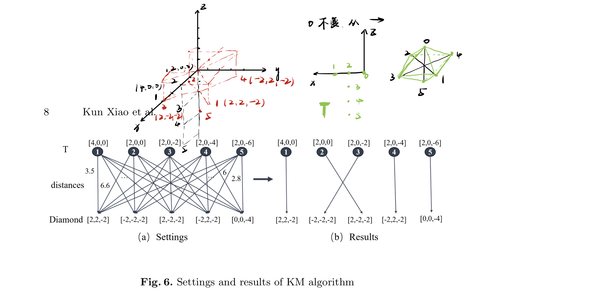

# Selected Papers

## List

* [UWB-Based Localization for Multi-UAV Systems and Collaborative Heterogeneous Multi-Robot Systems](https://www.sciencedirect.com/science/article/pii/S1877050920317324)
* [Distributed sliding mode control for time-varying formation tracking of multi-UAV system with a dynamic leader](https://www.sciencedirect.com/science/article/abs/pii/S1270963821000602)
* [基于UWB定位技术的多移动机器人编队控制](http://www.infocomm-journal.com/znkx/article/2019/2096-6652/2096-6652-1-1-00083.shtml)
* [Video-UWB Localization and Mapping](https://www.nist.gov/video/uwb-localization-and-mapping)
* [无人机集群定位与编队方式研究总结（最详细的鸟群模型分析）](https://zhuanlan.zhihu.com/p/350863301)

## Implementation of UAV Coordination Based on a Hierarchical Multi-UAV Simulation Platform

* [pdf website](https://arxiv.org/pdf/2005.01125.pdf)
* [abstract website](https://arxiv.org/abs/2005.01125)

这是一篇`XTDrone`预发表的论文；题目翻译为，**基于一种分层多无人机仿真平台的无人机协作实现**；其中分层的多无人机仿真平台指的`XTDrones`；

文章分为摘要，介绍，架构，联合搜索仿真，分布式无人机集群设计，分布式无人机集群仿真，结论及未来的工作，7个主要部分；

### 0. Abstract

*摘要；*

In this paper, a hierarchical multiple unmanned aerial vehicle(UAV) simulation platform, called XTDrone, is designed for UAV swarms, which is completely open-source 4 . There are six layers in XTDrone: communication, simulator, low-level control, high-level control, coordination, and human interaction layers. XTDrone has three advantages. Firstly, the simulation speed can be adjusted to match the computer performance, based on the lockstep mode. Thus, the simulations can be conducted on a work station or on a personal laptop, for different purposes. Secondly, a simplified simulator is also developed which enables quick algorithm designing so that the approximated behavior of UAV swarms can be observed in advance. Thirdly, XTDrone is based on Robot Operating System(ROS), Gazebo, and PX4, and hence the codes in simulations can be easily transplanted to embedded systems. Note that XTDrone can support various types of multi-UAV missions, and we provide two important demos in this paper: one is a ground-stationbased multi-UAV cooperative search, and the other is a distributed UAV formation flight, including consensus-based formation control, task assignment, and obstacle avoidance.

可以获得`XTDrone`的分层：**communication, simulator, low-level control, high-level control, coordination, and human interaction layers**

* 其中low level和high level的control不太清楚，现在猜测是底层的动力学建模-PID控制到顶层的飞行模式的控制，这一部分应该是PX4的主要内容；
* coordination部分负责协作，是主要了解内容

文章还包含了两个demo：

* ground-stationbased multi-UAV cooperative search
* a distributed UAV formation flight

### 1. Introduction

*介绍部分，介绍无人机集群的背景和`XTDrone`的结构；*

Unmanned aerial vehicles (UAVs) develop rapidly due to their large potential in both civilian and military uses, such as disaster rescue, reconnaissance and surveillance. As missions becomes increasingly complex, the importance of multiUAV cooperation grows. Therefore, a large number of researchers focuses on multi-UAV cooperation or UAV swarms in recent years.

多无人机，无人机集群研究关注度增加和出现；

Algorithm design and validation can waste time and energy without a reliable simulation platform, and thus much attention was drawn for simulation platform developing [6,7,8,9,10]. However, few platforms are open source and user friendly. Aerostack5 developed from [8], is the most popular multi-UAV simulation platform according to our investigation. However, compared to single UAV simulation platforms, such GAAS6 and RotorS7 , the numbers of stars and forks in github are much smaller. There is still an urgent need for a user-friendly multi-UAV simulation platform for not only researchers but also engineers. Based on this motivation, A hierarchical and modular multi-UAV simulation platform called XTDrone is developed.

`XTDrone`的优势；

Considering usability, development efficiency and open source community, ROS8 , Gazebo9 , PX410 and QGroundControl11 are chosen as four bases of XTDrone. Python is the main development language and some outstanding C++ open source projects are also integrated. The platform is divided into six layers: communication, simulator, low-level control, high-level control, coordination and human interaction layers. In each layer, there are different kinds of modules, such as task allocation, Simultaneous localization and mapping (SLAM), object detection, trajectory generation, position controller and so on. All of these modules can be replaced conveniently because the input and output messages are well-defined. Therefore, platform developers can realize and test their own algorithm conveniently. Because ROS and PX4 is originally designed for embedding system, developers can deploy their algorithm to real UAVs conveniently after testing and debugging on the simulation platform.

可用性很强；基于ROS，gazebo，PX 4和QGC；

主要是Python，少部分优秀的C++代码；

在测试和debug之后方便应用到真机上；

High computational consumption is an important problem for multi-UAV simulation. Powerful workstations are not only expensive but also inconvenient compared to laptops. XTDrone runs in the lockstep mode, meaning that different numerical solvers maintain synchronized time, which makes it possible to run the simulation faster or slower than real time, and also to pause it in order to step through code. A powerful computer runs faster and less powerful one runs slower. Therefore, this feature makes computers with different performance possible to be used for simulation. Furthermore, a simplified simulator is provided, so developers can firstly test and debug their algorithm on the simplified simulator with a large-scale swarm. And then when simulating in Gazebo, they can choose to use a powerful workstation for a large-scale swarm, or reduce the number of UAVs.

多机仿真很要求电脑性能，比如zyz同学十几fps的gazebo，因此`XTDrone`用了`lockstep mode`；

通过改变时间的流逝速度，程序运行流畅；性能一般的电脑则时间走得慢；

如果多机仿真数量太大，电脑无法满足，则减少飞机数量；

XTDrone is firstly a single UAV simulation platform and then a multi-UAV one. Reference [11] has provided details about single UAV simulation, and this paper focuses on the multi-UAV simulation. The rest of the paper is structured as follows. Section 2 presents the architecture of the simulation platform. And then, two demos are shown to demonstrate how the platform works. Section 3 presents a multi-UAV cooperative search mission, planned by the ground control station. Section 4 and Section 5 presents a distributed UAV formation, including consensus cooperative control, task assignment and obstacle avoidance. Section 4 describes algorithm designs and Section 5 presents its simulation implementation. Section 6 concludes the paper and indicates future work.

介绍下文结构；

### 2. Architecture

*主要介绍各个层负责的功能和通信；*

Fig. 1 shows the architecture of XTDrone. Five layers communicate with each other through the communication layer. The architecture is inspired by [12], which is a a multi-layered and distributed architecture for real UAV swarm. To some extent, the architecture of XTDrone is a simulation version of that in [12]. In this section, the six layers are introduced respectively from down to top.

通信层与其他五层都有联系；接下来由下到上介绍这六层；

The communication layer is in charge of the messages transmission among all the UAVs and the ground control station, which is the base of all other layers. ROS, MAVLink12 and MAVROS13, supply message-passing in the communication layer. To be user-friendly, XTDrone encapsulates complex protocols, and standardizes the topic names. Developers can conveniently subscribe and publish the needed topics in their designed modules.

通信层负责各个无人机和地面站之间的消息传送；

用ROS，MAVLink和MAVROS作通信基础；

封装了通信协议，并且给话题标准化命名，方便发布和订阅；

The simulator layer supplies UAV dynamic models, sensors, scene and other kinds of robots, all of which is customizable, so that developers can modify the aerodynamics model, or add multiple cameras to the UAV according to their needs. The main simulator is Gazebo. Moreover, for quick algorithm developing in the early stage, a simplified simulator based on Matplotlib14 is provided. Reference [11] presents more details about this layer.

仿真层提供无人机的动态模型，传感器以及其他机器人模型；

可以更改气动模型，以及无人机上的相机数量；

可以用Matplotlib作简单的仿真；

Low-level control layer is totally based on PX4 software in the loop (SITL), which contains state estimation and low-level control such as position control, attitude control and flight modes. XTDrone focuses more on high-level control layer and coordination layer, and developers can just use this layer without extra modification. To develop algorithm in this layer, developers are expected to be familiar with PX4.

低等级控制层基于PX4的软件在环仿真；

这一部分几乎是纯飞控的内容，包括高度和姿态控制还有飞行模式；

这一部分需要PX4和飞控基础（气动建模到PID控制），`XTDrone`关注高等级控制；

High-level control layer contains perception and motion planning. It’s a key layer for intelligence of a single UAV. Object detection and tracking, SLAM, obstacle avoidance, etc. are all in this layer. Some demos have been realized in XTDrone, and developers can modify them or rewrite them according to their needs. For a UAV swarm, this layer receives tasks allocated from coordination layer, and then each UAV achieves the task.

高等级控制层包括**环境感知和路径规划**；

目标探测和跟踪，SLAM技术，避障；

在多无人机的情况下，这一层需要接受上一层即协作层分配的任务，并且给每一个无人机分配；

The coordination layer is responsible for the tasks related to negotiation (e.g., task allocation) among UAVs for mission coordination. It divides the total mission into different small missions, and then sends them to high-level control layer. This layer is very flexible, and may contain different modules according to different missions and coordination strategies. For example, in the formation demo (Section 4 and 5), the task assignment and the consensus controller is in this layer.

协作层顾名思义可以负责任务分配：

* 包括任务由大到小的细分
* 小任务发送到高等级控制层

The human interaction layer is a set of interfaces for the developer to control and monitor the UAV swarm. For UAVs, a typical human machine interface is ground control station, and specifically, XTDrone utilizes QGroundControl, shown as Fig. 2(a). QGroundControl communicates with PX4 SITL through MAVLink, so developers can monitor and adjust parameters and targets of lowlevel control layer. Besides the low-level layer, coordination layer and high-level layer are controlled and monitored through a set of tools based on ROS, such as a customizable keyboard controller, shown as Fig. 2(b), rviz15 and rqt16 . Moreover, logging is essential for analyzing the algorithm and debugging the code. For ROS, ROSBag is a useful tool to record logs, and for PX4, flight logs, containing almost every key message, are recorded as ULog files17. And there are some user-friendly software18 to analysis ULog files.

交互层可以监视和控制无人机群：

* PX4 SITL和GQC之间通过MAVLink传送
* 高，低等级控制层和写作层可以通过ROS带的工具去监视和控制，比如rviz，rqt等

### 3. Cooperative Search Simulation

*协作搜索的仿真demo*

In this section, a multi-UAV cooperative search is implemented. We plan the trajectories for six UAVs through QGroundControl, the low-level controller of each UAV tracks the desired trajectory and the high-level controller of each UAV detects the target objects.

任务描述：

* 在QGC中规划好6架无人机的路径
* 低等级控制层负责保持路径，高等级控制层负责目标物体的探测

The mission goal is to search a human in a large region. A tiny-YoloV3 network [13] is trained beforehand, and deployed in the high-level controller layer19 . For searching in a wide region, a simple but efficient way is to divide the region into six non-overlapping regions. Each UAV searches one region and detects the target objects. By setting and uploading way points in QGroundControl, shown as Fig. 2(a), the low-level layer of each UAV tracks the desired flight trajectory, and meanwhile, tiny-YoloV3 works, shown as 3. Finally, the NO.5 UAV detects the human and then the mission is completed.

任务目标是在区域中找到目标人物，在高等级控制层用Yolo识别算法（训练过的）；

> 论文上的图片只有一个人，应该只有找个“人”，没有面部识别的内容

将目标区域六等分（不重叠，不覆盖），每架无人机各自探测；

同时低等级控制层要保证路径；

### 4. Distributed UAV Formation Design

In this section, a design of distributed UAV formation control is represented. A consensus controller, a task assignment strategy and an obstacle avoidance algorithm are designed. The formation is a leader-following formation. Firstly, the leader assigns task to all the followers. And then for each follower, the output velocities of the consensus controller and the obstacle avoidance module are composed to desired velocity in the high-level control layer. And then the desired velocity is sent to the low-level control layer. Finally, the desired formation is achieved.

分三部分，共同控制，任务分配和避障算法；

是一个领队集群，由领队连接；

#### 4.1 Consensus-based Formation

一致编队？一致性编队

对于一组N个的无人机，有：
$$
\dot{\xi_i}=u_i , i=1,2,...N
$$
其中$u_i\in{\mathbb R}^3$，为飞机的速度；$\xi_i\in{\mathbb R}^3$，为飞机的位置；目标是达到预定的编队位置；
$$
u_i=-\sum^{N}_{j=1}w_{ij}[(\xi_i-\delta_i)-(\xi_j-\delta_j)]
$$
其中$w_{ij}$是邻接矩阵[Adjacency matrix](https://zh.wikipedia.org/wiki/%E9%82%BB%E6%8E%A5%E7%9F%A9%E9%98%B5)，$W=[w_{ij}]\in{\mathbb R}^{N\times N}$，表示了无人机j会和无人机i建立通信如果$w_{ij}>0$；

$\delta_i$指的是无人机$i$的编队偏移量；

认为当系统达到一致的时候就是$||(\xi_i-\delta_i)-(\xi_j-\delta_j)||\rightarrow0$的时候，因为认为系统的一致性和编队的稳定性是等价的；

In [15], Yu Ding built an interaction topology based on their proposed “Veteran Rule”. We use this to determine the communication topology of UAVs, e.g. the adjacency matrix W = [wij ]. Assume that the number of UAVs is 6, and the current position is “T” shown in Fig.4, then we get the communication topology as Fig.5 and the adjacency matrix L as (3)

用一种方法来决定无人机之间的通讯拓扑；

#### 4.2 Task assignment

We consider formation reconfiguration as a kind of task assignment which setts different UAVs into different formation positions for the shortest total distance while changing formation. We adopt Kuhn-Munkres (K-M) algorithm for task assignment. As the current formation offset and the target formation offset could be obtained by each UAV, we set them as a bipartite graph. Each weight of graph is the distance (in practice turned to negative ) between the current formation offset and the target formation offset. The assignment solved by KM algorithm obtains the best total performance with the shortest total distance[16]. For instance, for the formation reconfiguration from ‘T’ to ‘diamond’, the settings and results of KM algorithm are shown in Fig.6

使用KM算法找到队形变换过程中的最短运动距离；

关于KM算法：https://blog.csdn.net/zsfcg/article/details/20738027；

#### 4.3 Obstacle avoidance

Fig. 7 shows the strategy of obstacle avoidance. A UAV will avoid when another UAV is in the range of b meters. r is the distance vector and points to the obstacle UAV. a is the avoidance vector of UAV1 and a 0 is the avoidance vector of UAV3. a and a 0 are in the opposite direction, and perpendicular to r. Because there are infinite vectors perpendicular to r, a simple method, shown as Algorithm 1 is designed to identify a unique solution. Two auxiliary vectors n1 and n2 are used to avoid the cross product result close to zero vector. kp is a proportion factor. If there are more than one UAVs in the range of b meters, avoidance vector a will be modified several times. The final a will be added to the desired velocity, and then the desired velocity will be sent to the low-level control layer.

Two **auxiliary vectors** n1 and n2 are used to avoid the cross product result close to zero vector.

Another question is how to obtain the relative position of other UAVs. Because of the distributed communication, a UAV cannot obtain all other UAVs’ absolute positions. There are many researches focused on the cooperative relative localization algorithm [17,18,19]. In this demo, for simplification, the relative position ground truth is sent to each UAV. Developers can just add a relative localization module to replace the ground truth with the module output.

提供了地理坐标的相对位置；

==但是我们的UWB能提供距离信息，那方向呢？==方向应该是可以获得的，但我不知道为啥。

### 5. Distributed UAV Formation Simulation

XTDrone contains two python classes, one for the leader and another for the follower. Developers can inherit these two classes to modify the communication and control scheme. By starting multiple ROS nodes, multiple UAV controllers are simulated.

Leader和其他的飞机有两个类；

多个ROS节点；

Fig. 8 shows the formation of 9 UAVs implemented in the simplified simulator and Fig. 9 shows the formation implemented in Gazebo. Three configurations from left to right are cube, pyramid and triangle. The videos of the formation reconfiguration can be seen at https://www.yuque.com/xtdrone/demo/ uav formation.

To validate the consensus control algorithm, a flight log is recorded during configuration from origin to ‘cube’, and the position response curves are shown in Fig. 10. Although some overshooting can be seen on the response curves, all the UAVs reaches stability.

没有积分反馈，不知道是怎么消掉稳态误差的；

## Distributed Variable-Baseline Stereo SLAM from two UAVs

* [abstract website](https://ieeexplore.ieee.org/abstract/document/9560944), from IEEE

这是一篇由ETH Vision for Robotics Lab发表的论文，题目翻译为两架无人机上的分布式可变基线的双目SLAM；

文章分为摘要，介绍，类似工作，初步工作，方法，实验评估和结论六个部分；

注意：这篇文章现在在IEEE上的应该是最后发表的版本（或者是修改的），和仓库里的不太一样，尤其是在一些数学公式的表示上，整体结构也有不同（正式版没有初步工作这一章节）；

### 0. Abstract

摘要；

Visual-Inertial Odometry (VIO) has been widely used and researched to control and aid the automation of navigation of robots especially in the absence of absolute position measurements, such as GPS. However, when observable landmarks in the scene lie far away from the robot’s sensor suite, as it is the case at high altitude flights, the fidelity of estimates and the observability of the metric scale degrades greatly for these methods. Aiming to tackle this issue, in this article, we employ two Unmanned Aerial Vehicles (UAVs) equipped with one monocular camera and one Inertial Measurement Unit (IMU) each, to exploit their view overlap and relative distance measurements between them using Ultra-Wideband (UWB) modules onboard to enable collaborative VIO. In particular, we propose a novel, distributed fusion scheme enabling the formation of a virtual stereo camera rig with adjustable baseline from the two UAVs. In order to control the UAV agents autonomously, we propose a decentralized collaborative estimation scheme, where each agent hold its own local map, achieving an average pose estimation latency of 11ms, while ensuring consistency of the agents’ estimates via consensus based optimization. Following a thorough evaluation on photorealistic simulations, we demonstrate the effectiveness of the approach at high altitude flights of up to 160m, going significantly beyond the capabilities of state-of-the-art VIO methods. Finally, we show the advantage of actively adjusting the baseline on-the-fly over a fixed, target base.

VIO是一种融合了IMU和传统相机进行SLAM的视觉惯性里程计，已广泛应用，尤其是无法获得绝对位置如GPS的情况下；但是当观察地标远离传感器套件时，比如高海拔，位姿估计精度和观测范围的广度都会严重消退；

因此采用两架无人机，各自搭载单目相机和IMU单元：

* 利用两机重叠视图和相对位置的测量，通过UWB实现协作的VIO
* 在两个无人机上形成了可变基线的虚拟立体相机平台
* 提出分布式协作估计方案（decentralized collaborative estimation scheme），各机单独生成地图，快速完成位姿估计，通过consensus based optimization达到估计的一致性

最终实验证明了在160m空中效果超过现有的VIO方法，并且展现了相对于固定基线，动态基线调整的优势，减少了实验误差；

### 1. Introduction

介绍；

Awareness of a robot’s pose in previously unseen environments is one of the key elements towards enabling autonomous navigation of robots. While GPS is of tremendous help towards achieving this goal, its availability and quality are still limited, e.g. indoors or close to structure, hence in a general scenario strong reliance on GPS can be a critical limitation. Addressing this issue, research into Simultaneous Localization And Mapping (SLAM) has received quite some attention as it potentially enables ego-motion estimation only using the sensors carried onboard the robot.

SLAM技术解决了传统GPS定位的一些限制，使得位姿估计更加全面；

Due to the low cost and low power consumption of cameras and their ability to capture rich information about the environment, they have become a popular sensor choice for performing SLAM. With the first systems [8], [10], [25] demonstrating the ability to estimate the ego motion up to scale using only a single camera, soon more mature and complete systems, such as [30], emerged. While the scale ambiguity inherently present in monocular systems can be resolved, for example, by using a stereo camera rig [31], the lack of information in-between frames renders purely vision-based systems sensitive to fast motions, which are rather common when employed onboard small UAVs. Therefore, the complementary characteristics of IMUs and cameras have been explored extensively to develop robust and accurate state estimation by the means of VIO systems, such as [4], [27], [35], which quickly became a standard for autonomous navigation of UAVs [33].

从传统SLAM的状态估计到鲁棒性更强，准确度更高的VIO系统；

While VIO techniques have been successfully applied in situations where the scene is in the close proximity to the camera (e.g. in autonomous driving, in low-altitude flights or operations indoors), in scenarios where the scene is further away from the camera, such as at high altitude flights, VIO methods experience difficulties to establish similar levels of accuracy. As all VIO methods rely on triangulation of scene landmarks, the scene depth estimates become more uncertain the smaller the triangulation angle gets. For monocular VIO, this angle is determined by the camera motion and the scene depth. As the overall scale of monocular VIO conceptually, is determined via the integration of IMU measurements, with increasing scene depth, a larger range of motion is required in order to obtain a large enough triangulation angle. This leads to the integration of more IMU readings, which at some point results in a numerically weakly constrained scale. The same effect can be observed when using stereo cameras, where the fixed baseline dictates the maximum depth that can be reliably detected [18] and thus, limiting the effectiveness of the imposed constraints on the scale. The choice of the stereo baseline is, thus, a crucial parameter and ideally, one would be able to modify this parameter on-the-fly depending on scene depth or accuracy requirements of the task at hand [14].

当场景距离相机较远时（如高海拔），VIO方法的准确度有所下降；原因是由于VIO方法基本上依赖地标的三角剖分（triangulation of scene landmarks），当夹角越小时，深度估计越不准确；对于单目VIO，更大的场景深度意味着更大的运动范围，以获得足够大的三角测量角度，认为会导致数值上的弱约束尺度（numerically weakly constrained scale）；

对于双目相机同理，固定基线决定了可探测的最大深度；

因此引入可变基线，值应该根据场景深度和任务要求的精确度来确定；

Inspired by the idea of using two UAVs as agents equipped with one camera each, to form a virtual stereo camera rig [2], we propose a novel, complete system utilizing view overlap across two agents together with relative distance measurements obtained via UWB in order to collaboratively estimate the pose of these two cameras. As the two agents are capable of modifying their relative poses, the baseline between their cameras can be adjusted accordingly, e.g. achieving a desired triangulation angle. In order to allow for a low latency pose estimation onboard the agents, independently of network delays, we propose a novel decentralized optimization architecture allowing each agent to hold their own estimate of the map, while ensuring consistency of common scene estimates amongst them. In brief, the main contributions of this work are the following:

*  a novel, real-time sensor fusion framework combining monocular visual and inertial data from two UAVs, and relative distance measurements between them (e.g. using ultra-wideband modules on each agent) enabling a reliable relative pose estimation of each other even at high altitudes
*  the adaptation of the framework of [34] for asynchronous multi-agent estimation to enable sliding-window bundle adjustment in a decentralized fashion for the first time to the best of our knowledge
*  a thorough evaluation of the proposed system using photorealistic simulation showing the improvements over state-of-the-art stereo-inertial methods at higher altitudes, and
*  demonstration of the advantage of an adjustable baseline in the proposed two-UAV stereo setup for accurate pose estimation by the means of a simple high-level formation controller.

一个完整的系统，利用两架无人机之间的视区重叠和通过UWB获得的相对位置，来协同估计两个相机的位姿；

提出了分散优化体系结构（decentralized optimization architecture），每架无人机获得自己对地图的估计（建图， hold their own estimate of the map），同时确保他们之间公共场景估计的一致性；工作内容包括：

* 一种新的实时传感器融合框架，其结合了两个无人机的单目视觉数据和惯导数据以及UWB获得的相对距离，使得在高海拔地区也能可靠地完成姿态估计
* ==看不懂，放机翻==，对[34]中异步多智能体估计的框架进行了调整，以使滑动窗口束调整首次以分散的方式实现
* 用真实照片仿真，评估了该方法与现有的双目VIO在高海拔地区的表现
* 表明了可变基线系统的优势

### 2. Related Work

相关工作；

Alongside the emergence of vision based SLAM for single robots [4], [25], [27], [31], [35], research into multi-robot systems started to attract attention recently. The collaborative framework proposed in [11], demonstrates how Keyframe (KF) data from cameras mounted on different UAVs can be combined into a global map. Designed for mapping visual-inertial data from multiple agents, [22] builds up a global map, showcasing the benefit of collaboration on the overall trajectory error. Utilizing Manhattan-World like structures where available in order to constrain the map optimization, [15] propose a large scale visual-inertial mapping framework and [29] utilize a cloud computer to generate 3D maps, collaboratively. While these approaches are focused on mapping, other systems aim to distribute the processes of the SLAM pipeline between the agents and a server [36], [38], [23], promising to reduce the computational load onboard the agents and to make map data generated from one agent available to all the robotic team. On the other hand, there also exist multi-session frameworks, such as [39], [35] that allow the user to re-localize in previously generated maps. In order to allow these systems to scale up to larger teams of robots, research effort has been aiming to avoid a central server entity and perform all operations in a distributed fashion instead. Many works focus on optimizing a specific aspect of the multi-agent system for a distributed setup, such as place recognition [6], robustness [44], or efficient data exchange [5].

介绍多机协同SLAM的相关研究；所有的研究都在向着分布式的方向转变；

*[Collaborative Monocular SLAM with Multiple Micro Aerial Vehicles](https://ieeexplore.ieee.org/document/6696923)* 中提出了将多个无人机上的KF数据合并成一幅地图的方法；

 All the aforementioned frameworks make use of collaboration of some form ranging from combining map data into a larger map, to re-using parts of a map created from other agents. Nonetheless, the tracking front-ends of these systems do not require any tight collaboration amongst them and therefore, share the same limitations as their single-agent counterparts, for example, degrading quality of the pose estimate at higher altitudes. A counter example is the collaborative system `CoSLAM` [47], which addresses the problem of inaccuracies due to dynamic objects in the scene by using multiple freely moving cameras with view-overlap. This approach allows reliable pose estimation of cameras, which only observes the dynamic scene points in collaboration with their neighbouring cameras. However, the system requires all image data to be collected at a single access point and makes heavy use of GPU computation, limiting the applicability of the approach to a robotic problem.

前面提到的研究虽然协作，但整个集群仍有着与单机共同的问题，就是在高海拔情况下的准确性；

A counter example，`CoSLAM`虽然解决了场景中动态物体的问题，但是依赖GPU加速计算，导致其适用性有所下降；

The problem of degrading quality of VIO state estimation at high altitudes has recently received some attention in the literature. In wind turbine inspection using UAVs, for example, [42] proposed a framework with two UAVs, one equipped with LED markers and a GPS module and the other one with one camera that can detect the markers and one camera for turbine inspection. For the estimation, the UAV with the cameras observes the other UAV’s markers and flies close to the turbine, where the GPS signal is disturbed, while the UAV with the markers flies further away from the turbine to secure more reliable GPS reception, while staying in the field of view of the observing UAV. While this method fits well to inspection of structures, where GPS reception is reliable at least slightly further away from the structure, it is clear that unreliable or imprecise GPS readings have a strong effect on the quality of the pose estimates. Other methods deal with creating a large stereo baseline by placing the two cameras at the tips of a fixed-wing aircraft [18], [19], where the authors model and correct for movements between the cameras due to deformation of the structure essentially continuously estimating the stereo extrinsic. In the work of [2] and [21] the estimation of the relative transformation between two independently moving UAVs equipped with monocular cameras by the means of (relative) motion and view overlap is investigated. While conceptually, such a configuration can be interpreted as a stereo camera, the absolute scale of the baseline only gets estimated via motion (e.g. IMU measurements), hence suffering from the same limitations as monocular VIO. Nonetheless, taking inspiration from [2], here we propose a framework performing VIO with two agents, each equipped with a monocular camera and an IMU in tight collaboration with each other using relative distance measurements between the agents, e.g. using UWB modules, the scale ambiguity of the variable baseline setup can be addressed, allowing to effectively obtain a virtual stereo camera with a baseline that can be adjusted according to the scene and accuracy requirements. In contrast to other collaborative estimators with tight collaboration on the front-end such as [47], we propose a decentralized architecture allowing for low-latency pose estimation independent of communication delays and fitting well within the bandwidth limitations of a standard WIFI module.

关于VIO在高海拔情况下准确度降低的问题已经引起注意；

### 3. Preliminaries

初步研究；

#### A. Notation

关于下文的符号规定；

Throughout this work, we use small bold letters (e.g. **a**) to denote vector values, capital bold letters (e.g. **A**) to denote matrices and plain capitals (e.g. A) denote coordinate frames.

To indicate a submatrix formed by the rows $r_i$ to $r_j$ and the columns $c_l$ to $c_k$ of A we use the notation $A[r_i, r_j;c_l,c_k]$

#### B.  Asynchronous-parallel ADMM

The Alternating Direction Method of Multipliers (ADMM) was first introduced by [17] and is an algorithm that aims to solve problems of the following form:

ADMM是一个旨在解决以下问题的算法：

在$\bold{Ax}+\bold{By}=\bold{w}$的条件下，求$f(\bold{x})+g(\bold{y})$的最小值；

#### C.  Z-Spline based 6DoF Pose Interpolation

基于六自由度位姿插值的Z-Spline；spline是一个插值方法；

用于连续时间的轨迹展示；

### 4. Method

研究方法；本文的主要方法；

#### A. System Overview

系统总述；

The system performing distributed, collaborative SLAM is designed to be run as two identical instances on two machines, called ‘agents’, communicating with each other over a wireless connection. An overview of the essential parts of one such instance is shown in Figure 3. The functionality of each instance is partitioned into three main threads: tracking, mapping, and optimization.

在两架无人机上运行分布式协作SLAM，无人机之间用无线连接通信；

系统分为三个主要进程：**跟踪，建图，优化**；

In the tracking thread, the image observations are fused together with IMU readings in order to localize against the current state of the 3D Map Points (MPs). The fusion is performed by the means of an Extended Kalman Filter (EKF), which allows for a computationally efficient and low-latency frame-wise pose tracking. The tracked frame is further processed to decide whether a KF should be created or not. In the proposed system this decision is purely based on time constraints, i.e. if the time difference between the last KF and the current frame is larger than a threshold, the current frame is marked to become a KF. This scheme is motivated by the simplicity in the book-keeping, but also by the fact that we use the KF poses as base poses in the spline representation of the trajectory in the back-end optimization, hence, using uniform sampling between the KFs reduces the complexity of the interpolation. When a KF is newly created at one agent, the relevant information such as the 2D key points, descriptor data as well pose related information gets immediately communicated to the other agent. In the following the KFs created on its own by an agent are referred to as native KFs, while KFs received via communication but created by the other agent are referred to as non-native KFs. Both, native- as well as non-native KFs are passed to the mapping part of the pipeline. In the mapping thread, we try to establish new 3D MPs via triangulation between the newest native KF and a selected subset of established KFs. In order to reduce the required book-keeping for the map maintenance, the system is designed such that each agent can hold its own set of map points, avoiding complex synchronization between the two agents. Besides the creation of new MPs, the mapping thread is also responsible to update the uncertainty estimates of the MPs and establish correspondences between the existing MPs and non-native KFs. In order to avoid extensive locking of data during these operations, the interface between the tracking and the mapping-thread copies the last state of the MPs to be used for tracking. While the mapping thread initializes the MP positions and maintains an estimate of their uncertainty, we utilize nonlinear optimization to update the MP positions and fuse UWB distance measurements between the two agents into the estimation.

**在跟踪进程中**，图片数据和惯导的数据结合来完成3D地图点的定位；由扩展卡尔曼滤波方法完成信息融合，保证计算效率和低延迟；  

**在建图进程中**，通过完成对最新的关键帧与一个从KFs选择的KF的三角测量建立3D Map Points；还需要更新地图点的不确定估计，建立现有的地图点与非原始KFs的联系；当建图进程完成对地图点的初始化之后，用非线性优化更新地图点，同时将UWB的测距信息引入到位姿估计中；

**在优化进程中**，用ADMM确保两架无人机估计轨迹相同；

#### B. EKF-based Pose Tracking

基于EKF的位姿跟踪；

In order to enable both robust and timely tracking of each robot’s pose, we designed an EKF fusing the IMU information together with 3D-2D measurements against the current state of the MPs. As the MP positions are conceptually considered as given in the tracking thread, the EKF state $\chi_{tr}$ is chosen as follows:

设计了EKF融合IMU信息和3D-2D对当前地图点的测量，地图点位置认为在跟踪进程中已经给定，因此EFK状态$\chi_{tr}$被定为：$\chi_{tr}=[\bold{q}_{WM}\ \bold{q}_{MS}\ \bold{p}_{MS}\ S^\bold{v}\ \bold{b}_a\ \bold{b}_{\omega}]$

#### C. Mapping

The mapping thread in the proposed pipeline is responsible to generate new MPs and to maintain an estimate of the uncertainty in their positions.

**Initialization of new Map Points**

The initialization of new MPs is performed by triangulating of 2D correspondences between the most recent native KF (target) and the KFs that are already in the Map (candidates). As an exhaustive correspondence search against all established KFs would be computationally too expensive, instead, we propose to limit the search to a small subset of candidate KFs. In order to select such a subset, we assign a penalty value $s_j$ to every established KF $j$ based on the relative viewpoint with respect to the target KF $i$ as follows:

新地图点的产生源于对2D correspondences between the most recent native KF (target) and the KFs that are already in the Map (candidates)的三角测量，新产生的关键帧和已有的关键帧；

**Estimation of the Map Points’ uncertainty**

#### D. Distributed Optimization Back-End

The optimization back-end constitutes the core element of the system and is responsible for the fusion of the UWB distance-measurements together with the visual measurements and maintaining a consistent estimate among the two agents. In this section, we first introduce the optimization objective assuming a centralized system followed by the undertaken steps to optimize the objective in a decentralized fashion.

后端优化构成了系统的核心元素，其负责UWB距离测量与视觉测量的融合，并在两个无人机之间保持一致的估计；先介绍优化目标，假设是一个集中的系统，然后介绍以分散方式优化目标所采取的步骤；

**Centralized Objective Function**

集中功能；

The optimization variables in the back-end consist of the KF poses inside a fixed window size of N and the corresponding M MPs visible in these KFs:

**Distributed Optimization**

分布式优化；

To avoid a complex synchronization effort between the two agents in order to obtain a unique, common map, we allow each agent to hold its own version of the map and, instead, propose to use an ADMM based distributed optimization scheme to obtain a common trajectory estimate across both agents. In order to optimize f(X ) in a distributed fashion, the problem in Eq. (54) needs to be brought into the form of Eq. (7). Based on the need for both agents’ trajectories in (55) and the absence of a shared map across the agents, we split the problem by their trajectories, resulting in the following distributed state:

为了避免复杂的获得共同地图的工作，允许每一驾无人机持有自己的地图；

取而代之的是，用基于ADMM的分布式优化方案来获得共同的轨迹估计；

#### E. Communication

The communication module of the proposed pipeline is responsible to communicate newly created data (i.e. KFs) as well as for exchanging updates on the dual variables over a wireless network. In the proposed system we employ ROS [41] to serialize/de-serialize data and communicate it between the agents. Every time a new KF gets inserted in the window, this KF is passed to the Communication module. As sending the full data of this KF, e.g. image information, would lead to tremendous network traffic, we summarize the necessary information into a message containing the following information:

* KF timestamp and KF ID information 
* 2D key-point locations and extraction octave information 
* Key-point descriptors 
* Pose TMS after tracking 
* Covariance ΣTMS of the tracked pose.

每次插入新的关键帧时，KF都会传递给通信模块，发送完整的关键帧数据（比如图片）会导致巨大的流量；因此将必要的信息总结为包含以下信息的消息：

* KF时间戳和KF的ID信息
* 2D关键点位置和提取倍频信息
* 关键点描述子
* 跟踪的位姿
* 跟踪位姿的协方差矩阵

Note that the sent pose is not only used as an initial guess, but it also defines the reference rotation used in the pose consensus.

发送的位姿不仅用作初始猜测，还定义了位姿一致中使用的参考旋转；

In order to update the consensus error terms, the dual variables associated to the KFs within the optimization window get exchanged after every update step in Eq. (9), (10). As the dual variables are uniquely assigned to a KF pose, we use the identifier of the associated KF in order to correctly assign the dual variables. In summary, for every performed update on the dual variables, we stack the following information into a message and transmit it to the neighbouring agent:

* Identifier of the sender (i.e. the agent ID) 
* Vector of dual variables (in 6D) 
* Vector of associated KF IDs

#### F. Initialization

### 5. Experimental Evaluation

### 6. Conclusion

## Collaborative Monocular SLAM with Multiple Micro Aerial Vehicles

[abstract website form IEEE](https://ieeexplore.ieee.org/document/6696923)

这篇文章来自上一篇的引用，在相关工作中提出这一篇介绍了具体的，将两架无人机的数据合并成一幅地图的方法，应该有指导意义；

文章标题意为，多无人机上的协同单目SLAM；

### 0. Abstract

摘要；

Abstract— This paper presents a framework for collaborative localization and mapping with multiple Micro Aerial Vehicles (MAVs) in unknown environments. Each MAV estimates its motion individually using an onboard, monocular visual odometry algorithm. The system of MAVs acts as a distributed pre-processor that streams only features of selected keyframes and relative-pose estimates to a centralized ground station. The ground station creates an individual map for each MAV and merges them together whenever it detects overlaps. This allows the MAVs to express their position in a common, global coordinate frame. The key to real-time performance is the design of data-structures and processes that allow multiple threads to concurrently read and modify the same map. The presented framework is tested in both indoor and outdoor environments with up to three MAVs. To the best of our knowledge, this is the first work on real-time collaborative monocular SLAM, which has also been applied to MAVs.

