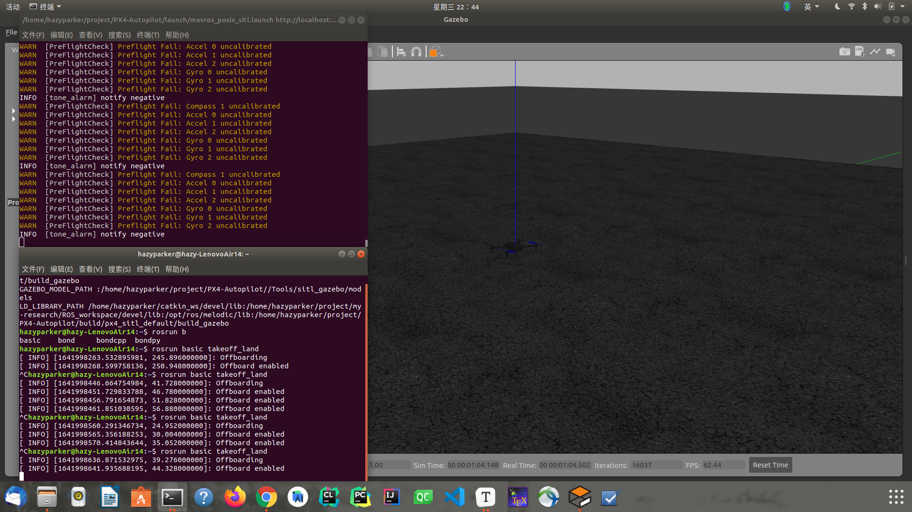

# 初步实现

## 内容

主要是根据ROS+PX4+MAVROS+gazebo写一些简单的单机或多机仿真程序；

* 程序控制的单机起飞降落
* 程序控制的航路点飞行
* 程序控制的集群跟随
* 程序控制的集群队形变换

## 程序控制的单机起飞降落

在完成ROS基础学习之后，试着联系上Pixhawk4，MAVROS，写一个程序控制的简单起飞降落的程序。

### 1. 预期结果

* 运行launch文件或运行`rosrun`命令，在gazebo中完成一架四旋翼无人机的起飞和降落
* 可以控制其在空中停留的时长

### 2. 实现方式

首先考虑创建功能包，但是依赖项不太清楚，因此参考师兄的`CMakeList`

```cmake
find_package(catkin REQUIRED COMPONENTS
  geometry_msgs
  mavros_msgs
  roscpp
  rospy
  std_msgs
  sensor_msgs
  cv_bridge
  tf
  message_generation
)

find_package(OpenCV 3 REQUIRED)
find_package (Eigen3 REQUIRED)
```

如果只是简单的起飞降落，用不到`Eigen3`和`OpenCV`；

先直接用师兄的代码实现一下看结果；

**BUG:**


问题表现为：

* invalid setpoints
* CMD：Unexpected command 176，result 0
* 在程序中的"Offboard enabled"循环出不来
* PX4不断地启动和关闭失效安全模式

zyz的运行里，176不影响结果；

attention to code passage below:

```cpp
        if( current_state.mode != "OFFBOARD" &&
            (ros::Time::now() - last_request > ros::Duration(5.0))){
            if( set_mode_client.call(offb_set_mode) &&
                offb_set_mode.response.mode_sent){
                ROS_INFO("Offboard enabled");
            }
            last_request = ros::Time::now();
        } else {
            if( !current_state.armed &&
                (ros::Time::now() - last_request > ros::Duration(5.0))){
                if( arming_client.call(arm_cmd) &&
                    arm_cmd.response.success){
                    ROS_INFO("Vehicle armed");
                }
                last_request = ros::Time::now();
            }
        }
```

message`ROS_INFO("Offboard enabled")` was printed endlessly; This shows:

*  `set_mode_client.call(offb_set_mode) && offb_set_mode.response.mode_sent` is **true**
* however, failed to switch to offboard mode

修改一下程序，多输出一些信息：

```cpp
        if( current_state.mode != "OFFBOARD" &&
            (ros::Time::now() - last_request > ros::Duration(5.0))){
            if( set_mode_client.call(offb_set_mode) &&
                offb_set_mode.response.mode_sent){
                ROS_INFO("Offboard enabled");
            }
            last_request = ros::Time::now();
            if (current_state.mode == "OFFBOARD") ROS_INFO("changed to OFFBOARD mode");
            if (current_state.mode != "OFFBOARD") ROS_INFO("OFFBOARD disabled unexpected");
        } else {
            if( !current_state.armed &&
                (ros::Time::now() - last_request > ros::Duration(5.0))){
                if( arming_client.call(arm_cmd) &&
                    arm_cmd.response.success){
                    ROS_INFO("Vehicle armed");
                }
                last_request = ros::Time::now();
            }
        }
```

结果与设想的一样，`OFFBOARD disabled unexpected`消息和`Offboard enabled`消息连着出现；

考虑到可能是`failsafe`mode不断`activate`与`deactivate`的原因，在地面站修改`NAV_RCL_RCT`参数，设置为0（也就是diasble failsafe），接下来的信息会这样：

```
failsafe mode activate
[WARN] CMD: unexpected command 176, result 0
[WARN] CMD: unexpected command 176, result 0
[WARN] CMD: unexpected command 176, result 0
```

不会出现`deactivate`了，但Offboard仍然会被disabled；并且开头不出现`invalid setpoints`警告了；

**BUG解决：**

实话说，不知道是怎么解决的，但是大概推测是PX4版本的问题；

先说两个现象，同样的程序，不一样的PX4，不一样的`.launch`（好像只有udp和localhost端口不一样，但是似乎不影响），在zyz电脑上完美运行，在我电脑上不行。（但是都会报176的错，不过不影响运行）；

zyz用的是`XTDrone`，从gitee下的PX4；我的是github直接clone的PX4；

于是把我的PX4也换成了`XTDrone`的，然后编译就出了一堆ERR，一些正常的google+DEBUG之后，算是解决了；

注意，运行PX4时一定要等PX4提示准备好了再输入ROS节点跑程序；

期待用github的版本直接跑通的那一天；我在PX4论坛发布了这个问题，实时跟进；

* https://discuss.px4.io/t/offboard-mode-does-not-start-due-to-failsafe-mode-activation/25586
* https://discuss.px4.io/t/failsafe-mode-activating-constantly-after-the-vehicle-enters-the-offboard-mode/24460
* https://discuss.px4.io/t/failsafe-mode-keeps-activating-and-deactivating/25778
* [No manual control stick input](https://issueexplorer.com/issue/PX4/PX4-Autopilot/18389), this bug also once appeared in my program，ROS2遇到该问题的解法
* 关注这个PR[improve offboard failsafe](https://github.com/PX4/PX4-Autopilot/pull/18160)

在https://issueexplorer.com/issue/PX4/PX4-Autopilot/18389的最后，他们提出了两个解法：

* Running `param set COM_RCL_EXCEPT 4` in the PX4 console before starting the offboard control node worked
* manually publish few setpoints to `fmu/manual_control_setpoint/in` and then start offboard mode

如果按照第一种办法在PX4修改该参数，报错如下：



fixme:https://github.com/PX4/PX4-Autopilot/issues/12469

make clean之后重新make，还是行不通；

第二种办法，我还不太会；

**BUG原因发现！！！**

如果你用的是github上下来的PX4（较新），在QGC中没有打开Virtual Joytick，可能会进入到failsafe mode出不来；

所以打开就行了；

### 3. 官方代码参考

官网示例代码连接地址：https://docs.px4.io/master/en/ros/mavros_offboard.html

```cpp
/**
 * @file offb_node.cpp
 * @brief Offboard control example node, written with MAVROS version 0.19.x, PX4 Pro Flight
 * Stack and tested in Gazebo SITL
 */

#include <ros/ros.h>
#include <geometry_msgs/PoseStamped.h>
#include <mavros_msgs/CommandBool.h>
#include <mavros_msgs/SetMode.h>
#include <mavros_msgs/State.h>

mavros_msgs::State current_state;
void state_cb(const mavros_msgs::State::ConstPtr& msg){
    current_state = *msg;
}

int main(int argc, char **argv)
{
    ros::init(argc, argv, "offb_node");
    ros::NodeHandle nh;

    ros::Subscriber state_sub = nh.subscribe<mavros_msgs::State>
            ("mavros/state", 10, state_cb);
    ros::Publisher local_pos_pub = nh.advertise<geometry_msgs::PoseStamped>
            ("mavros/setpoint_position/local", 10);
    ros::ServiceClient arming_client = nh.serviceClient<mavros_msgs::CommandBool>
            ("mavros/cmd/arming");
    ros::ServiceClient set_mode_client = nh.serviceClient<mavros_msgs::SetMode>
            ("mavros/set_mode");

    //the setpoint publishing rate MUST be faster than 2Hz
    ros::Rate rate(20.0);

    // wait for FCU connection
    while(ros::ok() && !current_state.connected){
        ros::spinOnce();
        rate.sleep();
    }

    geometry_msgs::PoseStamped pose;
    pose.pose.position.x = 0;
    pose.pose.position.y = 0;
    pose.pose.position.z = 2;

    //send a few setpoints before starting
    for(int i = 100; ros::ok() && i > 0; --i){
        local_pos_pub.publish(pose);
        ros::spinOnce();
        rate.sleep();
    }

    mavros_msgs::SetMode offb_set_mode;
    offb_set_mode.request.custom_mode = "OFFBOARD";

    mavros_msgs::CommandBool arm_cmd;
    arm_cmd.request.value = true;

    ros::Time last_request = ros::Time::now();

    while(ros::ok()){
        if( current_state.mode != "OFFBOARD" &&
            (ros::Time::now() - last_request > ros::Duration(5.0))){
            if( set_mode_client.call(offb_set_mode) &&
                offb_set_mode.response.mode_sent){
                ROS_INFO("Offboard enabled");
            }
            last_request = ros::Time::now();
        } else {
            if( !current_state.armed &&
                (ros::Time::now() - last_request > ros::Duration(5.0))){
                if( arming_client.call(arm_cmd) &&
                    arm_cmd.response.success){
                    ROS_INFO("Vehicle armed");
                }
                last_request = ros::Time::now();
            }
        }

        local_pos_pub.publish(pose);

        ros::spinOnce();
        rate.sleep();
    }

    return 0;
}
```

```c++
#include <ros/ros.h>
#include <geometry_msgs/PoseStamped.h>
#include <mavros_msgs/CommandBool.h>
#include <mavros_msgs/SetMode.h>
#include <mavros_msgs/State.h>
```

The `mavros_msgs` package contains all of the custom messages required to operate services and topics provided by the MAVROS package. All services and topics as well as their corresponding message types are documented in the [mavros wiki](http://wiki.ros.org/mavros).

这里需要了解一下MAVROS通信的相关包，如果不详细了解，就用示例中的通信方式；

```cpp
mavros_msgs::State current_state;
void state_cb(const mavros_msgs::State::ConstPtr& msg){
    current_state = *msg;
}
```

We create a simple callback which will save the current state of the autopilot. This will allow us to check connection, arming and *Offboard* flags.

`current_state`包含当前状态的相关信息，下面主要用了mode来检查，更换当前模式；官方的注释说的也很清楚，用这个检查连接，解锁与否，offboard模式切换与否；

```cpp
ros::Subscriber state_sub = nh.subscribe<mavros_msgs::State>("mavros/state", 10, state_cb);
ros::Publisher local_pos_pub = nh.advertise<geometry_msgs::PoseStamped>("mavros/setpoint_position/local", 10);
ros::ServiceClient arming_client = nh.serviceClient<mavros_msgs::CommandBool>("mavros/cmd/arming");
ros::ServiceClient set_mode_client = nh.serviceClient<mavros_msgs::SetMode>("mavros/set_mode");
```

We instantiate a publisher to publish the commanded local position and the appropriate clients to request arming and mode change. Note that for your own system, the "mavros" prefix might be different as it will depend on the name given to the node in it's launch file.

这一段在main函数建立节点句柄之后，新建了一个订阅者，一个发布者，两个服务客户端；

[关于mavros_msgs里面有什么信息](http://docs.ros.org/en/api/mavros_msgs/html/msg/Mavlink.html)；不是这`.msg`文件里面也没个注释这看不明白啊；只是消息类型，应该关注话题？

* `state_sub`订阅mavros_msgs::State类型的话题，话题为mavros/state，队列10（拿时间戳最新的10个数据），state_cb为注册的回调函数，一旦由话题则调这个回调函数，拿数据；
* `local_pos_sub`发布mavros/setpoint_position/local话题的信息，队列为10，消息类型为[geometry_msgs::PoseStamped](http://docs.ros.org/en/api/geometry_msgs/html/msg/PointStamped.html)
* `arming_client`发送解锁请求的客户端，消息类型mavros_msgs::CommandBool，服务名mavros/cmd/arming
* `set_mode_client`设置模式的客户端，消息类型mavros_msgs::SetMode，服务名mavros/set_mode

```cpp
//the setpoint publishing rate MUST be faster than 2Hz
ros::Rate rate(20.0);
```

PX4 has a timeout of 500ms between two *Offboard* commands. If this timeout is exceeded, the commander will fall back to the last mode the vehicle was in before entering *Offboard* mode. This is why the publishing rate **must** be faster than 2 Hz to also account for possible latencies. This is also the same reason why it is recommended to enter *Offboard* mode from *Position* mode, this way if the vehicle drops out of *Offboard* mode it will stop in its tracks and hover.

PX4对于Offboard模式的命令间隔有要求，时长必须小于500ms，否则退回上一模式；

所以**PX4建议要从position mode切换到offborad mode**；因为这样即使无人机掉出了offboard mode，也会停在所处位置轨迹上盘旋；

```cpp
// wait for FCU connection
while(ros::ok() && !current_state.connected){
    ros::spinOnce();
    rate.sleep();
}
```

Before publishing anything, we wait for the connection to be established between MAVROS and the autopilot. This loop should exit as soon as a heartbeat message is received.

等待fcu连接；

```cpp
geometry_msgs::PoseStamped pose;
pose.pose.position.x = 0;
pose.pose.position.y = 0;
pose.pose.position.z = 2;
```

Even though the PX4 Pro Flight Stack operates in the aerospace NED coordinate frame, MAVROS translates these coordinates to the standard ENU frame and vice-versa. This is why we set `z` to positive 2.

设置三维坐标；

```cpp
//send a few setpoints before starting
for(int i = 100; ros::ok() && i > 0; --i){
    local_pos_pub.publish(pose);
    ros::spinOnce();
    rate.sleep();
}
```

Before entering *Offboard* mode, you must have already started streaming setpoints. Otherwise the mode switch will be rejected. Here, `100` was chosen as an arbitrary amount.

**Otherwise the mode switch will be rejected**

```cpp
mavros_msgs::SetMode offb_set_mode;
offb_set_mode.request.custom_mode = "OFFBOARD";
```

We set the custom mode to `OFFBOARD`. A list of [supported modes (opens new window)](http://wiki.ros.org/mavros/CustomModes#PX4_native_flight_stack)is available for reference.

```cpp
mavros_msgs::CommandBool arm_cmd;
arm_cmd.request.value = true;

ros::Time last_request = ros::Time::now();

while(ros::ok()){
		if( current_state.mode != "OFFBOARD" &&
				(ros::Time::now() - last_request > ros::Duration(5.0))){
				if( set_mode_client.call(offb_set_mode) &&
						offb_set_mode.response.mode_sent){
						ROS_INFO("Offboard enabled");
				}
				last_request = ros::Time::now();
		} else {
				if( !current_state.armed &&
						(ros::Time::now() - last_request > ros::Duration(5.0))){
						if( arming_client.call(arm_cmd) &&
								arm_cmd.response.success){
								ROS_INFO("Vehicle armed");
						}
						last_request = ros::Time::now();
				}
		}

		local_pos_pub.publish(pose);

		ros::spinOnce();
		rate.sleep();
}
```

The rest of the code is pretty self explanatory. We attempt to switch to *Offboard* mode, after which we arm the quad to allow it to fly. We space out the service calls by 5 seconds so to not flood the autopilot with the requests. In the same loop, we continue sending the requested pose at the appropriate rate.

关于spinOnce：https://www.cnblogs.com/liu-fa/p/5925381.html；

### 4. 主要函数

一个检查是不是达到了(0, 0, 2)的函数；

一个订阅当前位姿信息的订阅者，以便检查是不是到达目标点；

一个用延迟写的循环，来在目标点悬停一段时间；

一个发送降落命令的，可以仿照解锁后自动起飞的方式，使用AUTO LAND模式；

### 5. 结果

代码地址：[takeoff_land.cpp](src/takeoff_land.cpp)


这是命令执行结束后的截图，可以看到仍然出现了offboard mode被关掉的意外，但是更意外的是，能够进到解锁的步骤并且向下进行；

应该是模式的启动需要时间；最终是可以启动的；

## 航路点控制飞行

代码地址：[move along waypoint](src/move_wayPoint.cpp)


## 简单的多机飞行

### 1. 参考

在这里先不深究集群编队的原理，只是先用别人的代码跑通

`XTDrone`：https://www.yuque.com/xtdrone/manual_cn/uav_formation

先看一下python3 generator.py里面干了什么：

```python
import sys

welcome_msg = """
                      ,----,                                                      
                    ,/   .`|                                                      
 ,--,     ,--,    ,`   .'  :   ,---,                                              
 |'. \   / .`|  ;    ;     / .'  .' `\                                            
 ; \ `\ /' / ;.'___,/    ,',---.'     \   __  ,-.   ,---.        ,---,            
 `. \  /  / .'|    :     | |   |  .`\  |,' ,'/ /|  '   ,'\   ,-+-. /  |           
  \  \/  / ./ ;    |.';  ; :   : |  '  |'  | |' | /   /   | ,--.'|'   |   ,---.   
   \  \.'  /  `----'  |  | |   ' '  ;  :|  |   ,'.   ; ,. :|   |  ,"' |  /     \  
    \  ;  ;       '   :  ; '   | ;  .  |'  :  /  '   | |: :|   | /  | | /    /  | 
   / \  \  \      |   |  ' |   | :  |  '|  | '   '   | .; :|   | |  | |.    ' / | 
  ;  /\  \  \     '   :  | '   : | /  ; ;  : |   |   :    ||   | |  |/ '   ;   /| 
./__;  \  ;  \    ;   |.'  |   | '` ,/  |  , ;    \   \  / |   | |--'  '   |  / | 
|   : / \  \  ;   '---'    ;   :  .'     ---'      `----'  |   |/      |   :    | 
;   |/   \  ' |            |   ,.'                         '---'        \   \  /  
`---'     `--`             '---'                                         `----'   
                                                                                  
Welcome to use the XTDrone multi-vehicle launch file generator!
"""
input_msg=  """
0.  rover
1.  plane
2.  typhoon_h480
3.  solo
4.  iris
5.  tiltrotor
6.  tailsitter
7.  standard_vtol
8.  plane_gimbal
Enter the TYPE_ID to add a vehicle type.
Then enter f to generate!
(defalt type is "iris")
  """

TYPE_ID_DICT = {
    "rover_with_lidar_stereo" : 0,
    "plane" : 1,
    "typhoon_h480" : 2,
    "solo_stereo_camera" : 3,
    "iris_stereo_camera" : 4,
    "tiltrotor" : 5,
    "tailsitter" : 6,
    "standard_vtol" : 7,
    "plane_gimbal" : 8
}


ID_TYPE_DICT = {v : k for k, v in TYPE_ID_DICT.items()}

print(welcome_msg)
TYPE_ID = 4
num_of_all = 0
num_of_type = [0]*8
row_of_type = [0]*8

while TYPE_ID != 'f':
    TYPE_ID = input(input_msg)
    if TYPE_ID>='0' and  TYPE_ID<='7':
        num_of_type[int(TYPE_ID)] = int( input("Enter the num of "+ID_TYPE_DICT[int(TYPE_ID)]+" :" ) )
        row_of_type[int(TYPE_ID)] = int( input("Enter the row num of "+ID_TYPE_DICT[int(TYPE_ID)]+" :" ) )
    elif TYPE_ID == 'f':
        for i in range(7):
            if  num_of_type[i] != 0:
                print(ID_TYPE_DICT[i]+' num : '+str(num_of_type[i]))
        print('generating........') 
    else:
        print("error!please enter a id_in_allber between 0 to 7!")

sum_of_row = sum(row_of_type)    


with open('launch_head_1.11','r') as f:
    launch_head=[]
    launch_head=f.read()
with open('launch_temp_1.11','r') as f:
    launch_lines=[]
    for line in f.readlines():
         launch_lines.append(line)


with open('multi_vehicle.launch','w') as f:
    f.write(launch_head)
    row_in_all = 0
    id_in_all = 0
    for type_id in range(8):
        type_num = num_of_type[type_id]
        row_in_type = row_of_type[type_id]
        sdf_name = ID_TYPE_DICT[type_id]

        # For example,
        # While "iris_stereo_camera" is the model name,
        # and we only need the "iris" to publish those topics.
        
        if "h480" in sdf_name or "vtol" in sdf_name or "plane_gimbal" in sdf_name:
            type_name = sdf_name.split('_')[0]+'_'+sdf_name.split('_')[1]
        else:
            type_name = sdf_name.split('_')[0]

        if type_num > 0:
            
            for id_in_type in range(0,type_num):

                offboard_local=34580+id_in_all
                offboard_remote=24540+id_in_all
                SITL=18570+id_in_all
                TCP=4560+id_in_all
                for line in launch_lines:
                    if "<!-- UAV" in line:
                        f.write("     <!-- "+type_name+("_%d -->\n" %id_in_type) )
                    elif "<group ns" in line:
                        f.write('''     <group ns="%s_%d">\n''' %(type_name,id_in_type)  )
                    elif '''<arg name="ID" value="0"/>''' in line:
                        f.write('''            <arg name="ID" value="%d"/>\n''' %id_in_all)
                    elif '''<arg name="ID_in_group" value="0"/>''' in line:
                        f.write('''            <arg name="ID_in_group" value="%d"/>\n''' %id_in_type)
                    elif "udp://:" in line:
                        f.write('''            <arg name="fcu_url" default="udp://:%d@localhost:%d"/>\n''' %(offboard_remote,offboard_local))
                    elif "mavlink_udp_port" in line:
                        f.write('''            <arg name="mavlink_udp_port" value="%d"/>\n'''%SITL)
                    elif "mavlink_tcp_port" in line:
                        f.write('''            <arg name="mavlink_tcp_port" value="%d"/>\n'''%TCP)
                    elif '''<arg name="vehicle" value=''' in line:
                        f.write('''            <arg name="vehicle" value="%s"/>\n'''%type_name)
                    elif '''<arg name="sdf" value=''' in line:
                        f.write('''            <arg name="sdf" value="%s"/>\n'''%sdf_name)    
                    elif '''name="x"''' in line:
                        f.write('''            <arg name="x" value="%d"/>\n'''%(row_in_all*3 +(id_in_type%row_in_type )*3 ))
                    elif '''name="y"''' in line:
                        f.write('''            <arg name="y" value="%d"/>\n'''  %(( id_in_type//row_in_type +1)*3  ) )
                    else:
                        f.write('%s' %line) 
                f.write("\n")
                id_in_all+=1

            row_in_all += row_in_type    
                
                

    f.write('</launch>\n')
    f.write('<!--the launch file is generated by XTDrone multi-vehicle generator.py  -->')
    print ("all down!")


    
```

看样子是根据用户输入的数据拿到飞机数量，飞机类型等参数，然后write到了launch文件里，那接下来去找launch文件找配置信息；

```python
f.write('</launch>\n')
```

写到了f文件中，可以看到launch_head_1.11里面只写了前部分，这个python负责把后续的配置文件写进去；

打开px4的多机launch查看：

```xml
<?xml version="1.0"?>
<launch>
    <!-- MAVROS posix SITL environment launch script -->
    <!-- launches Gazebo environment and 2x: MAVROS, PX4 SITL, and spawns vehicle -->
    <!-- vehicle model and world -->
    <arg name="est" default="ekf2"/>
    <arg name="vehicle" default="iris"/>
    <arg name="world" default="$(find mavlink_sitl_gazebo)/worlds/empty.world"/>
    <!-- gazebo configs -->
    <arg name="gui" default="true"/>
    <arg name="debug" default="false"/>
    <arg name="verbose" default="false"/>
    <arg name="paused" default="false"/>
    <!-- Gazebo sim -->
    <include file="$(find gazebo_ros)/launch/empty_world.launch">
        <arg name="gui" value="$(arg gui)"/>
        <arg name="world_name" value="$(arg world)"/>
        <arg name="debug" value="$(arg debug)"/>
        <arg name="verbose" value="$(arg verbose)"/>
        <arg name="paused" value="$(arg paused)"/>
    </include>
    <!-- UAV0 -->
    <group ns="uav0">
        <!-- MAVROS and vehicle configs -->
        <arg name="ID" value="0"/>
        <arg name="fcu_url" default="udp://:14540@localhost:14580"/>
        <!-- PX4 SITL and vehicle spawn -->
        <include file="$(find px4)/launch/single_vehicle_spawn.launch">
            <arg name="x" value="0"/>
            <arg name="y" value="0"/>
            <arg name="z" value="0"/>
            <arg name="R" value="0"/>
            <arg name="P" value="0"/>
            <arg name="Y" value="0"/>
            <arg name="vehicle" value="$(arg vehicle)"/>
            <arg name="mavlink_udp_port" value="14560"/>
            <arg name="mavlink_tcp_port" value="4560"/>
            <arg name="ID" value="$(arg ID)"/>
        </include>
        <!-- MAVROS -->
        <include file="$(find mavros)/launch/px4.launch">
            <arg name="fcu_url" value="$(arg fcu_url)"/>
            <arg name="gcs_url" value=""/>
            <arg name="tgt_system" value="$(eval 1 + arg('ID'))"/>
            <arg name="tgt_component" value="1"/>
        </include>
    </group>
    <!-- UAV1 -->
    <group ns="uav1">
        <!-- MAVROS and vehicle configs -->
        <arg name="ID" value="1"/>
        <arg name="fcu_url" default="udp://:14541@localhost:14581"/>
        <!-- PX4 SITL and vehicle spawn -->
        <include file="$(find px4)/launch/single_vehicle_spawn.launch">
            <arg name="x" value="1"/>
            <arg name="y" value="0"/>
            <arg name="z" value="0"/>
            <arg name="R" value="0"/>
            <arg name="P" value="0"/>
            <arg name="Y" value="0"/>
            <arg name="vehicle" value="$(arg vehicle)"/>
            <arg name="mavlink_udp_port" value="14561"/>
            <arg name="mavlink_tcp_port" value="4561"/>
            <arg name="ID" value="$(arg ID)"/>
        </include>
        <!-- MAVROS -->
        <include file="$(find mavros)/launch/px4.launch">
            <arg name="fcu_url" value="$(arg fcu_url)"/>
            <arg name="gcs_url" value=""/>
            <arg name="tgt_system" value="$(eval 1 + arg('ID'))"/>
            <arg name="tgt_component" value="1"/>
        </include>
    </group>
    <!-- UAV2 -->
    <group ns="uav2">
        <!-- MAVROS and vehicle configs -->
        <arg name="ID" value="2"/>
        <arg name="fcu_url" default="udp://:14542@localhost:14582"/>
        <!-- PX4 SITL and vehicle spawn -->
        <include file="$(find px4)/launch/single_vehicle_spawn.launch">
            <arg name="x" value="0"/>
            <arg name="y" value="1"/>
            <arg name="z" value="0"/>
            <arg name="R" value="0"/>
            <arg name="P" value="0"/>
            <arg name="Y" value="0"/>
            <arg name="vehicle" value="$(arg vehicle)"/>
            <arg name="mavlink_udp_port" value="14562"/>
            <arg name="mavlink_tcp_port" value="4562"/>
            <arg name="ID" value="$(arg ID)"/>
        </include>
        <!-- MAVROS -->
        <include file="$(find mavros)/launch/px4.launch">
            <arg name="fcu_url" value="$(arg fcu_url)"/>
            <arg name="gcs_url" value=""/>
            <arg name="tgt_system" value="$(eval 1 + arg('ID'))"/>
            <arg name="tgt_component" value="1"/>
        </include>
    </group>
</launch>
<!-- to add more UAVs (up to 10):
Increase the id
Change the name space
Set the FCU to default="udp://:14540+id@localhost:14550+id"
Set the malink_udp_port to 14560+id) -->
```

可以看出要修改的主要有ID，udp端口等；主要是配置通信端口；

xyz,RPY分别代表初始的坐标和旋转信息；

参考：https://www.cxyzjd.com/article/weixin_43409270/114703341；

需要注意的是，gazebo中有一个坐标，而在mavros之中，认为每架飞机的原点坐标即为其初始坐标，所以存在一定的坐标转换；


集群可以是给每一架无人机设置的，也可以是只控制领队，其余的无人机在队形不变的时候写好跟随代码；


### 2. 实现

总共需要若干步骤：

* 创建多个无人机；
* 多个无人机创建之后，之间通讯的建立，比如使用不同的话题或者服务来控制不同的无人机；
* 实现编队控制的算法，先是简单的，低概率会导致无人机碰撞的队形变换；
* 然后引入无人机之间的防撞算法，这里面就要求对无人机进行一定的速度控制；（拿到无人机的速度数据）


上图进行了简单的编队跟随测试，跟随效果一般，有较大延迟；[code-uav follow](src/multi_uav_follow.cpp)

下面是T形编队测试；

==注意不同无人机之间的坐标系转换==

																																																																																																																																																																																																																																																																																																																																																																																																		

根据KM算法解得每架子飞机对应的最短路径航路点，然后发布指令移动，但是会遇到如下问题：


mavros的通信里没有识别附近的无人机，也就是单独的代码没有探测放撞效果，在真机上比较致命；


* 第一种方法是论文中提到的，加速度矢量来规避碰撞的；
* 第二种方法是直接选一个安全的中间点

第一种方法首先在于直接修改速度矢量带来的稳定性影响（不知道能不能直接改）；其次更改之后，如果PX4希望的整个飞机的动力学建模和控制律得到的结果和实际的不符，会怎么影响PX4的控制；如果是自稳会不会直接把速度消调；

但是第二种方法在移动距离和队形间距基本在一个数量级时对损失的影响比较大；

因此可以考虑放弃KM方法的配对，改用一种不引起碰撞的方法；

## 下一步

* 集群和简单的航路点，单机多机话题消息传送基本了解；考虑到这个题目无人机集群队形和编队内放撞方面的需求不是很大，这一方面就先做到这；
* 下一步准备展开SLAM
