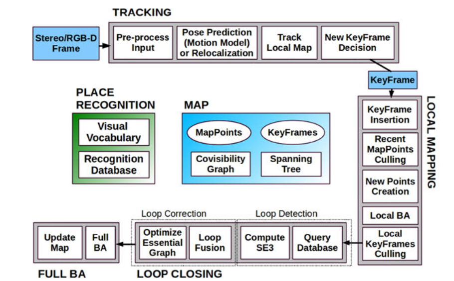

# ORB SLAM2 论文阅读

[paper website at IEEE](https://ieeexplore.ieee.org/abstract/document/7946260/)

## Introduction

## Related Work

## ORB SLAM2

系统的总架构图：

有三个主要进程：

* 跟踪进程，通过对每一帧的特征点提取、完成匹配、应用motion-only的BA最小化reprojection误差来完成对相机的跟踪和定位
* 地图进程，管理本地地图、优化
* 回环进程，位图优化（pose-graph）探测大的回环，消除累计漂移；该进程在位图优化结束后启动完整的BA来计算optimal structure and motion solution

**ORB特征**：用于跟踪，建图，位置识别；

**嵌入位置识别模块**：基于`DBoW2`；所有关键帧由最小spanning tree连接；

The system maintains a covisibiliy graph that links any two keyframes observing common points and a minimum spanning tree connecting all keyframes. These graph structures allow to retrieve
local windows of keyframes so that tracking and local mapping operate locally, allowing to work on large environments, and serve as structure for the pose-graph optimization performed when closing a loop.

### A. Monocular, Close Stereo, and Far Syereo Keypoints

### B. System Bootstrapping

### C. Bundle Adjustment with Monocular and Stereo Constraints

### D. Loop Closing and Full BA

Loop closing is performed in two steps, first, a loop has to be detected and validated, and second, the loop is corrected optimizing a pose graph. In contrast to monocular ORB-SLAM, where scale drift may occur [20], the stereo/depth information makes scale observable and the geometric validation and pose-graph optimization no longer require dealing with scale drift and are based on rigid body transformations instead of similarities.

两步回环：探测验证，然后位图优化；

双目和深度相机没有单目的深度漂移；使得尺度测量，几何验证位图优化可以基于刚体变换而不是相似性；

In ORB-SLAM2, we have incorporated a full BA optimization after the pose graph to achieve the optimal solution. This optimization might be very costly, and therefore, we perform it in a separate thread, allowing the system to continue creating map and detecting loops. However, this brings the challenge of merging the bundle adjustment output with the current state of the map. If a new loop is detected while the optimization is running, we abort the optimization and proceed to close the loop, which will launch the full BA optimization again. When the full BA finishes, we need to merge the updated subset of keyframes and points optimized by the full BA, with the nonupdated keyframes and points that where inserted while the optimization was running. This is done by propagating the correction of updated keyframes (i.e., the transformation from the nonoptimized to the optimized pose) to nonupdated keyframes through the spanning tree. Nonupdated points are transformed according to the correction applied to their reference keyframe.

如果在优化时有新的回环检测到，将放弃优化并进行合并，意味着又会重新开始完整的BA优化；

### E. Keyframe Insertion

