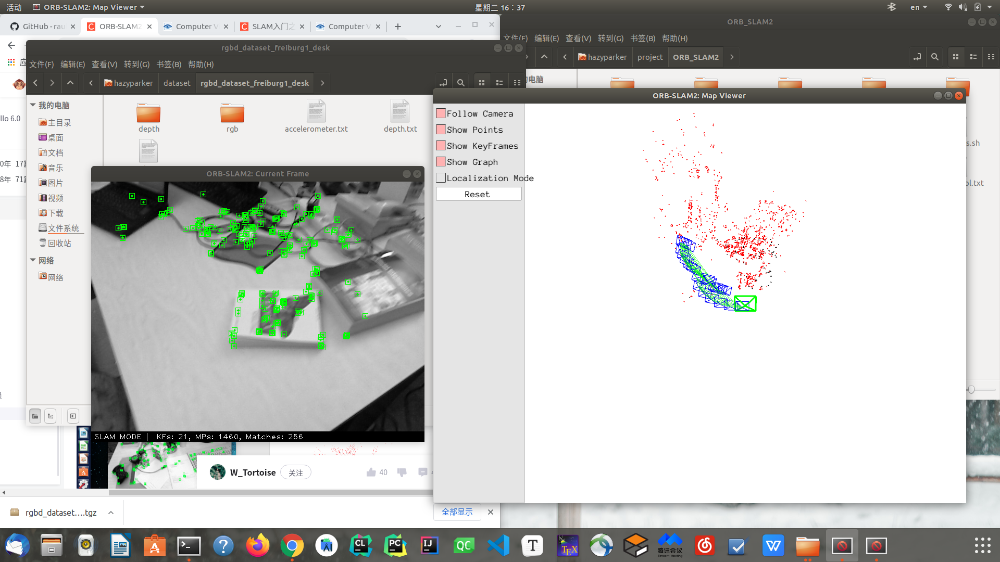

# SLAM配置方法

## ORB-SLAM2

* [github project link](https://github.com/raulmur/ORB_SLAM2)
* [ORB-SLAM2的安装与运行](https://blog.csdn.net/learning_tortosie/article/details/79881165)

### Build and examples

```shell
cd ORB_SLAM2
chmod +x build.sh
./build.sh
```

#### ERROR 1

```
/home/hazyparker/project/ORB_SLAM2/src/System.cc: In member function ‘cv::Mat ORB_SLAM2::System::TrackStereo(const cv::Mat&, const cv::Mat&, const double&)’:
/home/hazyparker/project/ORB_SLAM2/src/System.cc:134:17: error: ‘usleep’ was not declared in this scope
                 usleep(1000);
                 ^~~~~~
/home/hazyparker/project/ORB_SLAM2/src/System.cc:134:17: note: suggested alternative: ‘fseek’
                 usleep(1000);
                 ^~~~~~
                 fseek
/home/hazyparker/project/ORB_SLAM2/src/System.cc: In member function ‘cv::Mat ORB_SLAM2::System::TrackRGBD(const cv::Mat&, const cv::Mat&, const double&)’:
/home/hazyparker/project/ORB_SLAM2/src/System.cc:185:17: error: ‘usleep’ was not declared in this scope
                 usleep(1000);
                 ^~~~~~
/home/hazyparker/project/ORB_SLAM2/src/System.cc:185:17: note: suggested alternative: ‘fseek’
                 usleep(1000);
                 ^~~~~~
                 fseek
/home/hazyparker/project/ORB_SLAM2/src/System.cc: In member function ‘cv::Mat ORB_SLAM2::System::TrackMonocular(const cv::Mat&, const double&)’:
/home/hazyparker/project/ORB_SLAM2/src/System.cc:236:17: error: ‘usleep’ was not declared in this scope
                 usleep(1000);
                 ^~~~~~
/home/hazyparker/project/ORB_SLAM2/src/LoopClosing.cc: In member function ‘void ORB_SLAM2::LoopClosing::Run()’:
/home/hazyparker/project/ORB_SLAM2/src/LoopClosing.cc:84:9: error: ‘usleep’ was not declared in this scope
         usleep(5000);
         ^~~~~~
```

```
CMakeFiles/ORB_SLAM2.dir/build.make:110: recipe for target 'CMakeFiles/ORB_SLAM2.dir/src/LocalMapping.cc.o' failed
make[2]: *** [CMakeFiles/ORB_SLAM2.dir/src/LocalMapping.cc.o] Error 1
make[2]: *** 正在等待未完成的任务....
CMakeFiles/ORB_SLAM2.dir/build.make:86: recipe for target 'CMakeFiles/ORB_SLAM2.dir/src/Tracking.cc.o' failed
make[2]: *** [CMakeFiles/ORB_SLAM2.dir/src/Tracking.cc.o] Error 1
CMakeFiles/ORB_SLAM2.dir/build.make:494: recipe for target 'CMakeFiles/ORB_SLAM2.dir/src/Viewer.cc.o' failed
make[2]: *** [CMakeFiles/ORB_SLAM2.dir/src/Viewer.cc.o] Error 1
CMakeFiles/ORB_SLAM2.dir/build.make:134: recipe for target 'CMakeFiles/ORB_SLAM2.dir/src/LoopClosing.cc.o' failed
make[2]: *** [CMakeFiles/ORB_SLAM2.dir/src/LoopClosing.cc.o] Error 1
CMakeFiles/ORB_SLAM2.dir/build.make:62: recipe for target 'CMakeFiles/ORB_SLAM2.dir/src/System.cc.o' failed
make[2]: *** [CMakeFiles/ORB_SLAM2.dir/src/System.cc.o] Error 1
CMakeFiles/Makefile2:252: recipe for target 'CMakeFiles/ORB_SLAM2.dir/all' failed
make[1]: *** [CMakeFiles/ORB_SLAM2.dir/all] Error 2
Makefile:83: recipe for target 'all' failed
make: *** [all] Error 2
```

search key: `‘usleep’ was not declared in this scope`

result: [编译orbslam2出现的error: ‘usleep’ was not declared in this scope usleep(3000)](https://blog.csdn.net/m0_37874102/article/details/114124347?spm=1001.2101.3001.6661.1&utm_medium=distribute.pc_relevant_t0.none-task-blog-2%7Edefault%7ECTRLIST%7ERate-1.pc_relevant_aa&depth_1-utm_source=distribute.pc_relevant_t0.none-task-blog-2%7Edefault%7ECTRLIST%7ERate-1.pc_relevant_aa&utm_relevant_index=1), fixed

#### ERROR 2

```
[ 62%] Linking CXX shared library ../lib/libORB_SLAM2.so
/usr/bin/ld: 找不到 -lEigen3::Eigen
collect2: error: ld returned 1 exit status
CMakeFiles/ORB_SLAM2.dir/build.make:624: recipe for target '../lib/libORB_SLAM2.so' failed
make[2]: *** [../lib/libORB_SLAM2.so] Error 1
CMakeFiles/Makefile2:252: recipe for target 'CMakeFiles/ORB_SLAM2.dir/all' failed
make[1]: *** [CMakeFiles/ORB_SLAM2.dir/all] Error 2
Makefile:83: recipe for target 'all' failed
make: *** [all] Error 2
```

search key: `/usr/bin/ld:找不到-lEigen3::Eigen`

result: [ORB SLAM2 编译报错 /usr/bin/ld:找不到 -lEigen3::Eigen](https://www.cnblogs.com/H-zhou0525/p/15632669.html)


version of `Pangolin` is 0.6, however, `orb slam2` needs 0.5


change `REQUIRED` to `REQUIRED NO_MOUDLE`，　NO_MODULE可以用来明确地跳过模块模式。它也隐含指定了不使用在精简格式中使用的那些选项。

end: change `REQUIRED` to `REQUIRED NO_MOUDLE`, fixed and finished

#### TUM dataset example

cd `orb slam2` file, then

```shell
$ ./Examples/Monocular/mono_tum Vocabulary/ORBvoc.txt Examples/Monocular/TUMX.yaml PATH_TO_SEQUENCE_FOLDER
```

* [Link to TUM1 dataset](https://vision.in.tum.de/data/datasets/rgbd-dataset/download#freiburg1_desk)
* `PATH_TO_SEQUENCE_FOLDER`, path to the dataset that unzipped
* `TUMX.yaml` , `X` depends on dataset



### Build in ROS

* copy `ORB_SLAM2` to `catkin_ws/src`
* add Path, `export ROS_PACKAGE_PATH=$ROS_PACKAGE_PATH:~/catkin_ws/src/ORB_SLAM2/Examples/ROS` to `.bashrc`
* `source ~/.bashrc`

> While using camera via USB, pay attention to Info below:
>
> ORB-SLAM默认订阅的话题为`/camera/image_raw`，而`usb_cam`节点发布的话题为`/usb_cam/image_raw`，因此需要在`ros_mono.cc`中修改订阅的话题，这点要特别注意。因为源文件的更改必须要重新编译，这非常耗时
>
> from https://blog.csdn.net/learning_tortosie/article/details/79881165
>
> a more precise tutorial [ROS编译ORB-SLAM2运行](https://blog.csdn.net/KID_yuan/article/details/101272481)

If applied in `gazebo`, then just build like this: (in file `catkin_ws/src/ORB_SLAM2`)

```shell
chmod +x build_ros.sh
./build_ros.sh
```

#### ERROR 1

```
/home/hazyparker/下载/Pangolin-master/components/pango_opengl/include/pangolin/gl/opengl_render_state.h:40:10: fatal error: Eigen/Core: 没有那个文件或目录
 #include <Eigen/Core>
          ^~~~~~~~~~~~
compilation terminated.
```

```
CMakeFiles/RGBD.dir/build.make:118: recipe for target 'CMakeFiles/RGBD.dir/src/ros_rgbd.cc.o' failed
make[2]: *** [CMakeFiles/RGBD.dir/src/ros_rgbd.cc.o] Error 1
CMakeFiles/Makefile2:67: recipe for target 'CMakeFiles/RGBD.dir/all' failed
make[1]: *** [CMakeFiles/RGBD.dir/all] Error 2
CMakeFiles/Stereo.dir/build.make:118: recipe for target 'CMakeFiles/Stereo.dir/src/ros_stereo.cc.o' failed
make[2]: *** [CMakeFiles/Stereo.dir/src/ros_stereo.cc.o] Error 1
CMakeFiles/Makefile2:104: recipe for target 'CMakeFiles/Stereo.dir/all' failed
make[1]: *** [CMakeFiles/Stereo.dir/all] Error 2
Makefile:129: recipe for target 'all' failed
make: *** [all] Error 2
```

issue about `Eigen`, no such file or directory

* [解决 fatal error: Eigen/Core: No such file or directory](https://blog.csdn.net/qq_43872529/article/details/100937091)
* [Sophus库安装踩坑（SLAM十四讲）](https://blog.csdn.net/weixin_44684139/article/details/104803225)

Be advised, I installed `eigen3` on my own, so it exists in `usr/local/include/eigen3`. According to the 2nd reference, I've uninstalled eigen3.2 so that there is nothing in path `usr/include/eigen3`.

Aware of this, I shall use `ln -s` method to create a link to `usr/local/include/eigen3`.

```shell
sudo ln -s /usr/local/include/eigen3/Eigen /usr/include/Eigen
```

then I can find `Eigen` in `usr/include/`.

#### ERROR 2

after ERROR 1

```
CMake Error at CMakeLists.txt:42 (find_package):
  Found package configuration file:

    /home/hazyparker/下载/Pangolin-master/build/PangolinConfig.cmake

  but it set Pangolin_FOUND to FALSE so package "Pangolin" is considered to
  be NOT FOUND.  Reason given by package:

  Pangolin could not be found because dependency Eigen3 could not be found.


-- Configuring incomplete, errors occurred!
See also "/home/hazyparker/catkin_ws/src/ORB_SLAM2/Examples/ROS/ORB_SLAM2/build/CMakeFiles/CMakeOutput.log".
See also "/home/hazyparker/catkin_ws/src/ORB_SLAM2/Examples/ROS/ORB_SLAM2/build/CMakeFiles/CMakeError.log".
Makefile:724: recipe for target 'cmake_check_build_system' failed
make: *** [cmake_check_build_system] Error 1
```

Solution in ERROR 1 caused:`  Pangolin could not be found because dependency Eigen3 could not be found.`

same issue with issue 1015 https://github.com/raulmur/ORB_SLAM2/issues/1015, same issue of **Build and examples ERROR 1**

firstly, I add `include_directories("/usr/local/include/eigen3")` in `CMakeList.txt`, but it won't work

secondly, I revised `find_package(Eigen3 3.1.0 REQUIRED NO_MODULE)` to `find_package(Eigen3 3.1.0 REQUIRED)`, but it won't work either

An idea, delete the link created in **Build in ROS ERROR 1**, use `sudo apt-get install libeigen3-dev` instead(**which means eigen3.2**). When eigen 3.3 is needed, add `include_directories("/usr/local/include/eigen3")` in `CMakeList.txt` rather than `find_package`. 

failed.

It just occurred me that ROS owns a seperated `CMakeList.txt` in `ORB_SLAM2/Examples/ROS/ORB_SLAM2`

So, changing `find_package(Eigen3 3.1.0 REQUIRED)` to `find_package(Eigen3 3.1.0 REQUIRED NO_MODULE)` in `CmakeLists.txt`**of ROS**

fixed.

#### ERROR 3

```
/usr/bin/ld: CMakeFiles/RGBD.dir/src/ros_rgbd.cc.o: undefined reference to symbol '_ZN5boost6system15system_categoryEv'
/usr/lib/x86_64-linux-gnu/libboost_system.so: 无法添加符号: DSO missing from command line
collect2: error: ld returned 1 exit status
CMakeFiles/RGBD.dir/build.make:213: recipe for target '../RGBD' failed
make[2]: *** [../RGBD] Error 1
CMakeFiles/Makefile2:67: recipe for target 'CMakeFiles/RGBD.dir/all' failed
make[1]: *** [CMakeFiles/RGBD.dir/all] Error 2
make[1]: *** 正在等待未完成的任务....
/usr/bin/ld: CMakeFiles/Stereo.dir/src/ros_stereo.cc.o: undefined reference to symbol '_ZN5boost6system15system_categoryEv'
/usr/lib/x86_64-linux-gnu/libboost_system.so: 无法添加符号: DSO missing from command line
collect2: error: ld returned 1 exit status
CMakeFiles/Stereo.dir/build.make:213: recipe for target '../Stereo' failed
make[2]: *** [../Stereo] Error 1
CMakeFiles/Makefile2:104: recipe for target 'CMakeFiles/Stereo.dir/all' failed
make[1]: *** [CMakeFiles/Stereo.dir/all] Error 2
Makefile:129: recipe for target 'all' failed
make: *** [all] Error 2
```

search key: `recipe for target '../RGBD' failed`

result: [full setting](https://blog.csdn.net/weixin_65130206/article/details/122636582?spm=1001.2101.3001.6650.3&utm_medium=distribute.pc_relevant.none-task-blog-2%7Edefault%7EOPENSEARCH%7ERate-3.pc_relevant_default&depth_1-utm_source=distribute.pc_relevant.none-task-blog-2%7Edefault%7EOPENSEARCH%7ERate-3.pc_relevant_default&utm_relevant_index=6#t6)

add `-lboost_system` to `CMakeList.txt`


fixed all.

## VINS-Fusion

* [project link on github](https://github.com/HKUST-Aerial-Robotics/VINS-Fusion)

### Build

```shell
    cd ~/catkin_ws/src
    git clone https://github.com/HKUST-Aerial-Robotics/VINS-Fusion.git
    cd ../
    catkin_make
    source ~/catkin_ws/devel/setup.bash
```

need to be built by catkin, namely ROS environment.

关于opencv的问题，可能是ros的opencv版本低，应改为

```cmake
find_package(opencv 3 REQUIRED)
```

## CCM SLAM

* https://github.com/VIS4ROB-lab/ccm_slam

### Build

read me doc

注意不要用全部线程，会卡死；

## COVINS

* https://github.com/VIS4ROB-lab/covins

基本会报这三个错no eigen, ceres, opengv directory，其实是官方的bug，不承认；

issue链接：https://github.com/VIS4ROB-lab/covins/issues/13

解决办法就是把`dependencies.rosinstall`文件中的所有内容下下来，然后再按照其官方的方法编译即可；

需要注意，`opengv`所耗内存较大，我的电脑是8线程，一开始只用了四个（怕卡死），结果`opengv`由于线程太少编译不过，于是改为6线程，编译通过；

如果电脑卡死，可以放在那等程序跑完，一般会恢复正常；也可以强制关机（不太好）；

## ORB-SLAM3

* https://github.com/UZ-SLAMLab/ORB_SLAM3

对于普通编译，建议修改`build.sh`文件，更改线程数，我只用了4/8，如果按其默认的最好不要有别的任务进程，否则容易卡死；

对于ROS编译，现版本对`eigen3`和`opencv`的版本要求比较严苛，有的版本不一样会报错各种函数找不到，这时候就要看版本了；

我用的是`eigen3.4.0`，`opencv3.2.0+4.4`，然后把[AR](https://github.com/nindanaoto/ORB_SLAM3/tree/master/Examples/ROS/ORB_SLAM3/src/AR)中的三个文件换成该版本的，`Cmakelist.txt`中`opencv`改成4.4，编译通过；

issue链接：https://github.com/UZ-SLAMLab/ORB_SLAM3/issues/483
