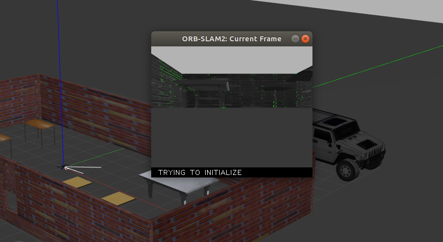

# gazebo环境中的四旋翼单目ORB仿真

## 配置

参考 https://gitee.com/hazyparker/my-research/blob/master/3_Onboard_SLAM/Stereo_ORB_Sim.md

## 添加相机

* 在`px4/launch`中找`mavros_posix_sitl.launch`
* 拷贝一份作备份
* 修改如下

```xml
    <!-- vehicle model and world -->
    <arg name="est" default="ekf2"/>
    <arg name="vehicle" default="iris"/>
    <!-- add mono camera for iris -->
    <arg name="my_camera" default="iris_fpv_cam"/>
    <arg name="world" default="$(find mavlink_sitl_gazebo)/worlds/empty.world"/>
    <!-- also need to revise sdf -->
    <arg name="sdf" default="$(find mavlink_sitl_gazebo)/models/$(arg my_camera)/$(arg my_camera).sdf"/>
    <!-- <arg name="sdf" default="$(find mavlink_sitl_gazebo)/models/$(arg vehicle)/$(arg vehicle).sdf"/> -->
```

## 运行

双目时，我用的：

```shell
$ rosrun ORB_SLAM2 Stereo ~/catkin_ws/src/ORB_SLAM2/Vocabulary/ORBvoc.txt ~/catkin_ws/src/ORB_SLAM2/Examples/Stereo/px4_sitl.yaml true /camera/left/image_raw:=/stereo/left/image_raw /camera/right/image_raw:=/stereo/right/image_raw /orbslam2/vision_pose/pose:=/mavros/vision_pose/pose
```

但是单目用类似的一直报错，直到我删掉了true：

```shell
$ rosrun ORB_SLAM2 Mono ~/catkin_ws/src/ORB_SLAM2/Vocabulary/ORBvoc.txt ~/catkin_ws/src/ORB_SLAM2/Examples/Monocular/px4_sitl.yaml /camera/image_raw:=/iris/usb_cam/image_raw  /orbslam2/vision_pose/pose:=/mavros/vision_pose/pose
```



## bug

现阶段使用视觉定位时仍存在无法起飞的bug（如果是自建场景且使用master的`PX4`）；

bug仍没找到解决办法，建议取消视觉定位，打开GPS；或将模式改为25，这样仍可以使用GPS（具体编号对应的模式可以在地面站中查到）；