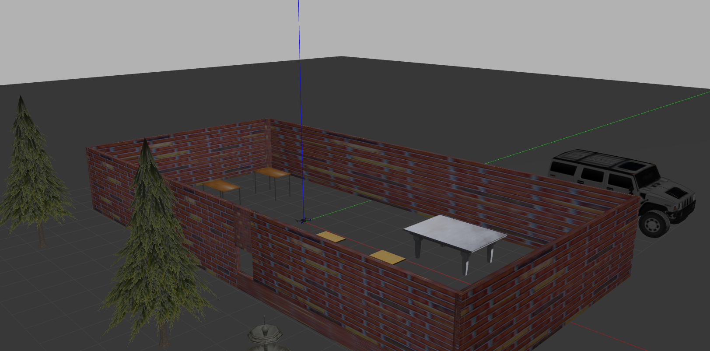
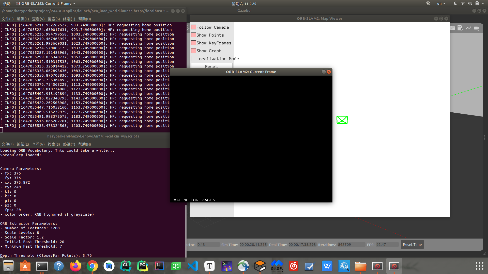
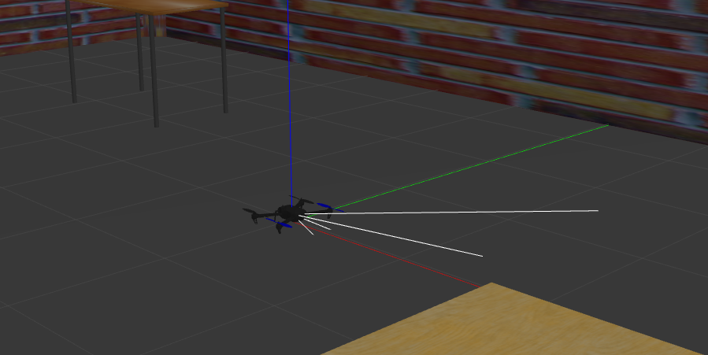
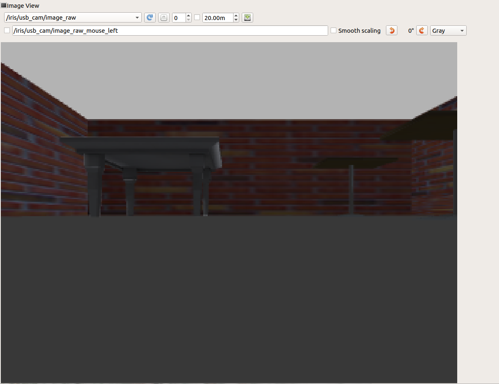
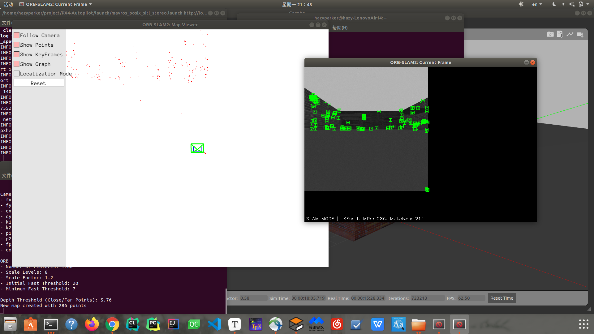
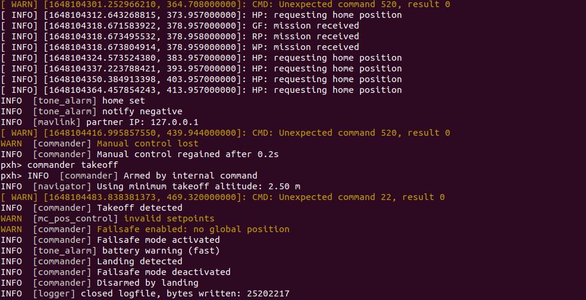

# On-board SLAM

SLAM on single UAV (in `gazebo`)

## `XTDrone` Methods

### EKF configure of PX4 software

Remove `GPS` , using Visual SLAM instead.

* `XTDrone` Doc- [PX4 EKF settings](https://www.yuque.com/xtdrone/manual_cn/ekf_settings)

edit `rcS`

```shell
gedit ~/PX4_Firmware/ROMFS/px4fmu_common/init.d-posix/rcS
```

found it's empty. However, file's  github version is not empty but filled like below:

https://github.com/PX4/PX4-Autopilot/blob/master/ROMFS/px4fmu_common/init.d-posix/rcS

```shell
#!/bin/sh

set -e

# PX4 commands need the 'px4-' prefix in bash.
# (px4-alias.sh is expected to be in the PATH)
# shellcheck disable=SC1091
. px4-alias.sh

#search path for sourcing px4-rc.*
PATH="$PATH:${R}etc/init.d-posix"

#
# Main SITL startup script
#

# check for ekf2 replay
# shellcheck disable=SC2154
if [ "$replay_mode" = "ekf2" ]
then
	. ${R}etc/init.d-posix/rc.replay
	exit 0
fi

# initialize script variables
set IO_PRESENT                  no
set MAV_TYPE                    none
set MIXER                       none
set MIXER_AUX                   none
set MIXER_FILE                  none
set OUTPUT_MODE                 sim
set EXTRA_MIXER_MODE            none
set PWM_OUT                     none
set SDCARD_MIXERS_PATH          etc/mixers
set USE_IO                      no
set VEHICLE_TYPE                none
set LOGGER_ARGS                 ""
set LOGGER_BUF                  1000

set RUN_MINIMAL_SHELL           no

# Use the variable set by sitl_run.sh to choose the model settings.
if [ "$PX4_SIM_MODEL" = "shell" ]; then
	set RUN_MINIMAL_SHELL yes
else
	# Find the matching Autostart ID (file name has the form: [0-9]+_${PX4_SIM_MODEL})
	# TODO: unify with rc.autostart generation
	# shellcheck disable=SC2012
	REQUESTED_AUTOSTART=$(ls "${R}etc/init.d-posix/airframes" | sed -n 's/^\([0-9][0-9]*\)_'${PX4_SIM_MODEL}'$/\1/p')
	if [ -z "$REQUESTED_AUTOSTART" ]; then
		echo "ERROR  [init] Unknown model $PX4_SIM_MODEL (not found by name on ${R}etc/init.d-posix/airframes)"
		exit 1
	else
		echo "INFO  [init] found model autostart file as SYS_AUTOSTART=$REQUESTED_AUTOSTART"
	fi
fi

# Load parameters
set PARAM_FILE eeprom/parameters_"$REQUESTED_AUTOSTART"
param select $PARAM_FILE

if [ -f $PARAM_FILE ]
then
	if param load
	then
		echo "[param] Loaded: $PARAM_FILE"
	else
		echo "[param] FAILED loading $PARAM_FILE"
	fi
else
	echo "[param] parameter file not found, creating $PARAM_FILE"
fi

# exit early when the minimal shell is requested
[ $RUN_MINIMAL_SHELL = yes ] && exit 0


# Use environment variable PX4_ESTIMATOR to choose estimator.
if [ "$PX4_ESTIMATOR" = "q" ]; then
	param set SYS_MC_EST_GROUP 3
elif [ "$PX4_ESTIMATOR" = "ekf2" ]; then
	param set SYS_MC_EST_GROUP 2
elif [ "$PX4_ESTIMATOR" = "lpe" ]; then
	param set SYS_MC_EST_GROUP 1
elif [ "$PX4_ESTIMATOR" = "inav" ]; then
	param set SYS_MC_EST_GROUP 0
fi

if param compare SYS_AUTOSTART $REQUESTED_AUTOSTART
then
	set AUTOCNF no
else
	set AUTOCNF yes
	param set SYS_AUTOCONFIG 1
fi

if param compare SYS_AUTOCONFIG 1
then
	set AUTOCNF yes

	# Wipe out params except RC*, flight modes, total flight time, accel cal, gyro cal, next flight UUID
	param reset_all SYS_AUTO* RC* COM_FLTMODE* LND_FLIGHT* TC_* CAL_ACC* CAL_GYRO* COM_FLIGHT*
fi

# multi-instance setup
# shellcheck disable=SC2154
param set MAV_SYS_ID $((px4_instance+1))

if [ $AUTOCNF = yes ]
then
	param set SYS_AUTOSTART $REQUESTED_AUTOSTART

	param set CAL_ACC0_ID  1310988 # 1310988: DRV_IMU_DEVTYPE_SIM, BUS: 1, ADDR: 1, TYPE: SIMULATION
	param set CAL_GYRO0_ID 1310988 # 1310988: DRV_IMU_DEVTYPE_SIM, BUS: 1, ADDR: 1, TYPE: SIMULATION
	param set CAL_ACC1_ID  1310996 # 1310996: DRV_IMU_DEVTYPE_SIM, BUS: 2, ADDR: 1, TYPE: SIMULATION
	param set CAL_GYRO1_ID 1310996 # 1310996: DRV_IMU_DEVTYPE_SIM, BUS: 2, ADDR: 1, TYPE: SIMULATION
	param set CAL_ACC2_ID  1311004 # 1311004: DRV_IMU_DEVTYPE_SIM, BUS: 3, ADDR: 1, TYPE: SIMULATION
	param set CAL_GYRO2_ID 1311004 # 1311004: DRV_IMU_DEVTYPE_SIM, BUS: 3, ADDR: 1, TYPE: SIMULATION

	param set CAL_MAG0_ID 197388
	param set CAL_MAG1_ID 197644

	param set SENS_BOARD_X_OFF 0.000001
	param set SENS_DPRES_OFF 0.001
fi

param set-default BAT1_N_CELLS 4

param set-default CBRK_AIRSPD_CHK 0
param set-default CBRK_SUPPLY_CHK 894281

# disable check, no CPU load reported on posix yet
param set-default COM_CPU_MAX -1

# Don't require RC calibration and configuration
param set-default COM_RC_IN_MODE 1

# Speedup SITL startup
param set-default EKF2_REQ_GPS_H 0.5

# Multi-EKF
param set-default EKF2_MULTI_IMU 3
param set-default SENS_IMU_MODE 0
param set-default EKF2_MULTI_MAG 2
param set-default SENS_MAG_MODE 0

param set-default IMU_GYRO_FFT_EN 1

param set-default -s MC_AT_EN 1

# By default log from boot until first disarm.
param set-default SDLOG_MODE 1
# enable default, estimator replay and vision/avoidance logging profiles
param set-default SDLOG_PROFILE 131
param set-default SDLOG_DIRS_MAX 7

param set-default TRIG_INTERFACE 3

# Adapt timeout parameters if simulation runs faster or slower than realtime.
if [ -n "$PX4_SIM_SPEED_FACTOR" ]; then
	COM_DL_LOSS_T_LONGER=$(echo "$PX4_SIM_SPEED_FACTOR * 10" | bc)
	echo "COM_DL_LOSS_T set to $COM_DL_LOSS_T_LONGER"
	param set COM_DL_LOSS_T $COM_DL_LOSS_T_LONGER

	COM_RC_LOSS_T_LONGER=$(echo "$PX4_SIM_SPEED_FACTOR * 0.5" | bc)
	echo "COM_RC_LOSS_T set to $COM_RC_LOSS_T_LONGER"
	param set COM_RC_LOSS_T $COM_RC_LOSS_T_LONGER

	COM_OF_LOSS_T_LONGER=$(echo "$PX4_SIM_SPEED_FACTOR * 0.5" | bc)
	echo "COM_OF_LOSS_T set to $COM_OF_LOSS_T_LONGER"
	param set COM_OF_LOSS_T $COM_OF_LOSS_T_LONGER

	COM_OBC_LOSS_T_LONGER=$(echo "$PX4_SIM_SPEED_FACTOR * 5.0" | bc)
	echo "COM_OBC_LOSS_T set to $COM_OBC_LOSS_T_LONGER"
	param set COM_OBC_LOSS_T $COM_OBC_LOSS_T_LONGER
fi

# Autostart ID
autostart_file=''
# shellcheck disable=SC2231
for f in ${R}etc/init.d-posix/airframes/"$(param show -q SYS_AUTOSTART)"_*
do
	filename=$(basename "$f")
	case "$filename" in
		*\.*)
			# ignore files that contain a dot (e.g. <vehicle>.post)
			;;
		*)
			autostart_file="$f"
			;;
	esac
done
if [ ! -e "$autostart_file" ]; then
	echo "Error: no autostart file found ($autostart_file)"
	exit 1
fi

. "$autostart_file"

#
# If autoconfig parameter was set, reset it and save parameters.
#
if [ $AUTOCNF = yes ]
then
	param set SYS_AUTOCONFIG 0
fi

# Simulator IMU data provided at 250 Hz
param set IMU_INTEG_RATE 250

#user defined params for instances can be in PATH
. px4-rc.params

dataman start
# only start the simulator if not in replay mode, as both control the lockstep time
if ! replay tryapplyparams
then
  . px4-rc.simulator
fi
load_mon start
battery_simulator start
tone_alarm start
rc_update start
manual_control start
sensors start
commander start
navigator start

# Try to start the micrortps_client with UDP transport if module exists
if px4-micrortps_client status > /dev/null 2>&1
then
	. px4-rc.rtps
fi

if param greater -s MNT_MODE_IN -1
then
	gimbal start
fi

if param greater -s TRIG_MODE 0
then
	camera_trigger start
	camera_feedback start
fi

if param compare -s IMU_GYRO_FFT_EN 1
then
	gyro_fft start
fi

if param compare -s IMU_GYRO_CAL_EN 1
then
	gyro_calibration start
fi

# Configure vehicle type specific parameters.
# Note: rc.vehicle_setup is the entry point for rc.interface,
#       rc.fw_apps, rc.mc_apps, rc.rover_apps, and rc.vtol_apps.
#
. ${R}etc/init.d/rc.vehicle_setup

#user defined mavlink streams for instances can be in PATH
. px4-rc.mavlink

# execute autostart post script if any
[ -e "$autostart_file".post ] && . "$autostart_file".post

# Run script to start logging
if param compare SYS_MC_EST_GROUP 2
then
	set LOGGER_ARGS "-p ekf2_timestamps"
else
	set LOGGER_ARGS "-p vehicle_attitude"
fi
. ${R}etc/init.d/rc.logging

mavlink boot_complete
replay trystart 
```

What Instruction want me to do is:

```shell
	# GPS used
	#param set EKF2_AID_MASK 1
	# Vision used and GPS denied
	param set EKF2_AID_MASK 24

	# Barometer used for hight measurement
	#param set EKF2_HGT_MODE 0
	# Barometer denied and vision used for hight measurement
	param set EKF2_HGT_MODE 3
```

no such configuration named `EKF2_AID` or `EKF2_HGT`

see if  `XTDrone` can help...

```
	param set EKF2_AID_MASK 1
	param set EKF2_ANGERR_INIT 0.01
	param set EKF2_HGT_MODE 0
	param set EKF2_GBIAS_INIT 0.01
```

they have such settings.

refer here: https://docs.px4.io/master/en/concept/system_startup.html

重启仿真前，需要删除上一次记录在虚拟`eeprom`中的参数文件，否则仿真程序会读取该参数文件，导致本次`rcS`的修改不能生效

```shell
rm ~/.ros/eeprom/parameters*
rm -rf ~/.ros/sitl*
```

### Visual SLAM on UAV, `XTDrone`'s version

* [视觉SLAM](https://www.yuque.com/xtdrone/manual_cn/vslam)

```shell
$ roslaunch px4 indoor1.launch
```

can't locate `indoor1.launch`, no such file in `px4-Auto pilot` and `px4 xtdrone`

**skip launch file**

```shell
cd ~/catkin_ws/scripts/
sh xtdrone_run_stereo.sh
```

about `xtdrone_run_stereo.sh`:

```shell
rosrun ORB_SLAM2 Stereo ~/catkin_ws/src/ORB_SLAM2/Vocabulary/ORBvoc.txt ~/catkin_ws/src/ORB_SLAM2/Examples/Stereo/px4_sitl.yaml true /camera/left/image_raw:=/iris_0/stereo_camera/left/image_raw /camera/right/image_raw:=/iris_0/stereo_camera/right/image_raw /orbslam2/vision_pose/pose:=/iris_0/mavros/vision_pose/pose
```

默认`xtdrone_run_stereo.sh`脚本是用于`iris_0`的，如果是给别的vehicle提供，需要修改该脚本，将`iris_0`换为其他vehicle

* ` ~/catkin_ws/src/ORB_SLAM2/Vocabulary/ORBvoc.txt`, `ORB` staff
* `~/catkin_ws/src/ORB_SLAM2/Examples/Stereo/px4_sitl.yaml true`
* `/camera/left/image_raw:=/iris_0/stereo_camera/left/image_raw`
* `/camera/right/image_raw:=/iris_0/stereo_camera/right/image_raw`
* `/orbslam2/vision_pose/pose:=/iris_0/mavros/vision_pose/pose`

[Analysis of `xtdrone_run_stereo.sh`](XTDrone_Method/Analysis_run_stereo.md)

## Make World in Gazebo

link here : [`README.md` of gazebo part](gazebo_model/README.md)

* [Instruction: How to make own world in gazebo and launch it](https://www.cxymm.net/article/qq_44725448/109638990)
* [Gazebo仿真平台模型搭建与修改](https://blog.csdn.net/qq_33742147/article/details/105437418)



```shell
$ cd px4
$ roslaunch px4 px4_load_world.launch
```

## Run `ORB_SLAM2` in new World(Stereo)

create `run_stereo.sh`

```shell
rosrun ORB_SLAM2 Stereo ~/catkin_ws/src/ORB_SLAM2/Vocabulary/ORBvoc.txt ~/catkin_ws/src/ORB_SLAM2/Examples/Stereo/px4_sitl.yaml true /camera/left/image_raw:=/iris_0/stereo_camera/left/image_raw /camera/right/image_raw:=/iris_0/stereo_camera/right/image_raw /orbslam2/vision_pose/pose:=/iris_0/mavros/vision_pose/pose
```

attention on `px4_sitl.yaml`, some ORB settings, [px4_sitl.yaml](gazebo_model/launch/px4_sitl.yaml)

step 1

```shell
$ roslaunch px4 px4_load_world.launch
```

step 2

```shell
$ sh run_stereo.sh
```

### ERROR 1



no camera model;

### Add camera

* sensor configuration by `XTDrone`: https://www.yuque.com/xtdrone/manual_cn/sensor_config
* [PX4+gazebo仿真给无人机添加摄像头](https://blog.csdn.net/u013083665/article/details/104840286)

```xml
    <!-- vehicle model and world -->
    <arg name="est" default="ekf2"/>
    <arg name="vehicle" default="iris"/>
    <!-- add stereo camera for iris -->
    <arg name="my_camera" default="iris_stereo_camera"/>
    <arg name="world" default="$(find mavlink_sitl_gazebo)/worlds/empty.world"/>
    <!-- also need to revise sdf -->
    <arg name="sdf" default="$(find mavlink_sitl_gazebo)/models/$(arg my_camera)/$(arg my_camera).sdf"/>
    <!-- <arg name="sdf" default="$(find mavlink_sitl_gazebo)/models/$(arg vehicle)/$(arg vehicle).sdf"/> -->
```

### ERROR 2

```shell
[ERROR] [1647073291.275405, 362.508000]: Spawn service failed. Exiting.
[vehicle_spawn_hazy_LenovoAir14_8698_4148646420794397173-5] process has died [pid 8761, exit code 1, cmd /opt/ros/melodic/lib/gazebo_ros/spawn_model -sdf -file /home/hazyparker/project/PX4-Autopilot/Tools/sitl_gazebo/models/iris_stereo_camera/iris_stereo_camera.sdf -model iris -x 0 -y 0 -z 0 -R 0 -P 0 -Y 0 __name:=vehicle_spawn_hazy_LenovoAir14_8698_4148646420794397173 __log:=/home/hazyparker/.ros/log/6b092dd2-a1dd-11ec-97ad-0c7a150d74d3/vehicle_spawn_hazy_LenovoAir14_8698_4148646420794397173-5.log].
log file: /home/hazyparker/.ros/log/6b092dd2-a1dd-11ec-97ad-0c7a150d74d3/vehicle_spawn_hazy_LenovoAir14_8698_4148646420794397173-5*.log
```

```shell
[ INFO] [1647073322.076330331, 383.762000000]: HP: requesting home position
[ INFO] [1647073335.938856747, 393.761000000]: HP: requesting home position
[ INFO] [1647073350.563281140, 403.761000000]: HP: requesting home position
[ INFO] [1647073365.357790834, 413.761000000]: HP: requesting home position
[ INFO] [1647073380.102181841, 423.761000000]: HP: requesting home position
[ INFO] [1647073394.585695376, 433.761000000]: HP: requesting home position
```

log here:

```shell
[rospy.client][INFO] 2022-03-12 16:21:31,149: init_node, name[/vehicle_spawn_hazy_LenovoAir14_8698_4148646420794397173], pid[8761]
[xmlrpc][INFO] 2022-03-12 16:21:31,150: XML-RPC server binding to 0.0.0.0:0
[xmlrpc][INFO] 2022-03-12 16:21:31,151: Started XML-RPC server [http://hazy-LenovoAir14:40625/]
[rospy.init][INFO] 2022-03-12 16:21:31,151: ROS Slave URI: [http://hazy-LenovoAir14:40625/]
[rospy.impl.masterslave][INFO] 2022-03-12 16:21:31,151: _ready: http://hazy-LenovoAir14:40625/
[rospy.registration][INFO] 2022-03-12 16:21:31,152: Registering with master node http://localhost:11311
[xmlrpc][INFO] 2022-03-12 16:21:31,152: xml rpc node: starting XML-RPC server
[rospy.init][INFO] 2022-03-12 16:21:31,251: registered with master
[rospy.rosout][INFO] 2022-03-12 16:21:31,251: initializing /rosout core topic
[rospy.rosout][INFO] 2022-03-12 16:21:31,253: connected to core topic /rosout
[rospy.simtime][INFO] 2022-03-12 16:21:31,254: initializing /clock core topic
[rospy.simtime][INFO] 2022-03-12 16:21:31,255: connected to core topic /clock
[rosout][INFO] 2022-03-12 16:21:31,257: Loading model XML from file /home/hazyparker/project/PX4-Autopilot/Tools/sitl_gazebo/models/iris_stereo_camera/iris_stereo_camera.sdf
[rosout][INFO] 2022-03-12 16:21:31,258: Waiting for service /gazebo/spawn_sdf_model
[rosout][INFO] 2022-03-12 16:21:31,260: Calling service /gazebo/spawn_sdf_model
[rospy.internal][INFO] 2022-03-12 16:21:31,266: topic[/clock] adding connection to [http://hazy-LenovoAir14:40611/], count 0
[rosout][INFO] 2022-03-12 16:21:31,274: Spawn status: SpawnModel: Entity pushed to spawn queue, but spawn service timed out waiting for entity to appear in simulation under the name iris
[rosout][ERROR] 2022-03-12 16:21:31,275: Spawn service failed. Exiting.
[rospy.core][INFO] 2022-03-12 16:21:31,276: signal_shutdown [atexit]
[rospy.internal][INFO] 2022-03-12 16:21:31,277: topic[/clock] removing connection to http://hazy-LenovoAir14:40611/
[rospy.impl.masterslave][INFO] 2022-03-12 16:21:31,278: atexit
```

**Spawn status: SpawnModel: Entity pushed to spawn queue, but spawn service timed out waiting for entity to appear in simulation under the name iris**

change `UDP`; from [website](https://blog.csdn.net/Hot_Ant/article/details/122326291?spm=1001.2101.3001.6650.2&utm_medium=distribute.pc_relevant.none-task-blog-2%7Edefault%7ECTRLIST%7ERate-2.pc_relevant_default&depth_1-utm_source=distribute.pc_relevant.none-task-blog-2%7Edefault%7ECTRLIST%7ERate-2.pc_relevant_default&utm_relevant_index=5)

```xml
    <!-- MAVROS configs -->
    <arg name="fcu_url" default="udp://:24540@localhost:14557"/>
```

former one is 14540;

then

```
[ INFO] [1647075235.758740372]: Physics dynamic reconfigure ready.
[INFO] [1647075235.813290, 0.000000]: Loading model XML from file /home/hazyparker/project/PX4-Autopilot/Tools/sitl_gazebo/models/iris_stereo_camera/iris_stereo_camera.sdf
[INFO] [1647075235.814700, 0.000000]: Waiting for service /gazebo/spawn_sdf_model
[INFO] [1647075235.816522, 0.000000]: Calling service /gazebo/spawn_sdf_model
[INFO] [1647075236.060912, 362.611000]: Spawn status: SpawnModel: Successfully spawned entity
[vehicle_spawn_hazy_LenovoAir14_15864_2230318896933430622-5] process has finished cleanly
```

### ERROR 3

```shell
$ rqt_image_view
```

```
terminate called after throwing an instance of 'boost::exception_detail::clone_impl<boost::exception_detail::error_info_injector<boost::lock_error> >'
  what():  boost: mutex lock failed in pthread_mutex_lock: 无效的参数
```

### `rqt_image_view`

UAV with monocular camera:



`rqt_image_view`of monocular camera:



found that topic name is `iris/usb_cam/image_raw`

`usb_cam`? https://blog.csdn.net/KID_yuan/article/details/101272481#t6

in `ros_stereo.cc`

```c++
    message_filters::Subscriber<sensor_msgs::Image> left_sub(nh, "/camera/left/image_raw", 1);
    message_filters::Subscriber<sensor_msgs::Image> right_sub(nh, "camera/right/image_raw", 1);
```

any difference between /camera and camera?

use `rostopic list`

**Monocular**:

```shell
/clock
/diagnostics
/gazebo/link_states
/gazebo/model_states
/gazebo/parameter_descriptions
/gazebo/parameter_updates
/gazebo/set_link_state
/gazebo/set_model_state
/iris/usb_cam/camera_info
/iris/usb_cam/image_raw
/iris/usb_cam/image_raw/compressed
/iris/usb_cam/image_raw/compressed/parameter_descriptions
/iris/usb_cam/image_raw/compressed/parameter_updates
/iris/usb_cam/image_raw/compressedDepth
/iris/usb_cam/image_raw/compressedDepth/parameter_descriptions
/iris/usb_cam/image_raw/compressedDepth/parameter_updates
/iris/usb_cam/image_raw/theora
/iris/usb_cam/image_raw/theora/parameter_descriptions
/iris/usb_cam/image_raw/theora/parameter_updates
/iris/usb_cam/parameter_descriptions
/iris/usb_cam/parameter_updates
/mavlink/from
/mavlink/gcs_ip
/mavlink/to
/mavros/actuator_control
/mavros/adsb/send
/mavros/adsb/vehicle
/mavros/altitude
/mavros/battery
/mavros/battery2
/mavros/cam_imu_sync/cam_imu_stamp
/mavros/camera/image_captured
/mavros/companion_process/status
/mavros/debug_value/debug
/mavros/debug_value/debug_vector
/mavros/debug_value/named_value_float
/mavros/debug_value/named_value_int
/mavros/debug_value/send
/mavros/esc_info
/mavros/esc_status
/mavros/esc_telemetry
/mavros/estimator_status
/mavros/extended_state
/mavros/fake_gps/mocap/tf
/mavros/geofence/waypoints
/mavros/global_position/compass_hdg
/mavros/global_position/global
/mavros/global_position/gp_lp_offset
/mavros/global_position/gp_origin
/mavros/global_position/home
/mavros/global_position/local
/mavros/global_position/raw/fix
/mavros/global_position/raw/gps_vel
/mavros/global_position/raw/satellites
/mavros/global_position/rel_alt
/mavros/global_position/set_gp_origin
/mavros/gps_input/gps_input
/mavros/gps_rtk/rtk_baseline
/mavros/gps_rtk/send_rtcm
/mavros/gpsstatus/gps1/raw
/mavros/gpsstatus/gps1/rtk
/mavros/gpsstatus/gps2/raw
/mavros/gpsstatus/gps2/rtk
/mavros/hil/actuator_controls
/mavros/hil/controls
/mavros/hil/gps
/mavros/hil/imu_ned
/mavros/hil/optical_flow
/mavros/hil/rc_inputs
/mavros/hil/state
/mavros/home_position/home
/mavros/home_position/set
/mavros/imu/data
/mavros/imu/data_raw
/mavros/imu/diff_pressure
/mavros/imu/mag
/mavros/imu/static_pressure
/mavros/imu/temperature_baro
/mavros/imu/temperature_imu
/mavros/landing_target/lt_marker
/mavros/landing_target/pose
/mavros/landing_target/pose_in
/mavros/local_position/accel
/mavros/local_position/odom
/mavros/local_position/pose
/mavros/local_position/pose_cov
/mavros/local_position/velocity_body
/mavros/local_position/velocity_body_cov
/mavros/local_position/velocity_local
/mavros/log_transfer/raw/log_data
/mavros/log_transfer/raw/log_entry
/mavros/mag_calibration/report
/mavros/mag_calibration/status
/mavros/manual_control/control
/mavros/manual_control/send
/mavros/mission/reached
/mavros/mission/waypoints
/mavros/mocap/pose
/mavros/mount_control/command
/mavros/mount_control/orientation
/mavros/mount_control/status
/mavros/nav_controller_output
/mavros/obstacle/send
/mavros/odometry/in
/mavros/odometry/out
/mavros/onboard_computer/status
/mavros/param/param_value
/mavros/play_tune
/mavros/px4flow/ground_distance
/mavros/px4flow/raw/optical_flow_rad
/mavros/px4flow/raw/send
/mavros/px4flow/temperature
/mavros/radio_status
/mavros/rallypoint/waypoints
/mavros/rc/in
/mavros/rc/out
/mavros/rc/override
/mavros/setpoint_accel/accel
/mavros/setpoint_attitude/cmd_vel
/mavros/setpoint_attitude/thrust
/mavros/setpoint_position/global
/mavros/setpoint_position/global_to_local
/mavros/setpoint_position/local
/mavros/setpoint_raw/attitude
/mavros/setpoint_raw/global
/mavros/setpoint_raw/local
/mavros/setpoint_raw/target_attitude
/mavros/setpoint_raw/target_global
/mavros/setpoint_raw/target_local
/mavros/setpoint_trajectory/desired
/mavros/setpoint_trajectory/local
/mavros/setpoint_velocity/cmd_vel
/mavros/setpoint_velocity/cmd_vel_unstamped
/mavros/state
/mavros/statustext/recv
/mavros/statustext/send
/mavros/target_actuator_control
/mavros/terrain/report
/mavros/time_reference
/mavros/timesync_status
/mavros/trajectory/desired
/mavros/trajectory/generated
/mavros/trajectory/path
/mavros/tunnel/in
/mavros/tunnel/out
/mavros/vfr_hud
/mavros/vision_pose/pose
/mavros/vision_pose/pose_cov
/mavros/vision_speed/speed_twist_cov
/mavros/wind_estimation
/rosout
/rosout_agg
/tf
/tf_static
```

camera information here:

```
/iris/usb_cam/camera_info
/iris/usb_cam/image_raw
/iris/usb_cam/image_raw/compressed
/iris/usb_cam/image_raw/compressed/parameter_descriptions
/iris/usb_cam/image_raw/compressed/parameter_updates
/iris/usb_cam/image_raw/compressedDepth
/iris/usb_cam/image_raw/compressedDepth/parameter_descriptions
/iris/usb_cam/image_raw/compressedDepth/parameter_updates
/iris/usb_cam/image_raw/theora
/iris/usb_cam/image_raw/theora/parameter_descriptions
/iris/usb_cam/image_raw/theora/parameter_updates
/iris/usb_cam/parameter_descriptions
/iris/usb_cam/parameter_updates
```

However, for **Stereo**

```
/clock
/diagnostics
/gazebo/link_states
/gazebo/model_states
/gazebo/parameter_descriptions
/gazebo/parameter_updates
/gazebo/set_link_state
/gazebo/set_model_state
/mavlink/from
/mavlink/gcs_ip
/mavlink/to
/mavros/actuator_control
/mavros/adsb/send
/mavros/adsb/vehicle
/mavros/altitude
/mavros/battery
/mavros/battery2
/mavros/cam_imu_sync/cam_imu_stamp
/mavros/camera/image_captured
/mavros/companion_process/status
/mavros/debug_value/debug
/mavros/debug_value/debug_vector
/mavros/debug_value/named_value_float
/mavros/debug_value/named_value_int
/mavros/debug_value/send
/mavros/esc_info
/mavros/esc_status
/mavros/esc_telemetry
/mavros/estimator_status
/mavros/extended_state
/mavros/fake_gps/mocap/tf
/mavros/geofence/waypoints
/mavros/global_position/compass_hdg
/mavros/global_position/global
/mavros/global_position/gp_lp_offset
/mavros/global_position/gp_origin
/mavros/global_position/home
/mavros/global_position/local
/mavros/global_position/raw/fix
/mavros/global_position/raw/gps_vel
/mavros/global_position/raw/satellites
/mavros/global_position/rel_alt
/mavros/global_position/set_gp_origin
/mavros/gps_input/gps_input
/mavros/gps_rtk/rtk_baseline
/mavros/gps_rtk/send_rtcm
/mavros/gpsstatus/gps1/raw
/mavros/gpsstatus/gps1/rtk
/mavros/gpsstatus/gps2/raw
/mavros/gpsstatus/gps2/rtk
/mavros/hil/actuator_controls
/mavros/hil/controls
/mavros/hil/gps
/mavros/hil/imu_ned
/mavros/hil/optical_flow
/mavros/hil/rc_inputs
/mavros/hil/state
/mavros/home_position/home
/mavros/home_position/set
/mavros/imu/data
/mavros/imu/data_raw
/mavros/imu/diff_pressure
/mavros/imu/mag
/mavros/imu/static_pressure
/mavros/imu/temperature_baro
/mavros/imu/temperature_imu
/mavros/landing_target/lt_marker
/mavros/landing_target/pose
/mavros/landing_target/pose_in
/mavros/local_position/accel
/mavros/local_position/odom
/mavros/local_position/pose
/mavros/local_position/pose_cov
/mavros/local_position/velocity_body
/mavros/local_position/velocity_body_cov
/mavros/local_position/velocity_local
/mavros/log_transfer/raw/log_data
/mavros/log_transfer/raw/log_entry
/mavros/mag_calibration/report
/mavros/mag_calibration/status
/mavros/manual_control/control
/mavros/manual_control/send
/mavros/mission/reached
/mavros/mission/waypoints
/mavros/mocap/pose
/mavros/mount_control/command
/mavros/mount_control/orientation
/mavros/mount_control/status
/mavros/nav_controller_output
/mavros/obstacle/send
/mavros/odometry/in
/mavros/odometry/out
/mavros/onboard_computer/status
/mavros/param/param_value
/mavros/play_tune
/mavros/px4flow/ground_distance
/mavros/px4flow/raw/optical_flow_rad
/mavros/px4flow/raw/send
/mavros/px4flow/temperature
/mavros/radio_status
/mavros/rallypoint/waypoints
/mavros/rc/in
/mavros/rc/out
/mavros/rc/override
/mavros/setpoint_accel/accel
/mavros/setpoint_attitude/cmd_vel
/mavros/setpoint_attitude/thrust
/mavros/setpoint_position/global
/mavros/setpoint_position/global_to_local
/mavros/setpoint_position/local
/mavros/setpoint_raw/attitude
/mavros/setpoint_raw/global
/mavros/setpoint_raw/local
/mavros/setpoint_raw/target_attitude
/mavros/setpoint_raw/target_global
/mavros/setpoint_raw/target_local
/mavros/setpoint_trajectory/desired
/mavros/setpoint_trajectory/local
/mavros/setpoint_velocity/cmd_vel
/mavros/setpoint_velocity/cmd_vel_unstamped
/mavros/state
/mavros/statustext/recv
/mavros/statustext/send
/mavros/target_actuator_control
/mavros/terrain/report
/mavros/time_reference
/mavros/timesync_status
/mavros/trajectory/desired
/mavros/trajectory/generated
/mavros/trajectory/path
/mavros/tunnel/in
/mavros/tunnel/out
/mavros/vfr_hud
/mavros/vision_pose/pose
/mavros/vision_pose/pose_cov
/mavros/vision_speed/speed_twist_cov
/mavros/wind_estimation
/rosout
/rosout_agg
/tf
/tf_static
```

no information about `iris`, why?

### Reason(bug)

refer to https://www.yuque.com/xtdrone/manual_cn/sensor_config: `XTDrone`

```xml
 <joint name="stereo_joint" type="fixed">
      <child>stereo_camera::link</child>
      <parent>base_link</parent>
      <axis>
        <xyz>0 0 1</xyz>
        <limit>
          <upper>0</upper>
          <lower>0</lower>
        </limit>
      </axis>
    </joint>
```

while local version is:

```xml
<joint name="stereo_camera_joint" type="revolute">
      <child>stereo_camera::link</child>
      <parent>iris::base_link</parent>
      <axis>
        <xyz>0 0 1</xyz>
        <limit>
          <upper>0</upper>
          <lower>0</lower>
        </limit>
      </axis>
    </joint>
```

there are 2 differences:

* type: fixed or revolute
* `base_link` or `iris::base_link`

see `iris_fpv_cam` for details:

```xml
<joint name="fpv_cam_joint" type="fixed">
      <child>fpv_cam::link</child>
      <parent>iris::base_link</parent>
      <axis>
        <xyz>0 0 1</xyz>
        <limit>
          <upper>0</upper>
          <lower>0</lower>
        </limit>
      </axis>
    </joint>
```

so if I change `iris_stereo_camera` to:

```xml
<joint name="stereo_camera_joint" type="fixed">
      <child>stereo_camera::link</child>
      <parent>iris::base_link</parent>
      <axis>
        <xyz>0 0 1</xyz>
        <limit>
          <upper>0</upper>
          <lower>0</lower>
        </limit>
      </axis>
    </joint>
```

still no topic named iris.

* https://ask.csdn.net/questions/7662410?spm=1001.2014.3001.5505
* https://discuss.px4.io/t/how-to-add-stereo-camera-to-uav-in-gazebo/26570
* https://answers.ros.org/question/397520/how-to-add-a-stereo-camera-on-uav-in-gazebo-px4/
* https://www.guyuehome.com/bubble/detail/id/66454
* https://bbs.amovlab.com/forum.php?mod=viewthread&tid=31788&extra=

no solution offered by above websites, but I found mine;

**Solution!**

delete `stereo_camera` file in `.gazebo/models`;

then gazebo will use model in `px4/tool/stil_gazebo/models/stereo_camera`

and `rostopic list` got answers:

```
/stereo/left/camera_info
/stereo/left/image_raw
/stereo/left/image_raw/compressed
/stereo/left/image_raw/compressed/parameter_descriptions
/stereo/left/image_raw/compressed/parameter_updates
/stereo/left/image_raw/compressedDepth
/stereo/left/image_raw/compressedDepth/parameter_descriptions
/stereo/left/image_raw/compressedDepth/parameter_updates
/stereo/left/image_raw/theora
/stereo/left/image_raw/theora/parameter_descriptions
/stereo/left/image_raw/theora/parameter_updates
/stereo/left/parameter_descriptions
/stereo/left/parameter_updates
/stereo/right/camera_info
/stereo/right/image_raw
/stereo/right/image_raw/compressed
/stereo/right/image_raw/compressed/parameter_descriptions
/stereo/right/image_raw/compressed/parameter_updates
/stereo/right/image_raw/compressedDepth
/stereo/right/image_raw/compressedDepth/parameter_descriptions
/stereo/right/image_raw/compressedDepth/parameter_updates
/stereo/right/image_raw/theora
/stereo/right/image_raw/theora/parameter_descriptions
/stereo/right/image_raw/theora/parameter_updates
/stereo/right/parameter_descriptions
/stereo/right/parameter_updates
```

image can also be delivered in `rqt_image_view`;

But there is still nothing in `ORB_SLAM2` window;

I run `rostopic list` again when `ORB_SLAM2` is running, got new topics:

```
/iris_0/stereo_camera/left/image_raw
/iris_0/stereo_camera/right/image_raw
```

familiar? that's defined in `run_stereo.sh`

```shell
rosrun ORB_SLAM2 Stereo ~/catkin_ws/src/ORB_SLAM2/Vocabulary/ORBvoc.txt ~/catkin_ws/src/ORB_SLAM2/Examples/Stereo/px4_sitl.yaml true /camera/left/image_raw:=/iris_0/stereo_camera/left/image_raw /camera/right/image_raw:=/iris_0/stereo_camera/right/image_raw /orbslam2/vision_pose/pose:=/iris_0/mavros/vision_pose/pose
```

what if I change `/iris_0/stereo_camera/right/image_raw` into `stereo/right/image_raw`

```
rosrun ORB_SLAM2 Stereo ~/catkin_ws/src/ORB_SLAM2/Vocabulary/ORBvoc.txt ~/catkin_ws/src/ORB_SLAM2/Examples/Stereo/px4_sitl.yaml true /camera/left/image_raw:=/stereo/left/image_raw /camera/right/image_raw:=/stereo/right/image_raw /orbslam2/vision_pose/pose:=/mavros/vision_pose/pose
```

BUG FIXED!!!

### Result

[overall](Stereo_ORB_Sim.md)



## Run Monocular `ORB_SLAM2`

edit `.sh` file

```shell
rosrun ORB_SLAM2 Mono ~/catkin_ws/src/ORB_SLAM2/Vocabulary/ORBvoc.txt ~/catkin_ws/src/ORB_SLAM2/Examples/Monocular/TUM1.yaml true /camera/image_raw:=/iris_0/usb_cam/image_raw  /orbslam2/vision_pose/pose:=/iris_0/mavros/vision_pose/pose
```

### ERROR 1

```
rosrun ORB_SLAM2 Mono ~/catkin_ws/src/ORB_SLAM2/Vocabulary/ORBvoc.txt ~/catkin_ws/src/ORB_SLAM2/Examples/Monocular/px4_sitl.yaml true /camera/image_raw:=/iris/usb_cam/image_raw  /orbslam2/vision_pose/pose:=/mavros/vision_pose/pose
```

```shell
Usage: rosrun ORB_SLAM2 Mono path_to_vocabulary path_to_settings
```

in `ros_mono.cc`:

```c++
int main(int argc, char **argv)
{
    ros::init(argc, argv, "Mono");
    ros::start();

    if(argc != 3)
    {
        cerr << endl << "Usage: rosrun ORB_SLAM2 Mono path_to_vocabulary path_to_settings" << endl;        
        ros::shutdown();
        return 1;
    }
}
```

reason unknown;

if use `rosrun ORB_SLAM2 Mono ~/catkin_ws/src/ORB_SLAM2/Vocabulary/ORBvoc.txt ~/catkin_ws/src/ORB_SLAM2/Examples/Monocular/px4_sitl.yaml`, ORB is fine;

however, `rosrun ORB_SLAM2 Mono ~/catkin_ws/src/ORB_SLAM2/Vocabulary/ORBvoc.txt ~/catkin_ws/src/ORB_SLAM2/Examples/Monocular/px4_sitl.yaml true ` failed.

add succeeded.

so the `.sh` file should be:

```
rosrun ORB_SLAM2 Mono ~/catkin_ws/src/ORB_SLAM2/Vocabulary/ORBvoc.txt ~/catkin_ws/src/ORB_SLAM2/Examples/Monocular/px4_sitl.yaml /camera/image_raw:=/iris/usb_cam/image_raw  /orbslam2/vision_pose/pose:=/mavros/vision_pose/pose
```

### Result


still trying to initialize, too few feature points got.

## Get UAV moved

### ERROR 1

after running `ORB_SLAM2` by stereo camera on iris, I tried `commander takeoff`

```shell
pxh> WARN  [commander] Takeoff denied! Please disarm and retry
WARN  [commander] Failsafe enabled: no RC
INFO  [logger] closed logfile, bytes written: 1817589
INFO  [mavlink] partner IP: 127.0.0.1
WARN  [commander] Takeoff denied! Please disarm and retry
```

refer to this comment: https://github.com/Microsoft/AirSim/issues/201#issuecomment-300082675

change my `udp` to 14540;

### ERROR 2

```
[ INFO] [1647332081.616824996, 463.948000000]: HP: requesting home position
WARN  [commander] Failsafe enabled: no RC and no offboard
[ERROR] [1647332086.858252172, 466.871000000]: FCU: Failsafe enabled: no RC and no offboard
[ INFO] [1647332086.916993721, 466.923000000]: FCU: Failsafe mode activated
[ INFO] [1647332097.829447664, 473.031000000]: FCU: DISARMED by Auto disarm initiated
[ INFO] [1647332099.221400643, 473.948000000]: HP: requesting home position
INFO  [logger] closed logfile, bytes written: 560350
[ INFO] [1647332116.884205512, 483.948000000]: HP: requesting home position
[ INFO] [1647332134.370511761, 493.948000000]: HP: requesting home position
[ INFO] [1647332152.956565434, 503.948000000]: HP: requesting home position
[ INFO] [1647332168.367523905, 513.948000000]: HP: requesting home position
[ INFO] [1647332183.421351360, 523.949000000]: HP: requesting home position
[ INFO] [1647332198.407902287, 533.948000000]: HP: requesting home position
[ INFO] [1647332212.284682896, 543.948000000]: HP: requesting home position
```

* https://discuss.px4.io/t/error-hp-requesting-home-position/26521
* https://www.guyuehome.com/bubble/detail/id/66457
* https://ask.csdn.net/questions/7663131?weChatOA=weChatOA1
* https://github.com/PX4/PX4-Autopilot/issues/15619, not so connected
* https://www.yuque.com/xtdrone/manual_cn/vslam#comment-22054636

in https://airsim-fork.readthedocs.io/en/latest/px4_sitl.html:  If you attempt to takeoff without a home position you will see the message:

```
WARN  [commander] Takeoff denied, disarm and re-try
```

```
param set LPE_LAT 47.641468
param set LPE_LON -122.140165
```

useless.


in `XTDrone`在另一个终端启动，

```
cd ~/XTDrone/communication
```

```
python multirotor_communication.py iris 0
```

建立通信后，启动键盘控制，即可飞行

```
cd ~/XTDrone/control/keyboard
```

```
python multirotor_keyboard_control.py iris 1 vel
```

### Fix bug

[link to detailed file](ekf/README.md)



## VINS fusion

[VINS_SIM.md](VINS_Sim.md)
