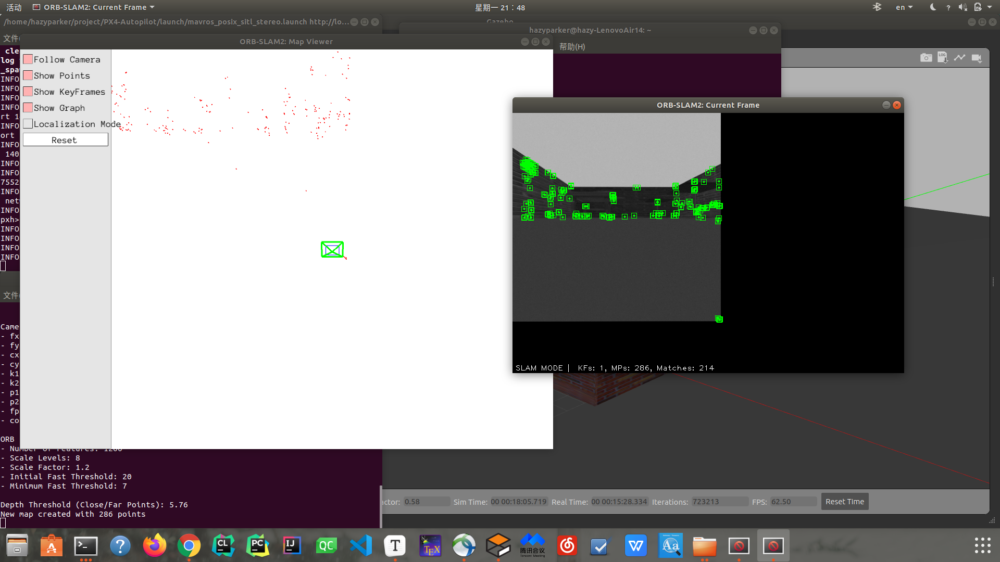

# gazebo环境中的四旋翼双目ORB仿真

## ORB SLAM2的编译

* [github project link](https://github.com/raulmur/ORB_SLAM2)
* [ORB-SLAM2的安装与运行](https://blog.csdn.net/learning_tortosie/article/details/79881165)

### Build

```shell
cd ORB_SLAM2
chmod +x build.sh
./build.sh
```

### Build in ROS

* copy `ORB_SLAM2` to `catkin_ws/src`
* add Path, `export ROS_PACKAGE_PATH=$ROS_PACKAGE_PATH:~/catkin_ws/src/ORB_SLAM2/Examples/ROS` to `.bashrc`
* `source ~/.bashrc`

in file `catkin_ws/src/ORB_SLAM2`

```shell
chmod +x build_ros.sh
./build_ros.sh
```

遇到的BUG基本上找关键词然后在网上可以解决，也可以参考[ORB SLAM2 configuration(with bugs fixed)](https://gitee.com/hazyparker/my-research/tree/master/2_SLAM#orb-slam2)，我应该是遇到了比较多的bug

## gazebo中world的搭建

* [gazebo_model_design](https://gitee.com/hazyparker/my-research/blob/master/3_Onboard_SLAM/gazebo_model/README.md)

## 双目相机的搭建

* 在`px4/launch`中找`mavros_posix_sitl.launch`
* 拷贝一份作备份
* 修改如下

```xml
    <!-- vehicle model and world -->
    <arg name="est" default="ekf2"/>
    <arg name="vehicle" default="iris"/>
    <!-- add stereo camera for iris -->
    <arg name="my_camera" default="iris_stereo_camera"/>
    <arg name="world" default="$(find mavlink_sitl_gazebo)/worlds/empty.world"/>
    <!-- also need to revise sdf -->
    <arg name="sdf" default="$(find mavlink_sitl_gazebo)/models/$(arg my_camera)/$(arg my_camera).sdf"/>
    <!-- <arg name="sdf" default="$(find mavlink_sitl_gazebo)/models/$(arg vehicle)/$(arg vehicle).sdf"/> -->
```

* 在`.gazebo/models`中删除`stereo_camera`，因为默认先选这个，这里要用`px4/tools/sitl_gazebo/models`里面的

## 运行

我在launch了`mavros_posix_sitl.launch`后，使用`rostopic list`命令，发现有：

```
/stereo/left/camera_info
/stereo/left/image_raw
/stereo/left/image_raw/compressed
/stereo/left/image_raw/compressed/parameter_descriptions
/stereo/left/image_raw/compressed/parameter_updates
/stereo/left/image_raw/compressedDepth
/stereo/left/image_raw/compressedDepth/parameter_descriptions
/stereo/left/image_raw/compressedDepth/parameter_updates
/stereo/left/image_raw/theora
/stereo/left/image_raw/theora/parameter_descriptions
/stereo/left/image_raw/theora/parameter_updates
/stereo/left/parameter_descriptions
/stereo/left/parameter_updates
/stereo/right/camera_info
/stereo/right/image_raw
/stereo/right/image_raw/compressed
/stereo/right/image_raw/compressed/parameter_descriptions
/stereo/right/image_raw/compressed/parameter_updates
/stereo/right/image_raw/compressedDepth
/stereo/right/image_raw/compressedDepth/parameter_descriptions
/stereo/right/image_raw/compressedDepth/parameter_updates
/stereo/right/image_raw/theora
/stereo/right/image_raw/theora/parameter_descriptions
/stereo/right/image_raw/theora/parameter_updates
/stereo/right/parameter_descriptions
/stereo/right/parameter_updates
```

存在，于是构建对应的`.sh`文件

```shell
rosrun ORB_SLAM2 Stereo ~/catkin_ws/src/ORB_SLAM2/Vocabulary/ORBvoc.txt ~/catkin_ws/src/ORB_SLAM2/Examples/Stereo/px4_sitl.yaml true /camera/left/image_raw:=/stereo/left/image_raw /camera/right/image_raw:=/stereo/right/image_raw /orbslam2/vision_pose/pose:=/mavros/vision_pose/pose
```

结果如下：



## bug

现阶段使用视觉定位仍存在视觉信息无法融合到`px4`的bug，如果你用的是自建场景且master版本；

可以考虑关闭视觉定位，或讲AID MASK调为25模式，即打开GPS，具体编号对应的模式可以在地面站查到；

