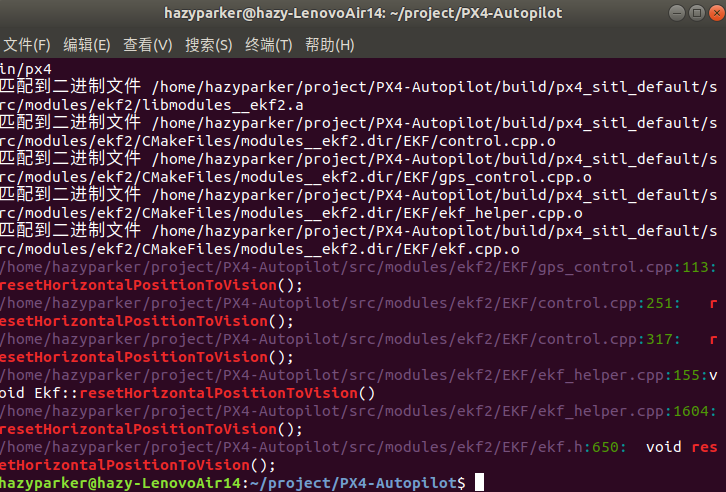
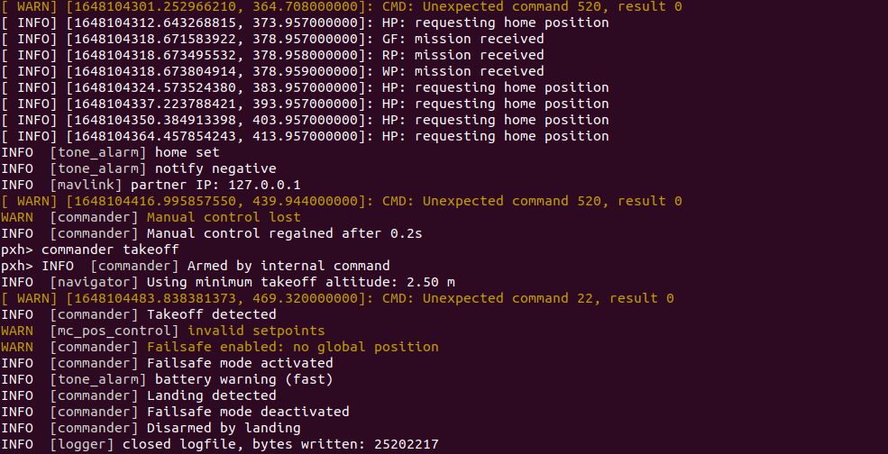

# EKF configuration

在`XTDrone`的教程中，要求修改EKF的两个参数，进而完成从`GPS`+气压高度计到视觉定位的模式转变，具体操作如下：

修改`PX4_Firmware/ROMFS/px4fmu_common/init.d-posix/rcS`中的两个参数

```xml
# GPS used
#param set EKF2_AID_MASK 1
# Vision used and GPS denied
param set EKF2_AID_MASK 24

# Barometer used for hight measurement
#param set EKF2_HGT_MODE 0
# Barometer denied and vision used for hight measurement
param set EKF2_HGT_MODE 3
```

最新`PX4-Autopilot`的`rcS`中没有这两个参数的定义，因为默认都是`GPS`的定位模式，需要自己加进去。

并且在修改完`rcS`参数后，需要删除`PX4`每次默认读取的参数，这样才能生效：

```
rm ~/.ros/eeprom/parameters*
rm -rf ~/.ros/sitl*
```

以上参考自[**PX4飞控EKF配置**](https://www.yuque.com/xtdrone/manual_cn/ekf_settings)

如合判断是否完成了修改？

* `roslaunch px4 mavros_posix_sitl.launch`，如果一直报`requesting home position`，就是接受信息模式改变引起的报错，因为还没有视觉信息
* 使用地面站，看这两个参数是否被修改了

但是也有例外，我遇到了`QGC`显示参数已经修改但是`PX4`的信息仍然是：

```
INFO  [ecl/EKF] 1701000: EKF aligned, (baro height, IMU buf: 22, OBS buf: 14)
INFO  [ecl/EKF] 1701000: reset position to last known position
INFO  [ecl/EKF] 1701000: reset velocity to zero
```

即仍然在使用气压计，这个bug的原因我没发现，但是我把build删了重新make了一遍。之后就不出`EKF`信息了，只是home position。

## `ekf` Message Error

在其他电脑上按照`XTdrone`的方法，[**视觉SLAM**](https://www.yuque.com/xtdrone/manual_cn/vslam)

```shell
cd PX4_Firmware
roslaunch px4 indoor1.launch
```

```shell
cd ~/catkin_ws/scripts/
sh xtdrone_run_stereo.sh
```

显示启动`ORB SLAM2`之后，其的确显示出了视觉融合信息成功的提示：

```
INFO  [ecl/EKF] 23860000: reset position to ev position
INFO  [ecl/EKF] 23860000: commencing external vision position fusion
INFO  [ecl/EKF] 23860000: commencing external vision yaw fusion
```

但在我的`px4`和`launch`上就不行，因此来分析一下`launch`的区别；

[**launch文件的比较分析结果**](comp_launch.md)

把问题汇总到了issues:

* https://gitee.com/robin_shaun/XTDrone/issues/I4YBV7
* https://github.com/PX4/PX4-Autopilot/issues/19344

在`PX4`文件夹下查找上面视觉融合成功提示的语句，分别在（使用`grep` "string" path方法）

```shell
/home/hazyparker/project/PX4-Autopilot/src/modules/ekf2/EKF/ekf_helper.cpp:158:ECL_INFO("reset position to ev position");
```

找到了第一句，但而三句无法找到；

```c++
void Ekf::resetHorizontalPositionToVision()
{
	_information_events.flags.reset_pos_to_vision = true;
	ECL_INFO("reset position to ev position");
	Vector3f _ev_pos = _ev_sample_delayed.pos;

	if (_params.fusion_mode & MASK_ROTATE_EV) {
		_ev_pos = _R_ev_to_ekf * _ev_sample_delayed.pos;
	}

	resetHorizontalPositionTo(Vector2f(_ev_pos));
	P.uncorrelateCovarianceSetVariance<2>(7, _ev_sample_delayed.posVar.slice<2, 1>(0, 0));

	// let the next odometry update know that the previous value of states cannot be used to calculate the change in position
	_hpos_prev_available = false;
}
```

```c++
void Ekf::startEvPosFusion()
{
	_control_status.flags.ev_pos = true;
	resetHorizontalPositionToVision();
	_information_events.flags.starting_vision_pos_fusion = true;
	ECL_INFO("starting vision pos fusion");
}
```

```c++
void Ekf::startEvVelFusion()
{
	_control_status.flags.ev_vel = true;
	resetVelocityToVision();
	_information_events.flags.starting_vision_vel_fusion = true;
	ECL_INFO("starting vision vel fusion");
}

void Ekf::startEvYawFusion()
{
	// turn on fusion of external vision yaw measurements and disable all magnetometer fusion
	_control_status.flags.ev_yaw = true;
	_control_status.flags.mag_dec = false;

	stopMagHdgFusion();
	stopMag3DFusion();

	_information_events.flags.starting_vision_yaw_fusion = true;
	ECL_INFO("starting vision yaw fusion");
}
```

可以看出，只要调用`resetHorizontalPositionToVision`函数，系统将成功融合视觉信息；



在`control.cpp` 和`gps_control.cpp`中会用到这个函数，且只有一两次；

* fake gps?

尽管提示的语句有些不一样，但是两个版本的`px4`是基本一致的，可以在master的版本中找到

可以看出是我们要找的函数；在`ekf_helper.cpp`中可以找到；

接下来寻找，什么情况下这几个函数会被调用；

使用`grep -rn ""`命令结果显示，所有均出自`control.cpp`；

```c++
void Ekf::controlExternalVisionFusion()
{
	// Check for new external vision data
	if (_ev_data_ready) {

		bool reset = false;

		if (_ev_sample_delayed.reset_counter != _ev_sample_delayed_prev.reset_counter) {
			reset = true;
		}

		if (_inhibit_ev_yaw_use) {
			stopEvYawFusion();
		}

		// if the ev data is not in a NED reference frame, then the transformation between EV and EKF navigation frames
		// needs to be calculated and the observations rotated into the EKF frame of reference
		if ((_params.fusion_mode & MASK_ROTATE_EV) && ((_params.fusion_mode & MASK_USE_EVPOS)
				|| (_params.fusion_mode & MASK_USE_EVVEL)) && !_control_status.flags.ev_yaw) {

			// rotate EV measurements into the EKF Navigation frame
			calcExtVisRotMat();
		}

		// external vision aiding selection logic
		if (_control_status.flags.tilt_align && _control_status.flags.yaw_align) {

			// check for a external vision measurement that has fallen behind the fusion time horizon
			if (isRecent(_time_last_ext_vision, 2 * EV_MAX_INTERVAL)) {
				// turn on use of external vision measurements for position
				if (_params.fusion_mode & MASK_USE_EVPOS && !_control_status.flags.ev_pos) {
					startEvPosFusion();
				}

				// turn on use of external vision measurements for velocity
				if (_params.fusion_mode & MASK_USE_EVVEL && !_control_status.flags.ev_vel) {
					startEvVelFusion();
				}
			}
		}

		// external vision yaw aiding selection logic
		if (!_inhibit_ev_yaw_use && (_params.fusion_mode & MASK_USE_EVYAW) && !_control_status.flags.ev_yaw
		    && _control_status.flags.tilt_align) {

			// don't start using EV data unless data is arriving frequently
			if (isRecent(_time_last_ext_vision, 2 * EV_MAX_INTERVAL)) {
				if (resetYawToEv()) {
					_control_status.flags.yaw_align = true;
					startEvYawFusion();
				}
			}
		}

		// determine if we should use the horizontal position observations
		if (_control_status.flags.ev_pos) {
			if (reset && _control_status_prev.flags.ev_pos) {
				if (!_fuse_hpos_as_odom) {
					resetHorizontalPositionToVision();
				}
			}

			Vector3f ev_pos_obs_var;

			// correct position and height for offset relative to IMU
			const Vector3f pos_offset_body = _params.ev_pos_body - _params.imu_pos_body;
			const Vector3f pos_offset_earth = _R_to_earth * pos_offset_body;
			_ev_sample_delayed.pos -= pos_offset_earth;

			// Use an incremental position fusion method for EV position data if GPS is also used
			if (_params.fusion_mode & MASK_USE_GPS) {
				_fuse_hpos_as_odom = true;

			} else {
				_fuse_hpos_as_odom = false;
			}

			if (_fuse_hpos_as_odom) {
				if (!_hpos_prev_available) {
					// no previous observation available to calculate position change
					_hpos_prev_available = true;

				} else {
					// calculate the change in position since the last measurement
					// rotate measurement into body frame is required when fusing with GPS
					Vector3f ev_delta_pos = _R_ev_to_ekf * Vector3f(_ev_sample_delayed.pos - _ev_sample_delayed_prev.pos);

					// use the change in position since the last measurement
					_ev_pos_innov(0) = _state.pos(0) - _hpos_pred_prev(0) - ev_delta_pos(0);
					_ev_pos_innov(1) = _state.pos(1) - _hpos_pred_prev(1) - ev_delta_pos(1);

					// observation 1-STD error, incremental pos observation is expected to have more uncertainty
					Matrix3f ev_pos_var = matrix::diag(_ev_sample_delayed.posVar);
					ev_pos_var = _R_ev_to_ekf * ev_pos_var * _R_ev_to_ekf.transpose();
					ev_pos_obs_var(0) = fmaxf(ev_pos_var(0, 0), sq(0.5f));
					ev_pos_obs_var(1) = fmaxf(ev_pos_var(1, 1), sq(0.5f));
				}
			} else {
				// use the absolute position
				Vector3f ev_pos_meas = _ev_sample_delayed.pos;
				Matrix3f ev_pos_var = matrix::diag(_ev_sample_delayed.posVar);

				if (_params.fusion_mode & MASK_ROTATE_EV) {
					ev_pos_meas = _R_ev_to_ekf * ev_pos_meas;
					ev_pos_var = _R_ev_to_ekf * ev_pos_var * _R_ev_to_ekf.transpose();
				}

				_ev_pos_innov(0) = _state.pos(0) - ev_pos_meas(0);
				_ev_pos_innov(1) = _state.pos(1) - ev_pos_meas(1);

				ev_pos_obs_var(0) = fmaxf(ev_pos_var(0, 0), sq(0.01f));
				ev_pos_obs_var(1) = fmaxf(ev_pos_var(1, 1), sq(0.01f));

				// check if we have been deadreckoning too long
				if (isTimedOut(_time_last_hor_pos_fuse, _params.reset_timeout_max)) {
					// only reset velocity if we have no another source of aiding constraining it
					if (isTimedOut(_time_last_of_fuse, (uint64_t)1E6) &&
					    isTimedOut(_time_last_hor_vel_fuse, (uint64_t)1E6)) {

						if (_control_status.flags.ev_vel) {
							resetVelocityToVision();
						}
					}

					resetHorizontalPositionToVision();
				}
			}

			// innovation gate size
			const float ev_pos_innov_gate = fmaxf(_params.ev_pos_innov_gate, 1.0f);

			fuseHorizontalPosition(_ev_pos_innov, ev_pos_innov_gate, ev_pos_obs_var, _ev_pos_innov_var, _ev_pos_test_ratio);
		}

		// determine if we should use the velocity observations
		if (_control_status.flags.ev_vel) {
			if (reset && _control_status_prev.flags.ev_vel) {
				resetVelocityToVision();
			}

			_ev_vel_innov = _state.vel - getVisionVelocityInEkfFrame();

			// check if we have been deadreckoning too long
			if (isTimedOut(_time_last_hor_vel_fuse, _params.reset_timeout_max)) {
				// only reset velocity if we have no another source of aiding constraining it
				if (isTimedOut(_time_last_of_fuse, (uint64_t)1E6) &&
				    isTimedOut(_time_last_hor_pos_fuse, (uint64_t)1E6)) {
					resetVelocityToVision();
				}
			}

			const Vector3f obs_var = matrix::max(getVisionVelocityVarianceInEkfFrame(), sq(0.05f));

			const float innov_gate = fmaxf(_params.ev_vel_innov_gate, 1.f);

			fuseHorizontalVelocity(_ev_vel_innov, innov_gate, obs_var, _ev_vel_innov_var, _ev_vel_test_ratio);
			fuseVerticalVelocity(_ev_vel_innov, innov_gate, obs_var, _ev_vel_innov_var, _ev_vel_test_ratio);
		}

		// determine if we should use the yaw observation
		if (_control_status.flags.ev_yaw) {
			if (reset && _control_status_prev.flags.ev_yaw) {
				resetYawToEv();
			}

			if (shouldUse321RotationSequence(_R_to_earth)) {
				float measured_hdg = getEuler321Yaw(_ev_sample_delayed.quat);
				fuseYaw321(measured_hdg, _ev_sample_delayed.angVar);

			} else {
				float measured_hdg = getEuler312Yaw(_ev_sample_delayed.quat);
				fuseYaw312(measured_hdg, _ev_sample_delayed.angVar);
			}
		}

		// record observation and estimate for use next time
		_ev_sample_delayed_prev = _ev_sample_delayed;
		_hpos_pred_prev = _state.pos.xy();

	} else if ((_control_status.flags.ev_pos || _control_status.flags.ev_vel ||  _control_status.flags.ev_yaw)
		   && isTimedOut(_time_last_ext_vision, (uint64_t)_params.reset_timeout_max)) {

		// Turn off EV fusion mode if no data has been received
		stopEvFusion();
		_warning_events.flags.vision_data_stopped = true;
		ECL_WARN("vision data stopped");
	}
}
```

发现`ekf.cpp`中的`Ekf::Update()`不会被调用；

## Bug Fixed(partly)

修复了一部分bug，感谢LBY学长，测试时发现`rqt_graph`的`RGBD`没有向外输出的位姿信息，查找后发现`xtdrone`对`orbslam2`的源代码做了修改，使用其版本的`ros_stereo.cc`即可，稍后分析其代码作用，主要内容是加入了位姿计算。

`ros_stereo.cc`链接：[`ros_stereo.cc`文件](../XTDrone_Method/ros_stereo.cc)

## Bugs



余下的bug，在有的设备上会影响整架飞机的起降和`offboard`模式切换，而有的却不影响；

这个bug主要变现为：`requesting home position`，没有`global position`导致`failsafe enabled`；这个bug还在解决中，方法拟为手动设置ros节点，发送`globalPositionTarget`信息，但实际为`NavSatFix`类型信息；
