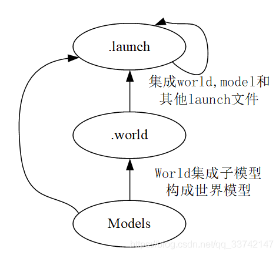
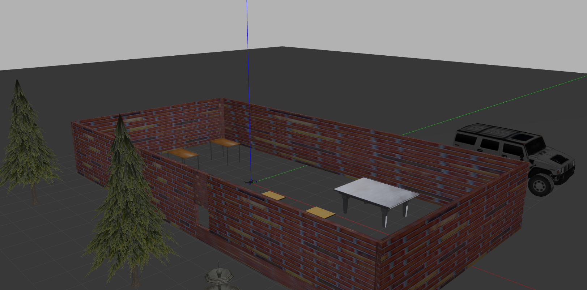

# gazebo model make process

Contents：

* learn from `px4` launch file
* make my own world
* design my own launch file

## `px4` original model (`.launch` file)

### single UAV launch file

```xml
<?xml version="1.0"?>
<launch>
    <!-- Posix SITL environment launch script -->
    <!-- launches PX4 SITL, Gazebo environment, and spawns vehicle -->
    <!-- vehicle pose -->
    <arg name="x" default="0"/>
    <arg name="y" default="0"/>
    <arg name="z" default="0"/>
    <arg name="R" default="0"/>
    <arg name="P" default="0"/>
    <arg name="Y" default="0"/>
    <!-- vehicle model and world -->
    <arg name="est" default="ekf2"/>
    <arg name="vehicle" default="iris"/>
    <arg name="world" default="$(find mavlink_sitl_gazebo)/worlds/empty.world"/>
    <arg name="sdf" default="$(find mavlink_sitl_gazebo)/models/$(arg vehicle)/$(arg vehicle).sdf"/>
    <env name="PX4_SIM_MODEL" value="$(arg vehicle)" />
    <env name="PX4_ESTIMATOR" value="$(arg est)" />

    <!-- gazebo configs -->
    <arg name="gui" default="true"/>
    <arg name="debug" default="false"/>
    <arg name="verbose" default="false"/>
    <arg name="paused" default="false"/>
    <arg name="respawn_gazebo" default="false"/>
    <!-- PX4 configs -->
    <arg name="interactive" default="true"/>
    <!-- PX4 SITL -->
    <arg unless="$(arg interactive)" name="px4_command_arg1" value="-d"/>
    <arg     if="$(arg interactive)" name="px4_command_arg1" value=""/>
    <node name="sitl" pkg="px4" type="px4" output="screen"
        args="$(find px4)/ROMFS/px4fmu_common -s etc/init.d-posix/rcS $(arg px4_command_arg1)" required="true"/>

    <!-- Gazebo sim -->
    <include file="$(find gazebo_ros)/launch/empty_world.launch">
        <arg name="gui" value="$(arg gui)"/>
        <arg name="world_name" value="$(arg world)"/>
        <arg name="debug" value="$(arg debug)"/>
        <arg name="verbose" value="$(arg verbose)"/>
        <arg name="paused" value="$(arg paused)"/>
        <arg name="respawn_gazebo" value="$(arg respawn_gazebo)"/>
    </include>
    <!-- gazebo model -->
    <node name="$(anon vehicle_spawn)" pkg="gazebo_ros" type="spawn_model" output="screen" args="-sdf -file $(arg sdf) -model $(arg vehicle) -x $(arg x) -y $(arg y) -z $(arg z) -R $(arg R) -P $(arg P) -Y $(arg Y)"/>
</launch>
```

**what's included?**

* vehicle pose initializing
* load vehicle model and **world**
* some gazebo configurations
* `px4` configuration
* `SITL`
* gazebo `sim`
* gazebo model

**<!-- vehicle model and world -->**

```xml
    <arg name="est" default="ekf2"/>
    <arg name="vehicle" default="iris"/>
    <arg name="world" default="$(find mavlink_sitl_gazebo)/worlds/empty.world"/>
    <arg name="sdf" default="$(find mavlink_sitl_gazebo)/models/$(arg vehicle)/$(arg vehicle).sdf"/>
    <env name="PX4_SIM_MODEL" value="$(arg vehicle)" />
    <env name="PX4_ESTIMATOR" value="$(arg est)" />
```

seems only argument's name with `world` have connection with gazebo world.

using `empty.world` as default.

**<!-- Gazebo sim -->**

```xml
    <include file="$(find gazebo_ros)/launch/empty_world.launch">
        <arg name="gui" value="$(arg gui)"/>
        <arg name="world_name" value="$(arg world)"/>
        <arg name="debug" value="$(arg debug)"/>
        <arg name="verbose" value="$(arg verbose)"/>
        <arg name="paused" value="$(arg paused)"/>
        <arg name="respawn_gazebo" value="$(arg respawn_gazebo)"/>
    </include>
```

focus on file `empty_world.launch`, where all parameters are loaded from.

### empty world launch file

[file path](launch/empty_world.launch) here.

check this one:

```xml
  <arg name="world_name" default="worlds/empty.world"/> <!-- Note: the world_name is with respect to GAZEBO_RESOURCE_PATH environmental variable -->
```

use command `locate`

```shell
$ locate empty.world
```

there are basically 2 files:

* `/usr/share/gazebo-9/worlds/empty.world`
* `PX4-Autopilot/Tools/sitl_gazebo/worlds/empty.world`


## Design my own `.launch` file

* [Instruction: How to make own world in gazebo and launch it](https://www.cxymm.net/article/qq_44725448/109638990)
* [Gazebo仿真平台模型搭建与修改](https://blog.csdn.net/qq_33742147/article/details/105437418)



what I need to edit may be `.world` and `.launch`.

### make models and world

use models created by gazebo team, like walls, tables, chairs, etc.

and https://blog.csdn.net/qq_33742147/article/details/105437418#t2 emphasizes it so clearly.

2 files created after model was saved;

* [`sdf` file](model/trial_1/model.sdf)
* [`config` file](model/trial_1/model.config)

in `sdf` file, list of items added is clear;

then saving the world.

[world file](world/world_diy1.world)

basic design of map seems quite easy, then the next step would be load the world created in `px4` gazebo.

### load world in gazebo

2 places to be mentioned:

​    <!-- vehicle model and world -->

​    <!-- Gazebo sim -->

#### set `px4` launch file

* copy `mavros_posix_sitl.launch`

```xml
<?xml version="1.0"?>
<launch>
    <!-- MAVROS posix SITL environment launch script -->
    <!-- launches MAVROS, PX4 SITL, Gazebo environment, and spawns vehicle -->
    <!-- vehicle pose -->
    <arg name="x" default="0"/>
    <arg name="y" default="0"/>
    <arg name="z" default="0"/>
    <arg name="R" default="0"/>
    <arg name="P" default="0"/>
    <arg name="Y" default="0"/>
    <!-- vehicle model and world -->
    <arg name="est" default="ekf2"/>
    <arg name="vehicle" default="iris"/>
    <arg name="world" default="$(find mavlink_sitl_gazebo)/worlds/empty.world"/>
    <arg name="sdf" default="$(find mavlink_sitl_gazebo)/models/$(arg vehicle)/$(arg vehicle).sdf"/>

    <!-- gazebo configs -->
    <arg name="gui" default="true"/>
    <arg name="debug" default="false"/>
    <arg name="verbose" default="false"/>
    <arg name="paused" default="false"/>
    <arg name="respawn_gazebo" default="false"/>
    <!-- MAVROS configs -->
    <arg name="fcu_url" default="udp://:14540@localhost:14557"/>
    <arg name="respawn_mavros" default="false"/>
    <!-- PX4 configs -->
    <arg name="interactive" default="true"/>
    <!-- PX4 SITL and Gazebo -->
    <include file="$(find px4)/launch/posix_sitl.launch">
        <arg name="x" value="$(arg x)"/>
        <arg name="y" value="$(arg y)"/>
        <arg name="z" value="$(arg z)"/>
        <arg name="R" value="$(arg R)"/>
        <arg name="P" value="$(arg P)"/>
        <arg name="Y" value="$(arg Y)"/>
        <arg name="world" value="$(arg world)"/>
        <arg name="vehicle" value="$(arg vehicle)"/>
        <arg name="sdf" value="$(arg sdf)"/>
        <arg name="gui" value="$(arg gui)"/>
        <arg name="interactive" value="$(arg interactive)"/>
        <arg name="debug" value="$(arg debug)"/>
        <arg name="verbose" value="$(arg verbose)"/>
        <arg name="paused" value="$(arg paused)"/>
        <arg name="respawn_gazebo" value="$(arg respawn_gazebo)"/>
    </include>
    <!-- MAVROS -->
    <include file="$(find mavros)/launch/px4.launch">
        <!-- GCS link is provided by SITL -->
        <arg name="gcs_url" value=""/>
        <arg name="fcu_url" value="$(arg fcu_url)"/>
        <arg name="respawn_mavros" value="$(arg respawn_mavros)"/>
    </include>
</launch>
```

```xml
<arg name="world" value="$(arg world)"/>
```

from `posix_sitl.launch`

[file path](launch/px4_load_world.launch)

rename it as `px4_load_world.launch`

* copy `posix_sitl.launch`

```xml
<?xml version="1.0"?>
<launch>
    <!-- Posix SITL environment launch script -->
    <!-- launches PX4 SITL, Gazebo environment, and spawns vehicle -->
    <!-- vehicle pose -->
    <arg name="x" default="0"/>
    <arg name="y" default="0"/>
    <arg name="z" default="0"/>
    <arg name="R" default="0"/>
    <arg name="P" default="0"/>
    <arg name="Y" default="0"/>
    <!-- vehicle model and world -->
    <arg name="est" default="ekf2"/>
    <arg name="vehicle" default="iris"/>
    <arg name="world" default="$(find mavlink_sitl_gazebo)/worlds/empty.world"/>
    <arg name="sdf" default="$(find mavlink_sitl_gazebo)/models/$(arg vehicle)/$(arg vehicle).sdf"/>
    <env name="PX4_SIM_MODEL" value="$(arg vehicle)" />
    <env name="PX4_ESTIMATOR" value="$(arg est)" />

    <!-- gazebo configs -->
    <arg name="gui" default="true"/>
    <arg name="debug" default="false"/>
    <arg name="verbose" default="false"/>
    <arg name="paused" default="false"/>
    <arg name="respawn_gazebo" default="false"/>
    <!-- PX4 configs -->
    <arg name="interactive" default="true"/>
    <!-- PX4 SITL -->
    <arg unless="$(arg interactive)" name="px4_command_arg1" value="-d"/>
    <arg     if="$(arg interactive)" name="px4_command_arg1" value=""/>
    <node name="sitl" pkg="px4" type="px4" output="screen"
        args="$(find px4)/ROMFS/px4fmu_common -s etc/init.d-posix/rcS $(arg px4_command_arg1)" required="true"/>

    <!-- Gazebo sim -->
    <include file="$(find gazebo_ros)/launch/empty_world.launch">
        <arg name="gui" value="$(arg gui)"/>
        <arg name="world_name" value="$(arg world)"/>
        <arg name="debug" value="$(arg debug)"/>
        <arg name="verbose" value="$(arg verbose)"/>
        <arg name="paused" value="$(arg paused)"/>
        <arg name="respawn_gazebo" value="$(arg respawn_gazebo)"/>
    </include>
    <!-- gazebo model -->
    <node name="$(anon vehicle_spawn)" pkg="gazebo_ros" type="spawn_model" output="screen" args="-sdf -file $(arg sdf) -model $(arg vehicle) -x $(arg x) -y $(arg y) -z $(arg z) -R $(arg R) -P $(arg P) -Y $(arg Y)"/>
</launch>
```

set `<arg name="world_name" value="$(arg world)"/>` to `/home/hazyparker/project/my-research/3_Onboard_SLAM/gazebo_model/world/world_diy1.world`

#### run it



drone can't take off due to lack of vision pose data.
