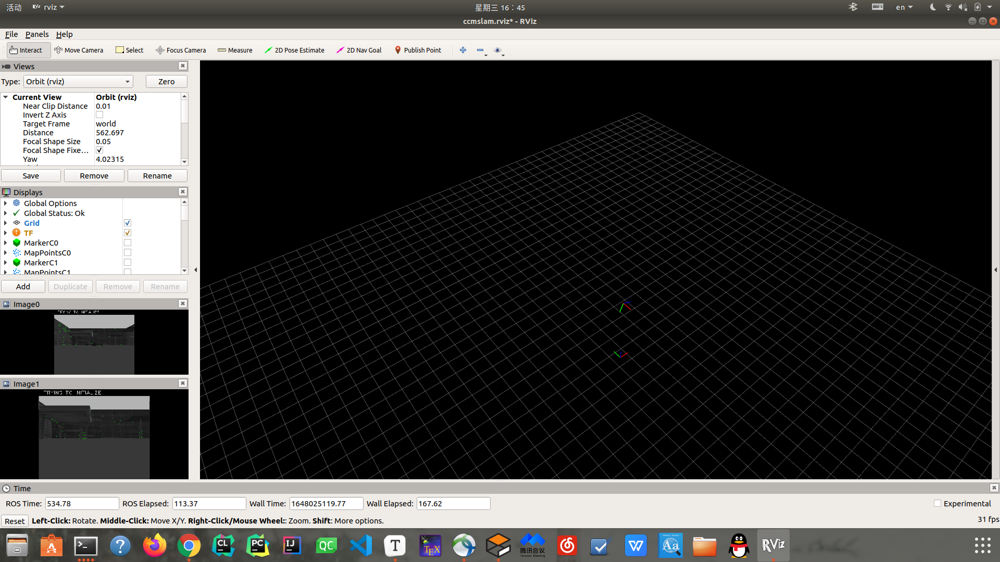

# Multi SLAM

先整合一下都需要做什么事；

* 多机SLAM，首先要多机及`mavros`控制，这一点stage1已经实现；
* SLAM，上面跑哪种SLAM，`ORB`，`VINS`，`COVINS`等；
* 对于多机轨迹和建图怎么融合，怎么在一个场景中显示；
* UWB怎么加；

**目录**

* [Stage 1 复现多机ORB SLAM 2](stage1.md)
* [Stage 2 ORB SLAM3 多地图模式](stage2.md)
* [Stage 3 CCM SLAM复现](stage3.md)
* [Stage 4 VINS和CCM的融合实现](stage4.md)

**结果**

`CCM_SLAM`

