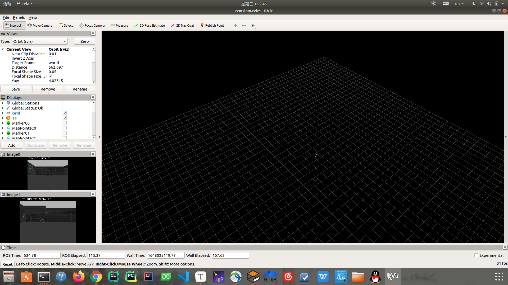

# stage 3 CCM SLAM 多机仿真

## 如何使用CCM

### 0. 偷师学艺

follow instructions:

For using you own datasets or camera, you need to create according calibration and launch files:

- Create a new camera calibration file, e.g. by copying and adjusting

  ```
  conf/vi_euroc.yaml
  ```

  - If you don't know the parameters of your camera, you can find them using a camera calibration toolbox, such as [kalibr](https://github.com/ethz-asl/kalibr).

- Create a new launch file, e.g. by copying and adjusting

  ```
  launch/EuRoC/Client0_euroc.yaml
  ```

  - Change the parameter `cam` to the path of your new camera file.
  - Change the parameter `TopicNameCamSub` to the name of your camera topic.
  - Hint: If you have an existing rosbag-file with camera data, you can directly modify the topic when playing the bagfile: `rosbag play mybag.bag existing_topic:=new_name`

- There is no need to change `Server.launch`, however, you can adjust the number of Agents in the system by changing `NumOfClients`. The maximum is set to **4** in the current implementation.

- If you are using a downward-looking camera instead of a forward-looking (as in the EuRoC sequences), it is recommended to change the rotational part of the [static transform publishers](http://wiki.ros.org/tf#static_transform_publisher) in the launch files to `0 0 -3.142`, e.g. `<node pkg="tf" type="static_transform_publisher" name="linkS0_broadcaster" args="0 0 5 0 0 -3.142 world odomS0 100" />`.

- There should be no need to change the name of the frame-IDs, such as `odomC0`.

### 1. 设置相机参数文件

在`cslam/conf`中添加之前ORB用的`px4_sitl.yaml`参数文件

### 2. 新建launch文件

先参考一下`ccm`自带的写成什么样, `Client0_euroc.launch`

```xml
<?xml version="1.0"?>
<launch>

<arg name="dist" default="0"/>
<arg name="cam" default="$(find ccmslam)/conf/vi_euroc.yaml"/>

  <group ns="ccmslam">

  <node pkg="tf" type="static_transform_publisher" name="linkC0_broadcaster" args="-100 300 5 -1.571 0 -2 world odomC0 100" /> 

<node pkg="ccmslam" type="ccmslamClientNode" name="ccmslamClientNode0" args="$(find ccmslam)/conf/ORBvoc.txt $(arg cam)" output="screen">

  <!-- ++++++++++++++++++++++++++++++++++++++++++++++ -->
  <!-- Agent Specific Params - !!!MUST BE ADJUSTED!!! -->

  <param name="~FrameId" type="string" value="odomC0" />
  <param name="~ClientId" type="int" value="0" />

  <param name="~TopicNameCamSub" type="string" value="/cam0/image_raw" />

  <param name="~MapInTopicName" type="string" value="MapOutServer0" unless="$(arg dist)" />
  <param name="~MapInTopicName" type="string" value="MapOutServer0Disturbed" if="$(arg dist)" /> 

</node>

  </group>
</launch>
```

按需求更改；

```xml
<?xml version="1.0"?>
<launch>

<arg name="dist" default="0"/>
<arg name="cam" default="$(find ccmslam)/conf/px4_sitl.yaml"/>

  <group ns="ccmslam">

  <node pkg="tf" type="static_transform_publisher" name="linkC0_broadcaster" args="-100 300 5 -1.571 0 -2 world odomC0 100" /> 

<node pkg="ccmslam" type="ccmslamClientNode" name="ccmslamClientNode0" args="$(find ccmslam)/conf/ORBvoc.txt $(arg cam)" output="screen">

  <!-- ++++++++++++++++++++++++++++++++++++++++++++++ -->
  <!-- Agent Specific Params - !!!MUST BE ADJUSTED!!! -->

  <param name="~FrameId" type="string" value="odomC0" />
  <param name="~ClientId" type="int" value="0" />

  <param name="~TopicNameCamSub" type="string" value="/iris0/usb_cam/image_raw" />

  <param name="~MapInTopicName" type="string" value="MapOutServer0" unless="$(arg dist)" />
  <param name="~MapInTopicName" type="string" value="MapOutServer0Disturbed" if="$(arg dist)" /> 

</node>

  </group>
</launch>
```

修改`Server.launch`中的client number

### 3. 运行

* launch px4 launch file

* `roslaunch ccmslam Server.launch`

* `roslaunch ccmslam Client0_px4.launch`

* `roslaunch ccmslam Client1_px4.launch`

* use `rviz` to show, 

* ```
  roscd ccmslam
  rviz -d conf/rviz/ccmslam.rviz
  ```

过程如图：


最终结果：



## 解决初始化问题

