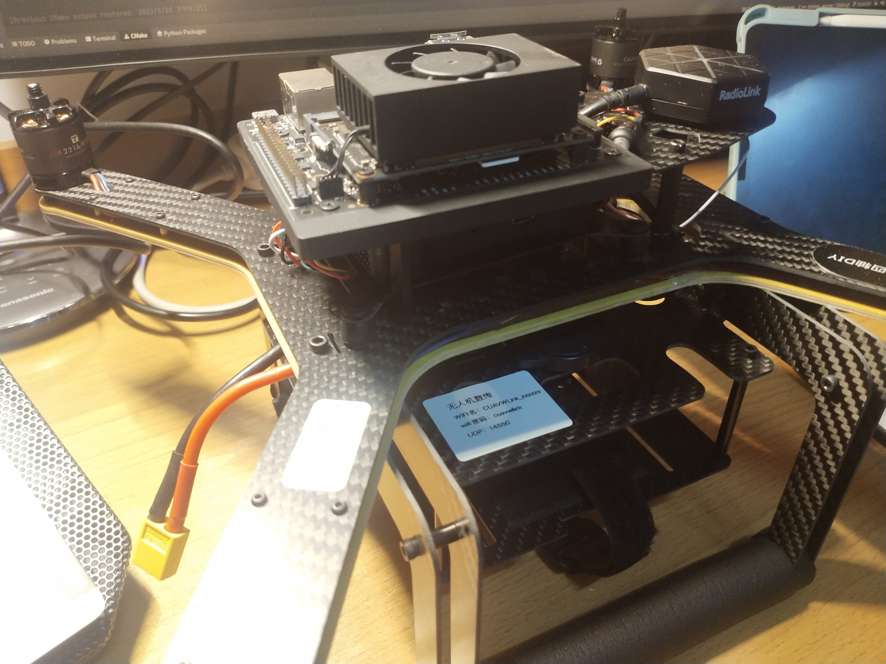
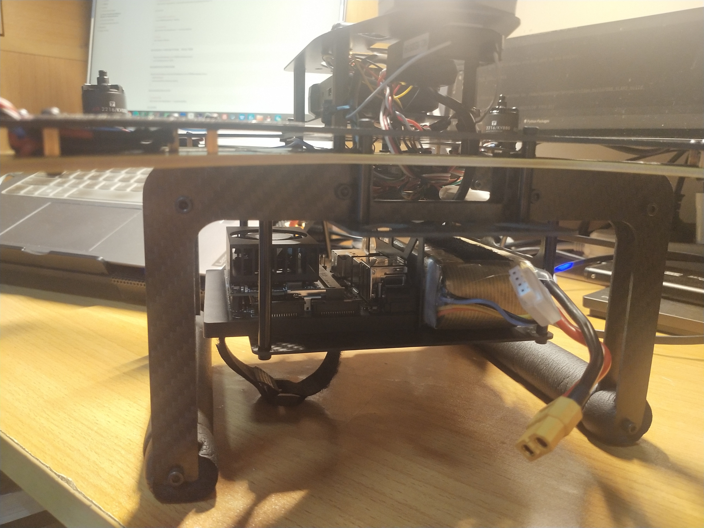
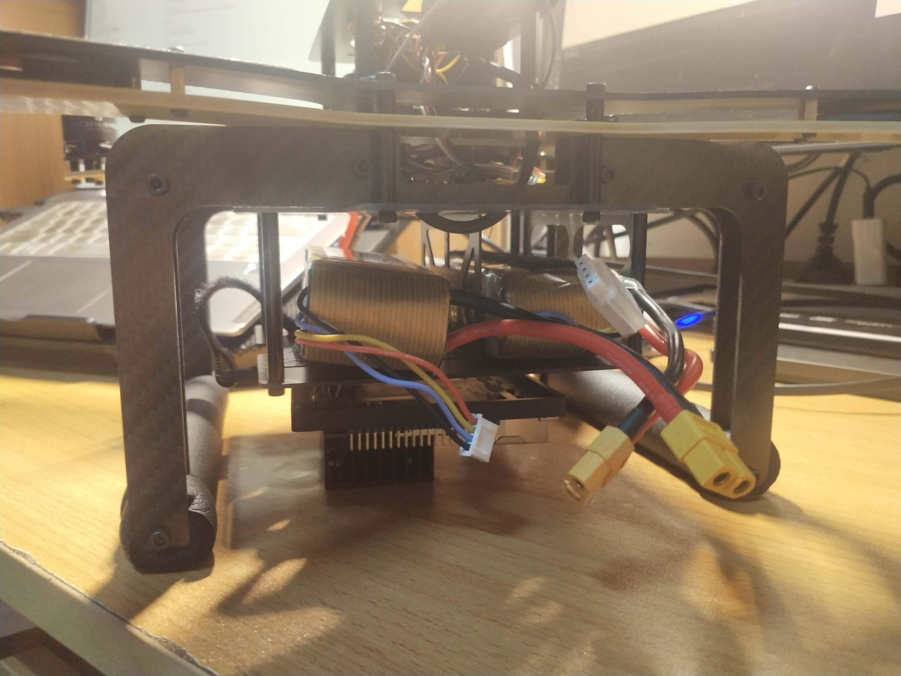

# 板载计算机的相关配置

## 1. 安装位置及供电

### 1.1 安装位置

板载计算机在无人机上的安装位置大致有以下几种思路：

**方案一，顶端**

会遮住飞控的线，在固定上可能只能选择扎带的方法，稳定性不太保证；

**方案二，中部**

**方案三，底部**

2线；

### 1.2 供电

* 一种思路是用两块电池，一块接飞控、电机；另一块则专门用于板载计算机的供电；但是需要注意电压；
* 另一种思路是，改线；从电源分出一条线，使得飞控与板载计算机并联，这样可能需要拆飞机焊电线；

## 2. 远程通信

现有的方法是使用No Machine，https://www.nomachine.com/

教程如下：https://www.nomachine.com/getting-started-with-nomachine

### Install NoMachine on the first computer

- [Download the NoMachine package](https://www.nomachine.com/download) for your operating system to the computer that you want to control remotely.
- After completing the download, launch the installer.
- Accept the license agreement and click *Next* and wait while Setup completes the installation.
- To be able to connect to this computer from remote you need to have a user account for this PC/Mac (username and password). You also need to know its IP address. There are two ways you can check the IP address. (i) Open NoMachine from the programs or applications menu. A Welcome panel will publish the local IP address of the computer on which you have installed the software (Fig. 1). Or (ii) click on the !M icon (the NoMachine Monitor) which is visible in the computer's system tray. Click on 'Show the Server Status' (Fig. 2).
- Make a note of this IP address. You will need it in the next phase when you are ready to connect to this computer.

### Install NoMachine on the second computer

- Now go to your second computer, the computer that you want to connect from.
- Download and install NoMachine per the steps above.