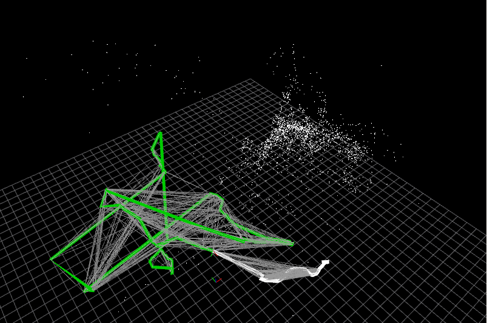

# Mavros控制无人机在gazebo环境下进行双目SLAM

在这里先放参考，键盘控制主要是从初接触ROS时的`turtlesim`功能包下的键盘控制节点得到的方法。

## 参考

* [ROS tutorial-turtle_teleop_key](https://github.com/ros/ros_tutorials/blob/ee5144f314e669cc6c85ea6e93b7da55d090a684/turtlesim/tutorials/teleop_turtle_key.cpp)，键盘控制程序
* [Mavros wiki](http://wiki.ros.org/mavros#Overview)，弄清话题的含义和数据类型

## 话题

使用了两种不同的话题：

* `setpoint_velocity/cmd_vel_unstamped`
* `setpoint_raw/local`

两者都是Mavros订阅的话题，其中

* 前者的解释是，*Send velocity setpoint to FCU*，数据类型是[geometry_msgs::Twist](http://docs.ros.org/en/api/geometry_msgs/html/msg/Twist.html)，这也是海龟速度控制的话题，分6方向线速度和角速度。
* 后者的解释是，*Send RAW setpoint messages to FCU and provide loopback topics (PX4)*，数据类型是[mavros_msgs::PositionTarget](http://docs.ros.org/en/api/mavros_msgs/html/msg/PositionTarget.html)

以下是两种信息内容的定义：

```yaml
# This expresses velocity in free space broken into its linear and angular parts.
Vector3  linear
Vector3  angular
```

```yaml
# Message for SET_POSITION_TARGET_LOCAL_NED
#
# Some complex system requires all feautures that mavlink
# message provide. See issue #402.

std_msgs/Header header

uint8 coordinate_frame
uint8 FRAME_LOCAL_NED = 1
uint8 FRAME_LOCAL_OFFSET_NED = 7
uint8 FRAME_BODY_NED = 8
uint8 FRAME_BODY_OFFSET_NED = 9

uint16 type_mask
uint16 IGNORE_PX = 1 # Position ignore flags
uint16 IGNORE_PY = 2
uint16 IGNORE_PZ = 4
uint16 IGNORE_VX = 8 # Velocity vector ignore flags
uint16 IGNORE_VY = 16
uint16 IGNORE_VZ = 32
uint16 IGNORE_AFX = 64 # Acceleration/Force vector ignore flags
uint16 IGNORE_AFY = 128
uint16 IGNORE_AFZ = 256
uint16 FORCE = 512 # Force in af vector flag
uint16 IGNORE_YAW = 1024
uint16 IGNORE_YAW_RATE = 2048

geometry_msgs/Point position
geometry_msgs/Vector3 velocity
geometry_msgs/Vector3 acceleration_or_force
float32 yaw
float32 yaw_rate
```

两者都可以根据其中的参数控制线速度角速度，具体内容可见代码。

引起我注意的还有一个话题，是mavros发布的，为`setpoint_raw/target_local` ([mavros_msgs/PositionTarget](http://docs.ros.org/en/api/mavros_msgs/html/msg/PositionTarget.html))，其描述为*Local target loopback*，这个loopback不是很懂。

## 代码

按话题，有两个：

* Twist，[TwistControl](src/VelocityKeyBoardControl.cpp)
* PositionTarget，[PositionTargetControl](src/KeyBoardControl.cpp)

## 实验

* [实验一，飞的最好，建图最差](https://www.bilibili.com/video/BV11r4y1s7g6?spm_id_from=333.999.0.0)
* [实验二，飞的一般，建图一般](https://www.bilibili.com/video/BV1eU4y127D1/?spm_id_from=333.788.recommend_more_video.-1)
* [实验三，飞的最差，建图最差](https://www.bilibili.com/video/BV1c54y1o7E3/?spm_id_from=333.788.recommend_more_video.-1)

存在一个共性的问题，回环不上。

## 程序使用

我后来一直用Twist控制的程序。

指令表：

| 按键         | 作用                                                     |
| ------------ | -------------------------------------------------------- |
| T            | 切Offboard，解锁，起飞到制定高度，短暂盘旋，控制交回键盘 |
| H            | 个方向速度设为0，旨在保持原位                            |
| L            | 切Land模式                                               |
| W            | 加X向线速度                                              |
| S            | 减X向线速度                                              |
| A            | 加Y向线速度                                              |
| D            | 减Y向线速度                                              |
| page up      | 加油门                                                   |
| page down    | 减油门                                                   |
| home（left） | 加偏航角速度                                             |
| end（right） | 减偏航角速度                                             |

两者都是按`T`起飞，由于程序设计存在一定问题，`Offboard`到达预定高度悬停结束后需要按住`H`保持；

PositionTarget程序中经常掉出`Offboard`，但是Twist中只要掉出了，随便长按一个键不撒就能回到`Offboard`，所以我后来一直用Twist，其实是由于程序没写好。我在实验里经常用`H`给无人机时间获取特征点。

## Bug及改进建议

Bug很明显是在Offboard模式上，无人机进到该模式后，不仅需要发布消息的频率不低于$2Hz$，还有消息不能断，因为一断就相当于没有RC，failsafe生效直接掉出Offboard；

* 在for循环中加入判断，没有键盘输入则无人机保持原位；但也有问题，键盘按的没那么快，这个判断总能触发，导致无人机动作很卡顿，跳跃
* 别的办法一直发消息，没想出来

还有就是在代码上，有很多可以改进的地方，我曾尝试写一个Mavros+PX4类，后来发现`current_pose`和`current_state`的回调函数必须静态，又拿不到类数据，写个this指针传的话，回调函数又变成两个参数，mavros不匹配，遂罢。

# 承上，ccm-slam仿真

**注意**，如果是轻薄本，放弃仿真的想法；我是在32G内存，RTX3080，i710th台式电脑上跑的；

方法很简单，两架飞机，键盘上也没那么多键位；

* 摄像头朝下，这种一般设定好高度后，不对z速度进行控制，只有前后左右移动；
* 摄像头超前，还是和上文一样的控制方法，但两架飞机用一套控制，挨个飞

**摄像头朝下一定要飞起来之后再启动ccm的client节点，否则ccm会died**

别的没什么了，单目就是比较难初始化，找个复杂的场景多平移几次；

## 实验

暂时只有一个实验；

* [实验1](https://www.bilibili.com/video/BV1RU4y1y7eh)

## 评价



初始化比较难，很容易丢，且回到原场景无法重定位；


