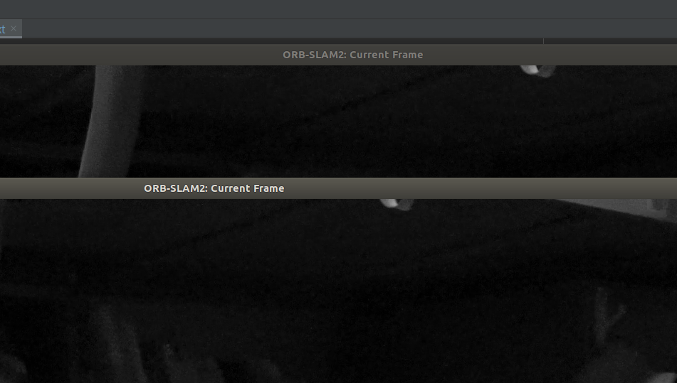

# Design Step
怎样设计； brain storm；

首先，两架无人机，跑两个ORB-SLAM2，如何做到启动两个ORB-SLAM2的（CCM没用ORB的窗口，可以看到其函数中也没有类似的Drawer）；

CCM能不能改成适用于双目的？


## 两个ORB-SLAM2端口
`CCM`是如何做到两个`ORB-SLAM2`的；

如果以同样的命令启动两个完全相同的ORB窗口，会报错由于相同ROS节点，这一点在其ROS启动文件中有涉及：

```cpp
    ros::init(argc, argv, "Mono");
    ros::start();

    if(argc != 3)
    {
        cerr << endl << "Usage: rosrun ORB_SLAM2 Mono path_to_vocabulary path_to_settings" << endl;        
        ros::shutdown();
        return 1;
    }  
```

所以多端口很简单，只要更改ROS节点名即可；或者加上参数，在传统的ORB启动方式：

```cpp
// Usage: rosrun ORB_SLAM2 Mono path_to_vocabulary path_to_settings
```

后再加上一个`port`，ROS节点名也作相应改变；

### ClientNode

在`CCM-SLAM`的`ClientNode.cpp`中有ROS节点的初始化：

```cpp
int main(int argc, char **argv) {

    ros::init(argc, argv, "CSLAM client node");

    if(argc != 3)
    {
        cerr << endl << "Usage: rosrun cslam clientnode path_to_vocabulary path_to_cam_params" << endl;
        ros::shutdown();
        return 1;
    }

    ros::NodeHandle Nh;  // topic name will be: node name(only), like "/image_raw"
    ros::NodeHandle NhPrivate("~");  // topic node will be: node name + topic name, like "iris_0/image_raw"
    // reference: <https://blog.csdn.net/weixin_44401286/article/details/112204903>

    boost::shared_ptr<cslam::ClientSystem> pCSys{new cslam::ClientSystem(Nh,NhPrivate,argv[1],argv[2])};

    ROS_INFO("Started CSLAM client node...");

    ros::Rate r(params::timings::client::miRosRate);
    while(ros::ok())
    {
        ros::spinOnce();
        r.sleep();
    }

    return 0;
}
```

其中出现了一个：

```cpp
    boost::shared_ptr<cslam::ClientSystem> pCSys{new cslam::ClientSystem(Nh,NhPrivate,argv[1],argv[2])};
```

注意，在这里利用智能指针调用了其`ClientSystem`中的函数，在`ClientSystem`中通过读取文件的方式，生成了不同的ROS节点；

### Client System

从ROS参数服务器读取Client ID：

```cpp
    int ClientId;
    // get ClientID from launch file, actually ROS parameter server
    mNhPrivate.param("ClientId",ClientId,-1);
    mClientId = static_cast<size_t>(ClientId);  // assign ClientID to member of class ClientSystem, mClientID
```

标准的SLAM流程：

```cpp
	// load vocabulary
    this->LoadVocabulary(strVocFile);

    // Create KeyFrame Database
    mpKFDB.reset(new KeyFrameDatabase(mpVoc));

    // Create the Map
    mpMap.reset(new Map(mNh,mNhPrivate,mClientId,eSystemState::CLIENT));
    usleep(10000); //wait to avoid race conditions
```

端口（客户端、服务端）的建立：

```cpp
    // Initialize Agent
    mpAgent.reset(new ClientHandler(mNh,mNhPrivate,mpVoc,mpKFDB,mpMap,
                                    mClientId,mpUID,eSystemState::CLIENT,strCamFile,nullptr));
    usleep(10000); //wait to avoid race conditions
    mpAgent->InitializeThreads();
    usleep(10000); //wait to avoid race conditions
```

在这里引入了`ClientHandler`；

### Client Handler

在上面的代码`ClientSystem`中，对`ClientHandler`做了两件事：

* 对`mpAgent`对象创建了新的`ClientHandler`
* 对`mpAgent`对象进行了`ClientHandler`中的线程初始化

```cpp
ClientHandler::ClientHandler(ros::NodeHandle Nh, ros::NodeHandle NhPrivate, vocptr pVoc, dbptr pDB, mapptr pMap, size_t ClientId, uidptr pUID, eSystemState SysState, const string &strCamFile, viewptr pViewer, bool bLoadMap)
    : mpVoc(pVoc),mpKFDB(pDB),mpMap(pMap),
      mNh(Nh),mNhPrivate(NhPrivate),
      mClientId(ClientId), mpUID(pUID), mSysState(SysState),
      mstrCamFile(strCamFile),
      mpViewer(pViewer),mbReset(false),
      mbLoadedMap(bLoadMap)
{
    // in case of nullptr
    if(mpVoc == nullptr || mpKFDB == nullptr || mpMap == nullptr || (mpUID == nullptr && mSysState == eSystemState::SERVER))
    {
        cout << ("In \" ClientHandler::ClientHandler(...)\": nullptr exception") << endl;
        throw estd::infrastructure_ex();
    }

    // in Map.h, set of Clients
    // list of ID
    mpMap->msuAssClients.insert(mClientId);

    // 3rd Party, g2o
    mg2oS_wcurmap_wclientmap = g2o::Sim3(); //identity transformation

    // load camera topic name to ROS parameter server
    // system state should be Client
    if(mSysState == eSystemState::CLIENT)
    {
        std::string TopicNameCamSub;
        // get camera topic name, link up with node name
        // load it in ROS parameter server
        mNhPrivate.param("TopicNameCamSub",TopicNameCamSub,string("nospec"));
        mSubCam = mNh.subscribe<sensor_msgs::Image>(TopicNameCamSub,10,boost::bind(&ClientHandler::CamImgCb,this,_1));
        // show camera topic, for debug if necessary
        cout << "Camera Input topic: " << TopicNameCamSub << endl;
    }
}
```

其主要内容是将图像的话题名加载到ROS的参数服务器上，以及一些基础的参数配置；

之后是初始化函数`InitializeThreads`

### Initialize Threads

其函数定义开始时，有一个宏定义判断

```cpp
#ifdef LOGGING
void ClientHandler::InitializeThreads(boost::shared_ptr<estd::mylog> pLogger)
#else
void ClientHandler::InitializeThreads()
#endif
```

如果LOGGING defined则直接用智能指针的plogger；

进入函数内，首先又是一个宏判断：

```cpp
    #ifdef LOGGING
    this->InitializeCC(pLogger);
    #else
    this->InitializeCC();
    #endif
```

指向了`InitializeCC`函数；

之后根据类型判断具体的初始化函数：

```cpp
    // choose Initializer: client or server
    if(mSysState == eSystemState::CLIENT)
    {
        this->InitializeClient();
    }
    else if(mSysState == eSystemState::SERVER)
    {
        this->InitializeServer(mbLoadedMap);
    }
    else
    {
        cout << "\033[1;31m!!!!! ERROR !!!!!\033[0m ClientHandler::InitializeThreads(): invalid systems state: " << mpCC->mSysState << endl;
        throw infrastructure_ex();
    }
```

下面对`InitializeCC`，`InitializeClient`，`InitializeServer`三个函数进行分析；

### Initialize CC

CC指的是另一个CentralControl文件；

开头也有一个宏定义：

```cpp
#ifdef LOGGING
void ClientHandler::InitializeCC(boost::shared_ptr<mylog> pLogger)
#else
void ClientHandler::InitializeCC()
#endif
```

之后首先调用了`CentralControl`：

```cpp
    // create new CentralControl
    mpCC.reset(new CentralControl(mNh,mNhPrivate,mClientId,mSysState,shared_from_this(),mpUID));
```

然后将`FrameID`话题名及其对应的对象加载到ROS参数服务器：

```cpp
    // load topic name "FrameID" or "FrameID"+ClientID to ROS parameter server
    if(mSysState == eSystemState::CLIENT)
    {
        ss = new stringstream;  // <https://www.geeksforgeeks.org/stringstream-c-applications/>
        *ss << "FrameId";  // operator <<- Add a string to the string-stream object
        mNhPrivate.param(ss->str(),mpCC->mNativeOdomFrame,std::string("nospec"));
    }
    else if(mSysState == eSystemState::SERVER)
    {
        ss = new stringstream;
        *ss << "FrameId" << mClientId;  // FrameID + ClientID
        mNhPrivate.param(ss->str(),mpCC->mNativeOdomFrame,std::string("nospec"));
    }
```

之后读取`YAML`文件中的相机参数（不是内参和畸变）：

```cpp
if(mSysState==CLIENT)
        {
            cv::FileStorage fSettings(mstrCamFile, cv::FileStorage::READ);

            float c0t00 = fSettings["Cam0.T00"];
            float c0t01 = fSettings["Cam0.T01"];
            float c0t02 = fSettings["Cam0.T02"];
            float c0t03 = fSettings["Cam0.T03"];
            float c0t10 = fSettings["Cam0.T10"];
            float c0t11 = fSettings["Cam0.T11"];
            float c0t12 = fSettings["Cam0.T12"];
            float c0t13 = fSettings["Cam0.T13"];
            float c0t20 = fSettings["Cam0.T20"];
            float c0t21 = fSettings["Cam0.T21"];
            float c0t22 = fSettings["Cam0.T22"];
            float c0t23 = fSettings["Cam0.T23"];
            float c0t30 = fSettings["Cam0.T30"];
            float c0t31 = fSettings["Cam0.T31"];
            float c0t32 = fSettings["Cam0.T32"];
            float c0t33 = fSettings["Cam0.T33"];
            mpCC->mT_SC << c0t00,c0t01,c0t02,c0t03,c0t10,c0t11,c0t12,c0t13,c0t20,c0t21,c0t22,c0t23,c0t30,c0t31,c0t32,c0t33;
        }
```

最后是关于里程计帧的处理：

```cpp
    // assign Native Odometry Frame to Odometry Frame in Map
    mpMap->mOdomFrame = mpCC->mNativeOdomFrame;
    mpMap->AddCCPtr(mpCC);  // add CentralControl ptr to Map class

    #ifdef LOGGING
    mpCC->mpLogger = pLogger;
    #endif
```

### Initialize Client

该函数的作用很简单，对各线程初始化；

```cpp
    //+++++ Create Drawers. These are used by the Viewer +++++
    mpViewer.reset(new Viewer(mpMap,mpCC));
    usleep(10000);
    //+++++ Initialize the Local Mapping thread +++++
    mpMapping.reset(new LocalMapping(mpCC,mpMap,mpKFDB,mpViewer));
    usleep(10000);
    //+++++ Initialize the communication thread +++++
    mpComm.reset(new Communicator(mpCC,mpVoc,mpMap,mpKFDB));
    mpComm->SetMapping(mpMapping);
    usleep(10000);
    mpMap->SetCommunicator(mpComm);
    mpMapping->SetCommunicator(mpComm);
    usleep(10000);
    //+++++ Initialize the tracking thread +++++
    //(it will live in the main thread of execution, the one that called this constructor)
    mpTracking.reset(new Tracking(mpCC, mpVoc, mpViewer, mpMap, mpKFDB, mstrCamFile, mClientId));
    usleep(10000);
    mpTracking->SetCommunicator(mpComm);
    mpTracking->SetLocalMapper(mpMapping);
    mpViewer->SetTracker(mpTracking);
    usleep(10000);
    //Launch Threads
    //Should no do that before, a fast system might already use a pointer before it was set -> segfault
    mptMapping.reset(new thread(&LocalMapping::RunClient,mpMapping));
    mptComm.reset(new thread(&Communicator::RunClient,mpComm));
    mptViewer.reset(new thread(&Viewer::RunClient,mpViewer));
    usleep(10000);
```

### Initialize Server

### Central Control

### 方法总结

1. 由于ORB不是标准的catkin编译，不能放在catkin workspace下直接`catkin_make`，其ROS板块使用的是`rosbuild`，因此可以在`Example/ROS/src`下建立类似CCM的client节点和系统管理程序，修改ROS下的`CmakeList`；
2. 如果在ORB的src下，类似CCM的方法直接加入新的Client节点和Server节点，编译时需要把整个ORB都`target_link_libraries`上，且在ROS调用时有困难；
3. 最后一个方法，新建一个ROS功能包，类似CCM一样把ORB用到的源码都加进来，保证一个完整的`catkin`结构，这样做可能有点像复现CCM（或抄）；

下面是方法一的实现：



## 存储关键帧信息

都需要存储什么信息，意味着地图融合时，客户端都需要传递什么信息；

* 关键帧+共视关键帧（回环检测要避免这些关键帧）
* 相机在对应关键帧的位姿
* 关键帧中匹配上的地图点，对应的关键帧，特征点和描述子

导出的信息不止关键帧，先只把关键帧导出；

只导出关键帧可行？

* 关键帧就是一张被选中的图片
* 只导出图片就意味着其中匹配特征点的信息和描述子的信息全丢失
* 且不包含对极几何计算得到的MP相对相机的坐标
* 等同于拿到了空白的图像，应该不可行
* CCM可以做到融合是因为其数据都在一个程序中执行，有一个communicator
* ？

导出关键帧，需要找到添加关键帧的函数

## 算法的逻辑

地图融合的含义是并集，就是两者都有的点，取一方的保留；两者各自独立的点，都保留；

但是在SLAM的进程中，不能通过设备得到的每一个关键帧都去和另一设备所有已有的关键帧做ORB特征点匹配来获得对应的地图点；

`CSfM`提供的大致框架可行，但有些地方说不太过去；

