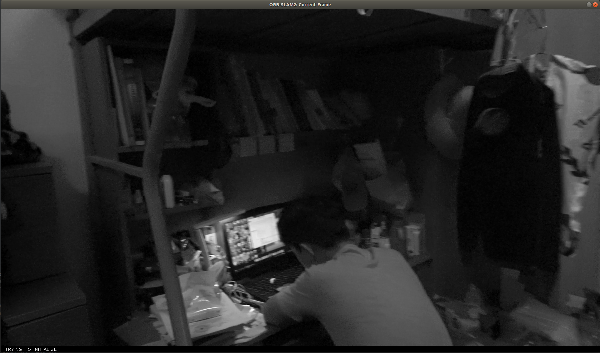

# 使用本地视频跑ORB SLAM2

参考：

* https://blog.csdn.net/zhangqian_shai/article/details/88406981
* https://blog.csdn.net/u010128736/article/details/53079964
* https://zhuanlan.zhihu.com/p/29629824

## 1.  学习`mono_tum.cc`

该程序完成了数据集的读取，这就意味着需要自己制作数据集；

或者，把数据转化成`rosbag`的形式，后者看起来更加方便一点；但是可能文件夹会变得巨大；

### 1.1 制作`rosbag`

用rosbag的方法；[代码地址](src/video2rosbag.cc)；

另一种rosbag的方法暂时不考虑；

要注意rosbag之后的视频空间会急剧增加；

### 1.2 ROS

* 在程序中设置好话题名；
* 设置好`sh`启动脚本
* 打开ORB进程，`rosbag play bag_name.bag`；

## 2. 单设备单目SLAM

暂时是初始化失败：

