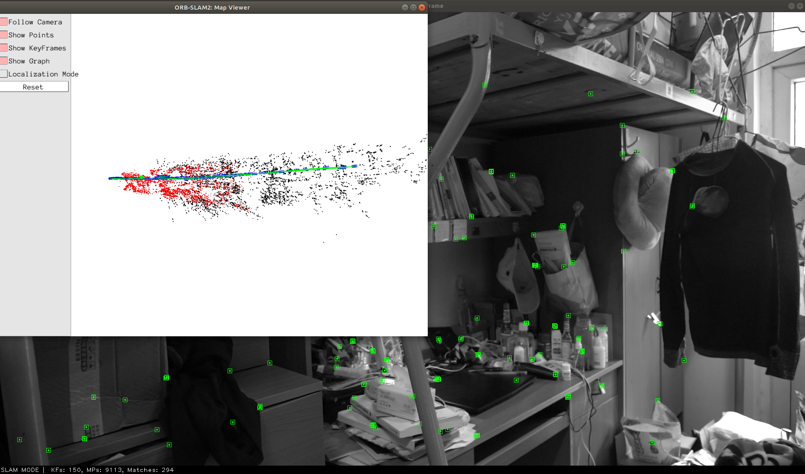
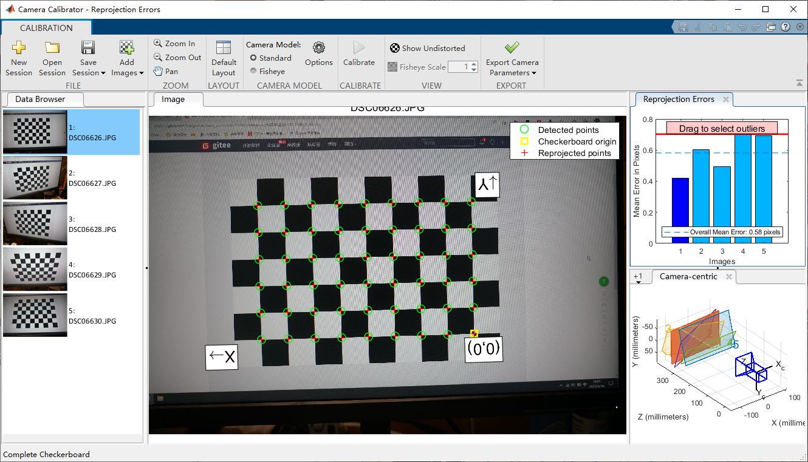

# 使用本地视频跑ORB SLAM2

参考：

* https://blog.csdn.net/zhangqian_shai/article/details/88406981
* https://blog.csdn.net/u010128736/article/details/53079964
* https://zhuanlan.zhihu.com/p/29629824

## 1.  学习`mono_tum.cc`

该程序完成了数据集的读取，这就意味着需要自己制作数据集；

或者，把数据转化成`rosbag`的形式，后者看起来更加方便一点；但是可能文件夹会变得巨大；

### 1.1 制作`rosbag`

用rosbag的方法；[代码地址](src/video2rosbag.cc)；

另一种rosbag的方法暂时不考虑；

要注意rosbag之后的视频空间会急剧增加；

### 1.2 ROS

* 在程序中设置好话题名；
* 设置好`sh`启动脚本
* 打开ORB进程，`rosbag play bag_name.bag`；

## 2. 单设备单目SLAM

暂时是初始化失败：


调整了相机参数配置文件；



一开始的初始化会丢一些点；

考虑到宿舍光线环境（大片阴影），下次去室外找一个复杂环境；

### 2.2 相机标定



```

cameraParams = 

  cameraParameters - 属性:

   Camera Intrinsics
                         Intrinsics: [1×1 cameraIntrinsics]

   Camera Extrinsics
                   RotationMatrices: [3×3×5 double]
                 TranslationVectors: [5×3 double]

   Accuracy of Estimation
              MeanReprojectionError: 0.5820
                 ReprojectionErrors: [54×2×5 double]
                  ReprojectedPoints: [54×2×5 double]

   Calibration Settings
                        NumPatterns: 5
                  DetectedKeypoints: [54×5 logical]
                        WorldPoints: [54×2 double]
                         WorldUnits: 'millimeters'
                       EstimateSkew: 0
    NumRadialDistortionCoefficients: 2
       EstimateTangentialDistortion: 0

>> cameraParams.IntrinsicMatrix

ans =

   1.0e+03 *

    3.4206         0         0
         0    3.4218         0
    2.6066    1.7279    0.0010

>> cameraParams.RadialDistortion

ans =

   -0.0452    0.0595

>> 
```

其中，标准的内参矩阵形式为：
$$
K=
\begin{bmatrix}
f_x & 0 & c_x\\
0 & f_y & c_y\\
0 & 0& 1
\end{bmatrix}
$$

* https://www.researchgate.net/publication/329189950_Application_of_UAV_Photogrammetric_System_for_Monitoring_Ancient_Tree_Communities_in_Beijing/figures
* reference

