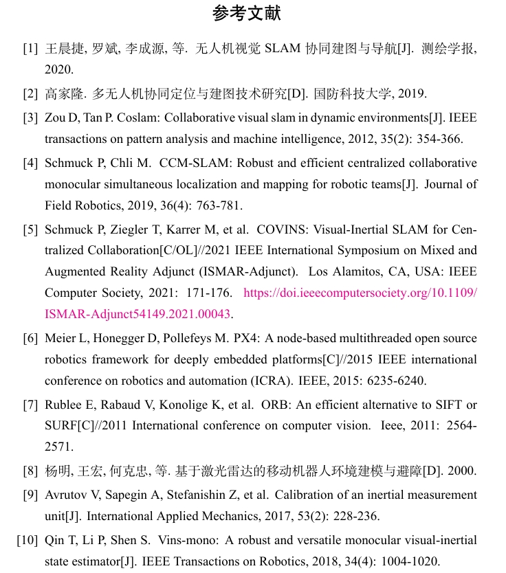

# 参考文献格式BibTex配置

主要配置bst和cls文件；

## 1. 参考

### 1.1 国标及对应模板

* [GB7714-BibTex-Github](https://github.com/zepinglee/gbt7714-bibtex-style)
* [GB7714-PDF1](http://journal.ustc.edu.cn/uploadfile/yjsjy/20161108/GB%20T%207714-2015%E4%BF%A1%E6%81%AF%E4%B8%8E%E6%96%87%E7%8C%AE-%E5%8F%82%E8%80%83%E6%96%87%E7%8C%AE%E8%91%97%E5%BD%95%E8%A7%84%E5%88%99.pdf)
* [GB7714-PDF2](https://polymer.zju.edu.cn/_upload/article/files/26/1d/66117b07482d93bed444d70c21af/70337ad0-881b-4498-8e4b-082e424dca6e.pdf)

### 1.2 2022年学校要求

***\*综述参考文献著录格式：\****

***\*①\**** ***\*期刊\****  ***\*作者．题名[J]．刊名，出版年，卷(期)：起止页码．\****

***\*②\**** ***\*论文集\****  ***\*作者．题名[A]．见[In]；编者．论文集名[C]．出版地：出版者，出版年．起止页码．\****

***\*③\**** ***\*专著\****  ***\*作者．书名[M]．版本(第1版免著)．出版地：出版者，出版年．起止页码．\****

***\*④\**** ***\*学位论文\****  ***\*作者．题名[D]．保存城市名：保存单位(写到二级单位)，出版年．\****

***\*⑤\**** ***\*标准\****  ***\*起草责任者．标准代号标准顺序号-发布年，标准名称[S]．出版地：出版者，出版年．\****

***\*⑥\**** ***\*科技报告\****   ***\*作者．题名[R]．报告题名及编号，出版地：出版者，出版年．(起止页码)．\****

***\*⑦\**** ***\*专利\****  ***\*专利所有者．题名  [P]．专利国别：专利号，公告日期．\****

***\*⑧\**** ***\*电子文献\****  ***\*作者．题名．发表或更新日期／引用日期．电子文献地址．\**** 

  

***\*文献作者3名以内全部列出，4名以上只列出前3名，后加“，“等；**

***\*外文作者姓在前，首字为大写，名缩写为首字母，与姓之间空一字符，不加缩写点。\****

## 2. 配置cls文件（class）

* [cls文件的意义及编写](https://zhuanlan.zhihu.com/p/77537952)
* [一些已有的class on CTAN](https://www.ctan.org/topic/class)

> File written in LaTeX, a document markup language often used for typesetting academic papers; stores a class with a predefined typeset configuration that can be imported into a [.TEX](https://fileinfo.com/extension/tex) document; used for storing templates for articles, forms, and other types of documents.

在`mian.tex`的开头中，`\documentclass{}`中写明了使用的`cls`，在本模板中使用`nwputhesis.cls`文件，可以在目录下找到；

### 2.1 配置超链接颜色

修改配置：

```latex
\RequirePackage[colorlinks,linkcolor=black, citecolor=black, urlcolor=black]{hyperref}
```

其意为链接和引用的颜色为黑色；

### 2.2 更改引用格式包

原版使用的是该GB格式包：

```latex
\bibliographystyle{GBT7714-2005NLang-UTF8}
```

存在一些问题，比如从Google Scholar找到的`BibTex`可能缺项，在这个`bst`文件中可能会报缺项，从而出现**[S.I.]**之类不友好的格式；

原仓库还配置了`nwputhesis.bst`格式，其问题是中文作者大于3时，出现`et al`，而不是`等`；

解决方法可以参考[GB7714-BibTex-Github](https://github.com/zepinglee/gbt7714-bibtex-style)，读取`lang`，然后`if`条件判断来确定加`et al` 或`等`；

为了方便起见，我将包更改为：

```latex
\bibliographystyle{gbt7714-numerical}
```

来自[GB7714-BibTex-Github](https://github.com/zepinglee/gbt7714-bibtex-style)；

## 3. 配置bst文件

在[GB7714-BibTex-Github](https://github.com/zepinglee/gbt7714-bibtex-style)中，使用顺序编码制的`bst`文件；

有两个点需要注意：

**英文作者的大小写**：

* 国标没有明确规定，但参照上面GB的PDF，可以看出其例子里全是大写的；
* 学校模板规定首字大写；

如沿用GB例子中的全部大写，则不需作任何修改；

如使用学校模板中的首字母大写，则需修改：

```latex
FUNCTION {format.name}
{ "{vv~}{ll}{, jj}{, ff}" format.name$ 't :=
  t "others" =
    { bbl.et.al }
    { t get.str.lang 'name.lang :=
      name.lang lang.en =
        { t #1 "{vv~}{ll}{ f{~}}" format.name$
          uppercase.name
            { "u" change.case$ }
            'skip$
          if$
          t #1 "{, jj}" format.name$ *
        }
        { t #1 "{ll}{ff}" format.name$ }
      if$
    }
  if$
}
```

我选择注释掉了

```latex
          uppercase.name
            { "u" change.case$ }
            'skip$
          if$
```

禁止`uppercase`，则可以解决大小写问题；

（可能存在别的问题，因为很多地方都用了`format.name`）

**标题的大小写**：

* GB和学校模板都没有明确规定
* 该Github的模板中，使用的是`sentence.case`，按句子大写，也就是句首字母大写（可能看起来有些奇怪）；

如果想修改成`Bib`文件所写即所得，则需要修改：

```latex
FUNCTION {format.title}
{ title empty$
    { "" }
    { title
      sentence.case.title
        'change.sentence.case
        'skip$
      if$
      entry.numbered number empty$ not and
        { bbl.colon *
          type$ "patent" = show.patent.country and
            { address empty$ not
                { address * ", " * }
                { location empty$ not
                    { location * ", " * }
                    { entry.lang lang.zh =
                        { "中国" * ", " * }
                        'skip$
                      if$
                    }
                  if$
                }
              if$
            }
            'skip$
          if$
          number *
        }
        'skip$
      if$
      link.title
        'add.link
        'skip$
      if$
    }
  if$
}
```

我选择注释掉了：

```latex
      sentence.case.title
        'change.sentence.case
        'skip$
      if$
```

关于各种case，可以参考[convert case](https://convertcase.net/)来获得一个清晰的认识；

## 4. 编译方法

`xelatex`+`Bibtex`+`xelatex`

## 5. 例子



//代表论文集中的析出文献，符合GB要求；

紫色的url可以在cls文件中更改；

## 6. 致谢

* https://github.com/zepinglee/gbt7714-bibtex-style
* https://github.com/zz92118
* https://gitee.com/pi-lab/template_bachelor
