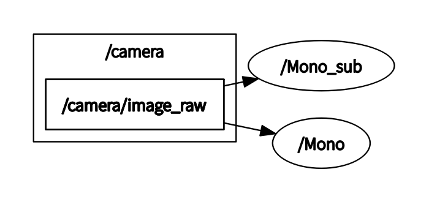

# log
#### 至4.16
* `ORB_SLAM2`源码部分学习到了回环检测，从顶层了解其运行机制，暂时不用去看底层代码
* 明确了接下来的目标，[README.md stage6](../6_Map_Merging/README.md)
* 进行了初步的设计，用rosbag实现了`ORB_SLAM2`，但是仍存在很多问题
* `mp4`转`rosbag`的程序，但是有的地方需要特别注意
* [rosbag形式的ORB SLAM2实验和相机标定](../6_Map_Merging/myVideoORB.md)

#### 至4.30 

* 中期报告修改（提交）
* ORB-SLAM2代码学习；[导图法](https://www.mindmeister.com/map/2257958379)；[类导图法](https://www.mindmeister.com/map/2257266424)；[知乎：函数功能主导](https://zhuanlan.zhihu.com/p/84905697)；[MapPoint](MapPoint.md)；[Frame](Frame.md)；（结束）
* [Collaborative Monocular SLAM with Multiple Micro Aerial Vehicles](../6_Map_Merging/README.md)

下周：

* 不考虑实时性（mutex），只实现PR+MM
* 弄清上文方法
* 解决PX4多机时bug， joystick
* CCM数据流分析+论文中的Map Matcher+Map Merging方法分析（不含源码）

#### 至5.7

PX4更换之前的旧版本能解决很多问题；

在实现简单地图融合时的困难：

* 地图融合的原理属于一个比较好理解和简单的部分，但Client之间的信息传递是避不开的
* 首先是打开两个端口运行ORB-SLAM2，[CCM-SLAM](../6_Map_Merging/README.md)
* 然后面临的问题是信息传递，两个节点之间**如何传递消息**

`Mono_sub`是测试用的额外节点，完成和`Mono`相同的任务；

* 首先能想到的即引入第三方节点，通过话题的发布和订阅（publisher，subscriber），将数据信息传递给第三方节点；
* 在CCM-SLAM中有详细的`communicator`，其在ORB的源码上也作了修改，增加了维持Client-Server信息传递的函数和进程；（有小细节）
* 理想情况第一步遇到障碍后参考第二步方法解决，不理想情况只能用第二种方法
* 最后调`MapMerging`实现功能；

论文的结构：介绍，相关研究，研究内容，评估，结论总结，参考（六部分）

下周安排：

* 完成消息传递部分的设计，直接加上`MapMerging`代码
* 论文完成介绍，相关研究，系统（研究内容）（一二三部分，如果是），即过半
